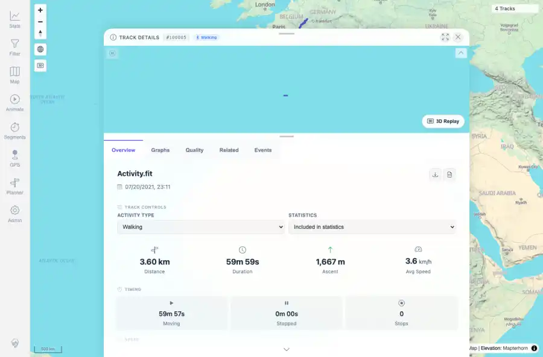

# Packet: FIT_05

## Scope

- Coverage source: `documentation/testing/frontend-regression-test-plan.md`
- Coverage ID or run packet: FIT_05
- In scope: Verify Download as GPX for the FIT-backed track returns valid GPX with real trackpoints.
- Out of scope: Other coverage IDs except where noted as shared state/evidence.

## Prerequisites

- Required previous coverage IDs or run packets: FIT_04 terminal; FIT-backed track detail page available.
- Required app/data state: Current run-state and packet set for this run.
- Required browser context: As specified by the coverage action.

## Allowed Mutations

- Allowed: Use the visible Download GPX control, save the binary to /tmp for XML validation, and update packet/run-state; do not add GPX binary to run assets.
- Not allowed: Collapse this ID into a parent row or skip required direct evidence.

## Actions And Results

| Coverage ID | Action | Expected result | Actual result | Status | Evidence |
|---|---|---|---|---|---|
| FIT_05 | Opened track 100005, clicked Download GPX, saved the downloaded GPX to /tmp, validated it with xmllint, and counted GPX elements. | A valid GPX file downloads and contains real trkpt trackpoints, not only waypoints. | Download GPX suggested Activity.gpx. xmllint validated the file as XML; it contained 1 trk, 1 trkseg, 3,601 trkpt elements, and 0 waypoints. The exported GPX creator was GPSBabel. | PASS | [assets/FIT_05-gpx-download-validation.txt](../assets/FIT_05-gpx-download-validation.txt); [assets/FIT_05-download-gpx-control.webp](../assets/FIT_05-download-gpx-control.webp); [assets/FIT_05-download-gpx-control.txt](../assets/FIT_05-download-gpx-control.txt) |

## Issues

| ID | Severity | Summary | Reproduction | Expected | Actual | Evidence | Release impact |
|---|---|---|---|---|---|---|---|

## Evidence Files

| File | Purpose |
|---|---|
| [assets/FIT_05-gpx-download-validation.txt](../assets/FIT_05-gpx-download-validation.txt) | Text/log evidence |
| [assets/FIT_05-download-gpx-control.webp](../assets/FIT_05-download-gpx-control.webp) | Screenshot evidence |
| [assets/FIT_05-download-gpx-control.txt](../assets/FIT_05-download-gpx-control.txt) | Text/log evidence |

## Screenshot Evidence

## Timings

| Step | Timing |
|---|---:|
| Browser GPX-download validation | 7 seconds |

## Handoff Notes

- Completed: This coverage ID is terminal.
- Remaining unfinished coverage: Continue with the next queue row.
- Blocked or not applicable: none.
- State left for the next packet: unchanged.
