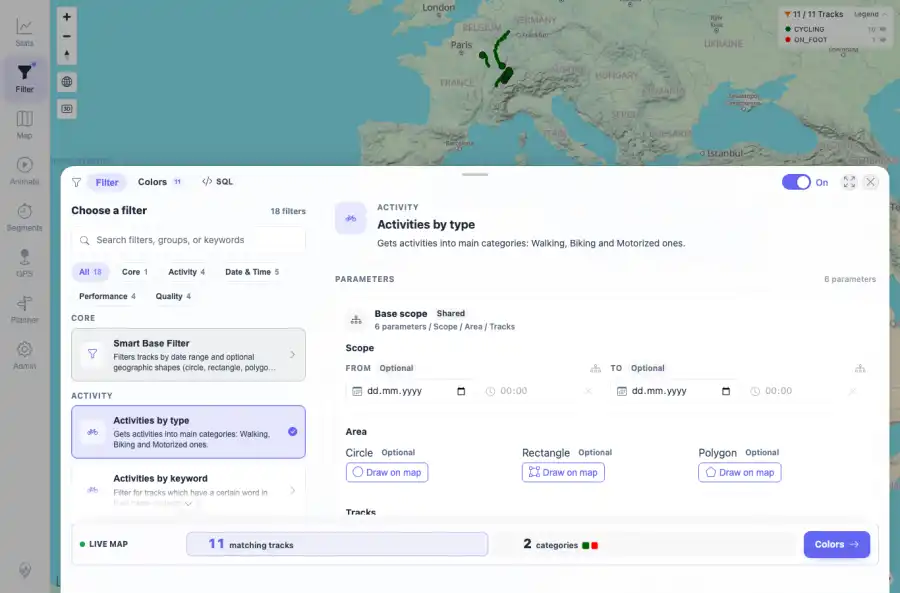

# Packet: FLT_01

## Scope

- Coverage source: `documentation/testing/frontend-regression-test-plan.md`
- Coverage ID or run packet: FLT_01
- In scope: Saved-filter restoration when opening the filter panel after reload.
- Out of scope: Other coverage IDs except where noted as shared state/evidence.

## Prerequisites

- Required previous coverage IDs or run packets: Previous queue rows through TRD_14 terminal; current dataset has 11 tracks.
- Required app/data state: Current run-state and packet set for this run.
- Required browser context: As specified by the coverage action.

## Allowed Mutations

- Allowed: UI filter interactions, local browser storage changes for filter settings, screenshot/text evidence, packet/run-state updates.
- Not allowed: Collapse this ID into a parent row or skip required direct evidence.

## Actions And Results

| Coverage ID | Action | Expected result | Actual result | Status | Evidence |
|---|---|---|---|---|---|
| FLT_01 | Enabled filtering, selected Activities by type, verified the live preview and map legend, reloaded the page, reopened the filter panel, and checked that the saved filter remained active with the selected row and map chip/legend visible. | The previously saved filter remains active after reload and is visible as the active filter selection/chip context. | Activities by type persisted through reload; the filter panel opened with the toggle On, Activities by type active, action bar at 11 matching tracks and 2 categories, and the map legend showing 11 / 11 tracks with CYCLING and ON_FOOT groups. | PASS | [assets/FLT_01-saved-filter-active.webp](../assets/FLT_01-saved-filter-active.webp); [assets/FLT_01-saved-filter-active.txt](../assets/FLT_01-saved-filter-active.txt) |

## Issues

| ID | Severity | Summary | Reproduction | Expected | Actual | Evidence | Release impact |
|---|---|---|---|---|---|---|---|

## Evidence Files

| File | Purpose |
|---|---|
| [assets/FLT_01-saved-filter-active.webp](../assets/FLT_01-saved-filter-active.webp) | Screenshot evidence |
| [assets/FLT_01-saved-filter-active.txt](../assets/FLT_01-saved-filter-active.txt) | Text/log evidence |

## Screenshot Evidence

## Timings

| Step | Timing |
|---|---:|
| Browser automation and evidence capture | ~5 minutes |

## Handoff Notes

- Completed: This coverage ID is terminal.
- Remaining unfinished coverage: Continue with the next queue row.
- Blocked or not applicable: none.
- State left for the next packet: unchanged.
