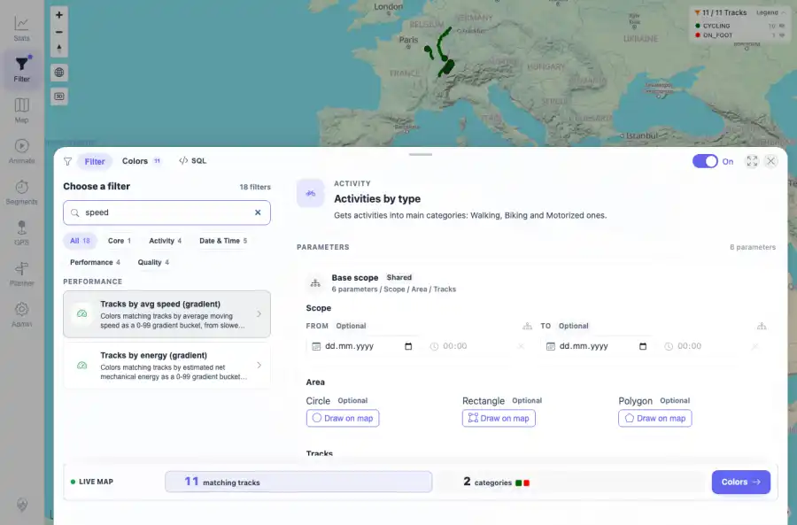
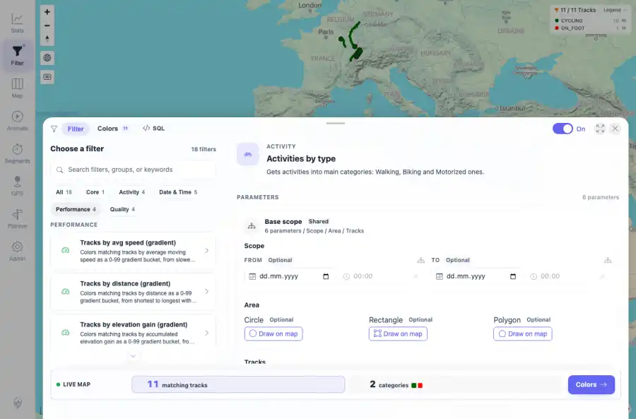

# Packet: FLT_02

## Scope

- Coverage source: `documentation/testing/frontend-regression-test-plan.md`
- Coverage ID or run packet: FLT_02
- In scope: Filter catalog browsing, search, and group chips.
- Out of scope: Other coverage IDs except where noted as shared state/evidence.

## Prerequisites

- Required previous coverage IDs or run packets: Previous queue rows through TRD_14 terminal; current dataset has 11 tracks.
- Required app/data state: Current run-state and packet set for this run.
- Required browser context: As specified by the coverage action.

## Allowed Mutations

- Allowed: UI filter interactions, local browser storage changes for filter settings, screenshot/text evidence, packet/run-state updates.
- Not allowed: Collapse this ID into a parent row or skip required direct evidence.

## Actions And Results

| Coverage ID | Action | Expected result | Actual result | Status | Evidence |
|---|---|---|---|---|---|
| FLT_02 | Searched the catalog for speed, then cleared search and selected the Performance group chip. | Search narrows matching filters and group chips scope the catalog to their group. | The speed search returned speed-related gradient filters; the Performance chip showed the four performance filters and the chip state updated to active. | PASS | [assets/FLT_02-catalog-search-speed.webp](../assets/FLT_02-catalog-search-speed.webp); [assets/FLT_02-catalog-performance-group.webp](../assets/FLT_02-catalog-performance-group.webp); [assets/FLT_02-catalog-search-grouping.txt](../assets/FLT_02-catalog-search-grouping.txt) |

## Issues

| ID | Severity | Summary | Reproduction | Expected | Actual | Evidence | Release impact |
|---|---|---|---|---|---|---|---|

## Evidence Files

| File | Purpose |
|---|---|
| [assets/FLT_02-catalog-search-speed.webp](../assets/FLT_02-catalog-search-speed.webp) | Screenshot evidence |
| [assets/FLT_02-catalog-performance-group.webp](../assets/FLT_02-catalog-performance-group.webp) | Screenshot evidence |
| [assets/FLT_02-catalog-search-grouping.txt](../assets/FLT_02-catalog-search-grouping.txt) | Text/log evidence |

## Screenshot Evidence

## Timings

| Step | Timing |
|---|---:|
| Browser automation and evidence capture | ~5 minutes |

## Handoff Notes

- Completed: This coverage ID is terminal.
- Remaining unfinished coverage: Continue with the next queue row.
- Blocked or not applicable: none.
- State left for the next packet: unchanged.
