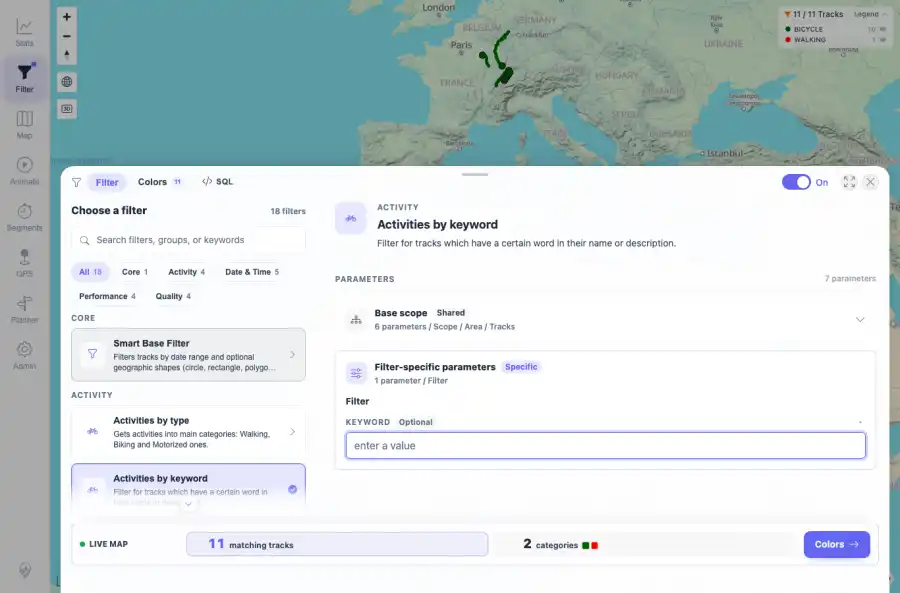

# Packet: FLT_03

## Scope

- Coverage source: `documentation/testing/frontend-regression-test-plan.md`
- Coverage ID or run packet: FLT_03
- In scope: Filter parameter rendering, auto-apply, clear/reset behavior, count/map/legend update.
- Out of scope: Other coverage IDs except where noted as shared state/evidence.

## Prerequisites

- Required previous coverage IDs or run packets: Previous queue rows through TRD_14 terminal; current dataset has 11 tracks.
- Required app/data state: Current run-state and packet set for this run.
- Required browser context: As specified by the coverage action.

## Allowed Mutations

- Allowed: UI filter interactions, local browser storage changes for filter settings, screenshot/text evidence, packet/run-state updates.
- Not allowed: Collapse this ID into a parent row or skip required direct evidence.

## Actions And Results

| Coverage ID | Action | Expected result | Actual result | Status | Evidence |
|---|---|---|---|---|---|
| FLT_03 | Selected Activities by keyword, entered format into the optional keyword parameter, waited for live preview/map update, then cleared the keyword and waited for the base result to restore. | Parameter edits apply immediately; clearing the parameter removes its narrowing effect without stale pending UI. | Entering format reduced the result to 3 / 11 tracks with one BICYCLE category; clearing it restored 11 / 11 tracks and two categories with updated action bar and map legend. | PASS | [assets/FLT_03-keyword-format-applied.webp](../assets/FLT_03-keyword-format-applied.webp); [assets/FLT_03-keyword-cleared.webp](../assets/FLT_03-keyword-cleared.webp); [assets/FLT_03-keyword-param-auto-apply.txt](../assets/FLT_03-keyword-param-auto-apply.txt) |

## Issues

| ID | Severity | Summary | Reproduction | Expected | Actual | Evidence | Release impact |
|---|---|---|---|---|---|---|---|

## Evidence Files

| File | Purpose |
|---|---|
| [assets/FLT_03-keyword-format-applied.webp](../assets/FLT_03-keyword-format-applied.webp) | Screenshot evidence |
| [assets/FLT_03-keyword-cleared.webp](../assets/FLT_03-keyword-cleared.webp) | Screenshot evidence |
| [assets/FLT_03-keyword-param-auto-apply.txt](../assets/FLT_03-keyword-param-auto-apply.txt) | Text/log evidence |

## Screenshot Evidence

## Timings

| Step | Timing |
|---|---:|
| Browser automation and evidence capture | ~5 minutes |

## Handoff Notes

- Completed: This coverage ID is terminal.
- Remaining unfinished coverage: Continue with the next queue row.
- Blocked or not applicable: none.
- State left for the next packet: unchanged.
