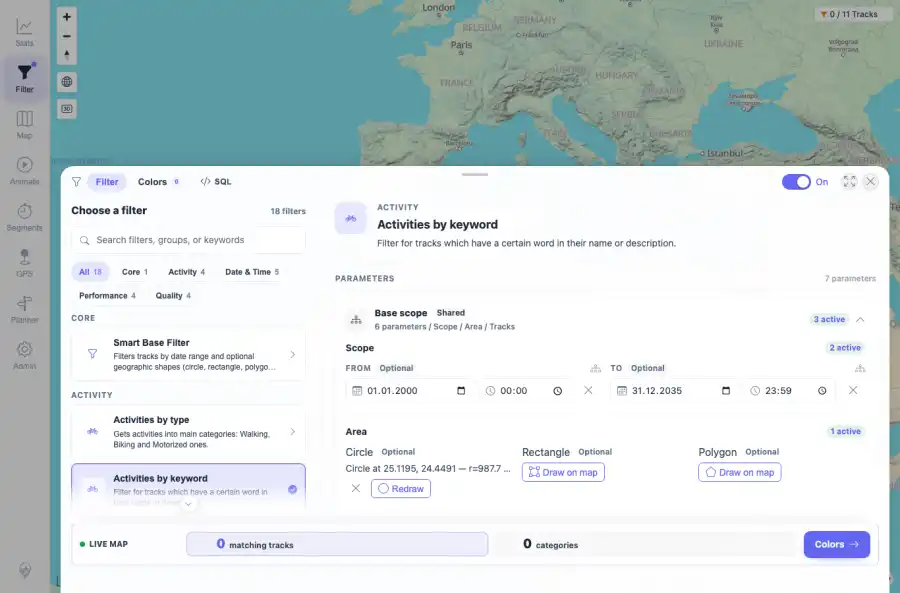
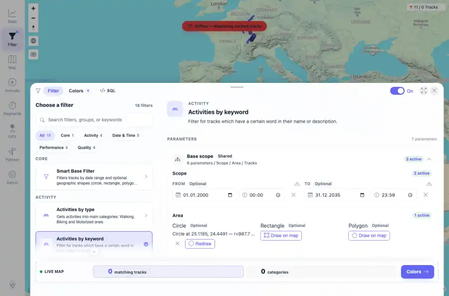

# Packet: FLT_04

## Scope

- Coverage source: `documentation/testing/frontend-regression-test-plan.md`
- Coverage ID or run packet: FLT_04
- In scope: Date, text, and geo parameter persistence and reload re-application.
- Out of scope: Other coverage IDs except where noted as shared state/evidence.

## Prerequisites

- Required previous coverage IDs or run packets: Previous queue rows through TRD_14 terminal; current dataset has 11 tracks.
- Required app/data state: Current run-state and packet set for this run.
- Required browser context: As specified by the coverage action.

## Allowed Mutations

- Allowed: UI filter interactions, local browser storage changes for filter settings, screenshot/text evidence, packet/run-state updates.
- Not allowed: Collapse this ID into a parent row or skip required direct evidence.

## Actions And Results

| Coverage ID | Action | Expected result | Actual result | Status | Evidence |
|---|---|---|---|---|---|
| FLT_04 | On Activities by keyword, set keyword=format, From 2000-01-01 00:00, To 2035-12-31 23:59, drew a circle shape, captured state, reloaded, reopened the filter, and compared restored inputs/storage/live result. | Date, text, and geo parameters are saved, restored after reload, and re-applied to the live filter result. | Keyword, date/time range, and circle parameters persisted in storage and in the filter UI after reload; the live result stayed consistently re-applied at 0 matching tracks for the drawn circle scope. | PASS | [assets/FLT_04-params-before-reload.webp](../assets/FLT_04-params-before-reload.webp); [assets/FLT_04-params-after-reload.webp](../assets/FLT_04-params-after-reload.webp); [assets/FLT_04-params-persist-reapply.txt](../assets/FLT_04-params-persist-reapply.txt) |

## Issues

| ID | Severity | Summary | Reproduction | Expected | Actual | Evidence | Release impact |
|---|---|---|---|---|---|---|---|

## Evidence Files

| File | Purpose |
|---|---|
| [assets/FLT_04-params-before-reload.webp](../assets/FLT_04-params-before-reload.webp) | Screenshot evidence |
| [assets/FLT_04-params-after-reload.webp](../assets/FLT_04-params-after-reload.webp) | Screenshot evidence |
| [assets/FLT_04-params-persist-reapply.txt](../assets/FLT_04-params-persist-reapply.txt) | Text/log evidence |

## Screenshot Evidence

## Timings

| Step | Timing |
|---|---:|
| Browser automation and evidence capture | ~5 minutes |

## Handoff Notes

- Completed: This coverage ID is terminal.
- Remaining unfinished coverage: Continue with the next queue row.
- Blocked or not applicable: none.
- State left for the next packet: unchanged.
