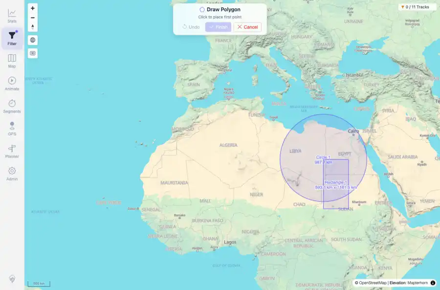
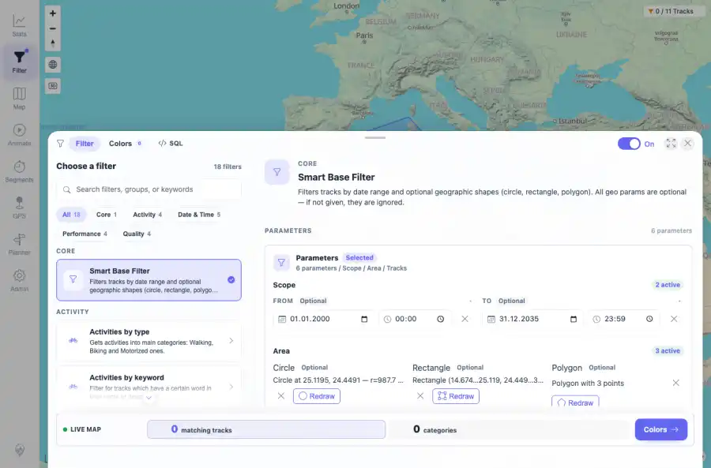
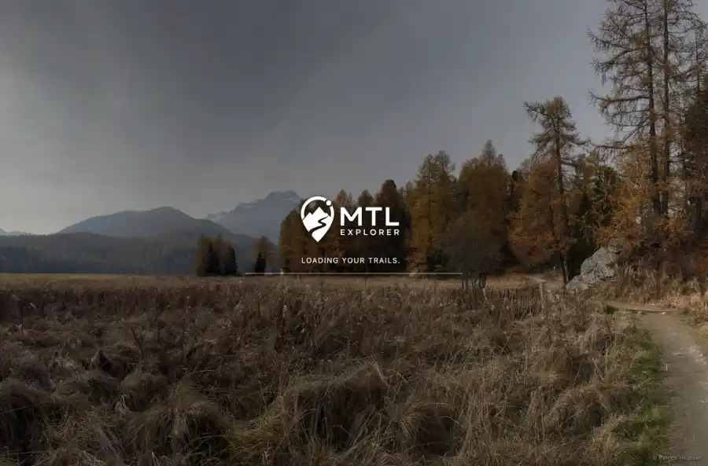
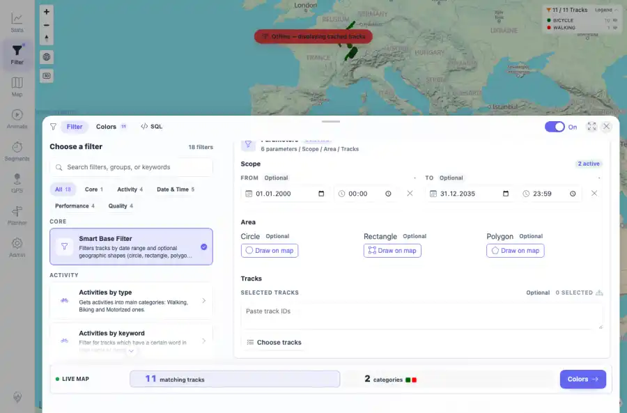

# Packet: FLT_05

## Scope

- Coverage source: `documentation/testing/frontend-regression-test-plan.md`
- Coverage ID or run packet: FLT_05
- In scope: Geo drawing for circle, rectangle, polygon plus undo, cancel, finish, reload, and clear.
- Out of scope: Other coverage IDs except where noted as shared state/evidence.

## Prerequisites

- Required previous coverage IDs or run packets: Previous queue rows through TRD_14 terminal; current dataset has 11 tracks.
- Required app/data state: Current run-state and packet set for this run.
- Required browser context: As specified by the coverage action.

## Allowed Mutations

- Allowed: UI filter interactions, local browser storage changes for filter settings, screenshot/text evidence, packet/run-state updates.
- Not allowed: Collapse this ID into a parent row or skip required direct evidence.

## Actions And Results

| Coverage ID | Action | Expected result | Actual result | Status | Evidence |
|---|---|---|---|---|---|
| FLT_05 | Drew a circle, rectangle, and polygon through the map drawing toolbar; started a draft polygon, verified Undo, canceled it, drew and finished a polygon, reloaded to verify saved shape summaries, then cleared all geo shapes. | Circle, rectangle, and polygon drawing work; undo/cancel/finish controls work; saved shapes reappear; clearing removes all shapes and restores the unshaped result. | The toolbar reflected undo/cancel state; completed circle, rectangle, and polygon appeared in UI summaries and storage after reload; clearing all shape controls removed geo params and restored the Smart Base result to 11 matching tracks. | PASS | [assets/FLT_05-polygon-undo-before-cancel.webp](../assets/FLT_05-polygon-undo-before-cancel.webp); [assets/FLT_05-shapes-finished.webp](../assets/FLT_05-shapes-finished.webp); [assets/FLT_05-shapes-after-reload.webp](../assets/FLT_05-shapes-after-reload.webp); [assets/FLT_05-shapes-cleared.webp](../assets/FLT_05-shapes-cleared.webp); [assets/FLT_05-geo-drawing-controls.txt](../assets/FLT_05-geo-drawing-controls.txt) |

## Issues

| ID | Severity | Summary | Reproduction | Expected | Actual | Evidence | Release impact |
|---|---|---|---|---|---|---|---|

## Evidence Files

| File | Purpose |
|---|---|
| [assets/FLT_05-polygon-undo-before-cancel.webp](../assets/FLT_05-polygon-undo-before-cancel.webp) | Screenshot evidence |
| [assets/FLT_05-shapes-finished.webp](../assets/FLT_05-shapes-finished.webp) | Screenshot evidence |
| [assets/FLT_05-shapes-after-reload.webp](../assets/FLT_05-shapes-after-reload.webp) | Screenshot evidence |
| [assets/FLT_05-shapes-cleared.webp](../assets/FLT_05-shapes-cleared.webp) | Screenshot evidence |
| [assets/FLT_05-geo-drawing-controls.txt](../assets/FLT_05-geo-drawing-controls.txt) | Text/log evidence |

## Screenshot Evidence

## Timings

| Step | Timing |
|---|---:|
| Browser automation and evidence capture | ~5 minutes |

## Handoff Notes

- Completed: This coverage ID is terminal.
- Remaining unfinished coverage: Continue with the next queue row.
- Blocked or not applicable: none.
- State left for the next packet: unchanged.
