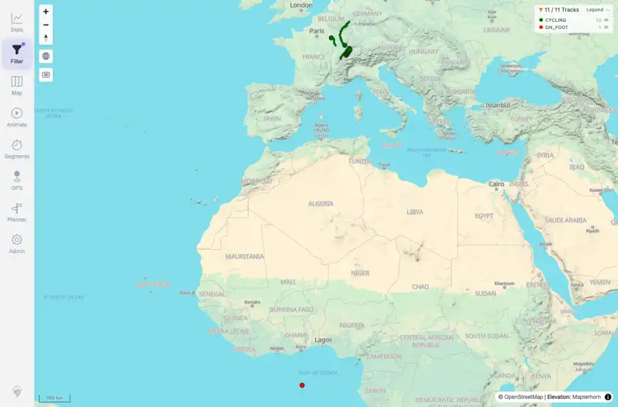
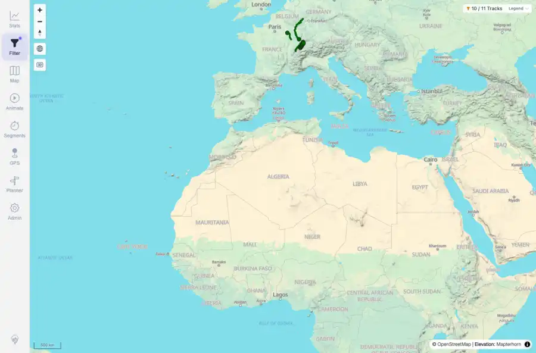

# Packet: FLT_07

## Scope

- Coverage source: `documentation/testing/frontend-regression-test-plan.md`
- Coverage ID or run packet: FLT_07
- In scope: Active-filter legend rows, collapse, and group hiding.
- Out of scope: Other coverage IDs except where noted as shared state/evidence.

## Prerequisites

- Required previous coverage IDs or run packets: Previous queue rows through TRD_14 terminal; current dataset has 11 tracks.
- Required app/data state: Current run-state and packet set for this run.
- Required browser context: As specified by the coverage action.

## Allowed Mutations

- Allowed: UI filter interactions, local browser storage changes for filter settings, screenshot/text evidence, packet/run-state updates.
- Not allowed: Collapse this ID into a parent row or skip required direct evidence.

## Actions And Results

| Coverage ID | Action | Expected result | Actual result | Status | Evidence |
|---|---|---|---|---|---|
| FLT_07 | Selected Activities by type, expanded the map legend, hid the ON_FOOT row, verified the map count changed, then collapsed the legend. | The legend reflects the active filter and hiding/collapsing groups updates the map immediately. | The categorical legend showed CYCLING 10 and ON_FOOT 1; hiding ON_FOOT changed the map count to 10 / 11 and marked that row disabled; collapsing preserved the hidden state. | PASS | [assets/FLT_07-legend-expanded.webp](../assets/FLT_07-legend-expanded.webp); [assets/FLT_07-legend-hidden-group.webp](../assets/FLT_07-legend-hidden-group.webp); [assets/FLT_07-legend-collapsed.webp](../assets/FLT_07-legend-collapsed.webp); [assets/FLT_07-legend-hide-collapse.txt](../assets/FLT_07-legend-hide-collapse.txt) |

## Issues

| ID | Severity | Summary | Reproduction | Expected | Actual | Evidence | Release impact |
|---|---|---|---|---|---|---|---|

## Evidence Files

| File | Purpose |
|---|---|
| [assets/FLT_07-legend-expanded.webp](../assets/FLT_07-legend-expanded.webp) | Screenshot evidence |
| [assets/FLT_07-legend-hidden-group.webp](../assets/FLT_07-legend-hidden-group.webp) | Screenshot evidence |
| [assets/FLT_07-legend-collapsed.webp](../assets/FLT_07-legend-collapsed.webp) | Screenshot evidence |
| [assets/FLT_07-legend-hide-collapse.txt](../assets/FLT_07-legend-hide-collapse.txt) | Text/log evidence |

## Screenshot Evidence

## Timings

| Step | Timing |
|---|---:|
| Browser automation and evidence capture | ~5 minutes |

## Handoff Notes

- Completed: This coverage ID is terminal.
- Remaining unfinished coverage: Continue with the next queue row.
- Blocked or not applicable: none.
- State left for the next packet: unchanged.
