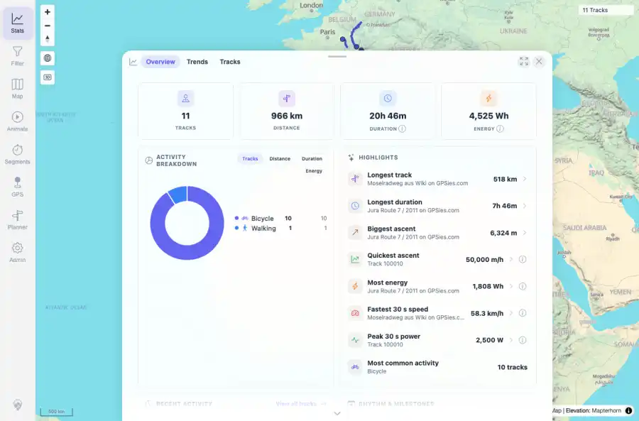
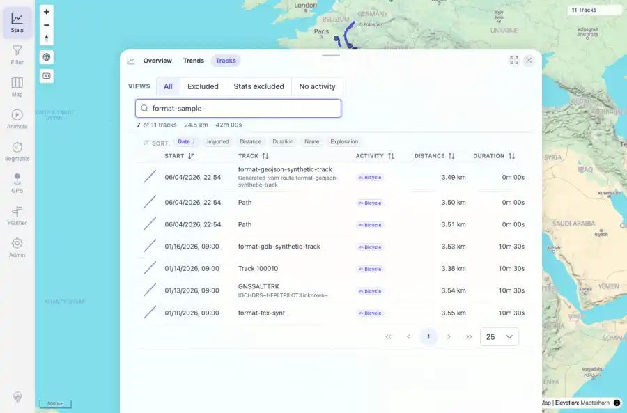
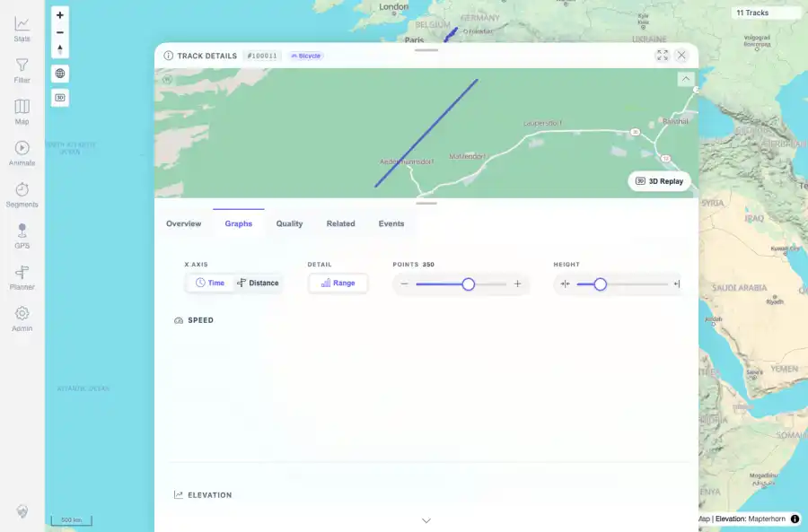

# Packet: FMT_02

## Scope

- Coverage source: `documentation/testing/frontend-regression-test-plan.md`
- Coverage ID or run packet: FMT_02
- In scope: For each tested non-GPX format, verify upload/import acceptance, conversion, map display, details/charts, statistics inclusion, Download original, and Download as GPX.
- Out of scope: Other coverage IDs except where noted as shared state/evidence.

## Prerequisites

- Required previous coverage IDs or run packets: FMT_01 terminal; seven non-GPX synthetic samples indexed successfully.
- Required app/data state: Current run-state and packet set for this run.
- Required browser context: As specified by the coverage action.

## Allowed Mutations

- Allowed: Read-only UI/API verification and binary downloads to /tmp for checksum/XML validation; packet/run-state updates.
- Not allowed: Collapse this ID into a parent row or skip required direct evidence.

## Actions And Results

| Coverage ID | Action | Expected result | Actual result | Status | Evidence |
|---|---|---|---|---|---|
| FMT_02 | Opened map, stats, and track-browser search for the format samples; opened each of the seven non-GPX detail pages; verified graph content; downloaded each original source and compared checksum; downloaded each GPX export and validated XML/trkpt counts. | Every tested non-GPX format is accepted, converted, shown on map, opens details/charts, contributes to stats, downloads its original source, and exports a GPX with real trackpoints. | All seven formats passed: TCX, KML, KMZ, IGC, NMEA, GeoJSON, and GDB each had loadStatus=SUCCESS, 24 points, stats inclusion visible, overview and graph checks true, original download checksum/size matched the source file, and GPX export was valid with 24 trkpt elements. Map and stats showed 11 total tracks, and browser search for format-sample returned the format rows. | PASS | [assets/FMT_02-format-verification-summary.txt](../assets/FMT_02-format-verification-summary.txt); [assets/FMT_02-map-formats.webp](../assets/FMT_02-map-formats.webp); [assets/FMT_02-map-formats.txt](../assets/FMT_02-map-formats.txt); [assets/FMT_02-stats-formats.webp](../assets/FMT_02-stats-formats.webp); [assets/FMT_02-stats-formats.txt](../assets/FMT_02-stats-formats.txt); [assets/FMT_02-browser-format-search.webp](../assets/FMT_02-browser-format-search.webp); [assets/FMT_02-browser-format-search.txt](../assets/FMT_02-browser-format-search.txt); [assets/FMT_02-detail-geojson-graphs.webp](../assets/FMT_02-detail-geojson-graphs.webp); [assets/FMT_02-detail-geojson-graphs.txt](../assets/FMT_02-detail-geojson-graphs.txt) |

## Issues

| ID | Severity | Summary | Reproduction | Expected | Actual | Evidence | Release impact |
|---|---|---|---|---|---|---|---|

## Evidence Files

| File | Purpose |
|---|---|
| [assets/FMT_02-format-verification-summary.txt](../assets/FMT_02-format-verification-summary.txt) | Text/log evidence |
| [assets/FMT_02-map-formats.webp](../assets/FMT_02-map-formats.webp) | Screenshot evidence |
| [assets/FMT_02-map-formats.txt](../assets/FMT_02-map-formats.txt) | Text/log evidence |
| [assets/FMT_02-stats-formats.webp](../assets/FMT_02-stats-formats.webp) | Screenshot evidence |
| [assets/FMT_02-stats-formats.txt](../assets/FMT_02-stats-formats.txt) | Text/log evidence |
| [assets/FMT_02-browser-format-search.webp](../assets/FMT_02-browser-format-search.webp) | Screenshot evidence |
| [assets/FMT_02-browser-format-search.txt](../assets/FMT_02-browser-format-search.txt) | Text/log evidence |
| [assets/FMT_02-detail-geojson-graphs.webp](../assets/FMT_02-detail-geojson-graphs.webp) | Screenshot evidence |
| [assets/FMT_02-detail-geojson-graphs.txt](../assets/FMT_02-detail-geojson-graphs.txt) | Text/log evidence |

## Screenshot Evidence

## Timings

| Step | Timing |
|---|---:|
| Browser/download verification for seven formats | 52 seconds |

## Handoff Notes

- Completed: This coverage ID is terminal.
- Remaining unfinished coverage: Continue with the next queue row.
- Blocked or not applicable: none.
- State left for the next packet: unchanged.
