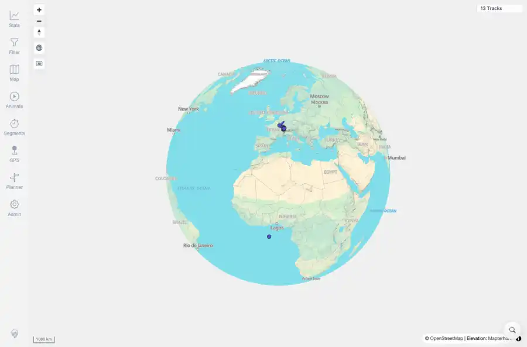

# Packet: GLB_01

## Scope

- Coverage source: `documentation/testing/frontend-regression-test-plan.md`
- Coverage ID or run packet: GLB_01
- In scope: Automatic globe projection at low map zoom.
- Out of scope: Other coverage IDs except where noted as shared state/evidence.

## Prerequisites

- Required previous coverage IDs or run packets: Map screen available with prior queue rows terminal.
- Required app/data state: Current run-state and packet set for this run.
- Required browser context: As specified by the coverage action.

## Allowed Mutations

- Allowed: Use map zoom controls, capture globe-control state, and update GLB_01 packet/run-state.
- Not allowed: Collapse this ID into a parent row or skip required direct evidence.

## Actions And Results

| Coverage ID | Action | Expected result | Actual result | Status | Evidence |
|---|---|---|---|---|---|
| GLB_01 | Clicked Zoom out until the map crossed the globe-enter threshold. | Globe view engages automatically when zoomed out far enough. | PASS: after zooming out, the globe control was visible and active, and app zoom logs showed low-zoom globe states such as `[zoom] 2.273 / globe` and `[zoom] 1.963 / globe`. | PASS | [assets/GLB_01-globe-auto-engaged.webp](../assets/GLB_01-globe-auto-engaged.webp); [assets/GLB_01-globe-auto-engaged.txt](../assets/GLB_01-globe-auto-engaged.txt) |

## Issues

| ID | Severity | Summary | Reproduction | Expected | Actual | Evidence | Release impact |
|---|---|---|---|---|---|---|---|

## Evidence Files

| File | Purpose |
|---|---|
| [assets/GLB_01-globe-auto-engaged.webp](../assets/GLB_01-globe-auto-engaged.webp) | Screenshot evidence |
| [assets/GLB_01-globe-auto-engaged.txt](../assets/GLB_01-globe-auto-engaged.txt) | Text/log evidence |

## Screenshot Evidence

## Timings

| Step | Timing |
|---|---:|
| Auto globe zoom-out check | ~15 seconds |

## Handoff Notes

- Completed: This coverage ID is terminal.
- Remaining unfinished coverage: Continue with the next queue row.
- Blocked or not applicable: none.
- State left for the next packet: unchanged.
