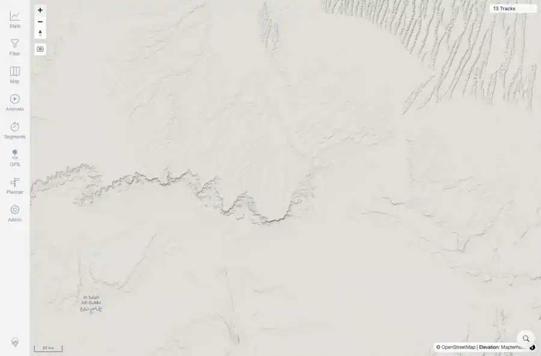

# Packet: GLB_02

## Scope

- Coverage source: `documentation/testing/frontend-regression-test-plan.md`
- Coverage ID or run packet: GLB_02
- In scope: Return from globe projection to flat map after zooming in.
- Out of scope: Other coverage IDs except where noted as shared state/evidence.

## Prerequisites

- Required previous coverage IDs or run packets: GLB_01 terminal; globe mode active.
- Required app/data state: Current run-state and packet set for this run.
- Required browser context: As specified by the coverage action.

## Allowed Mutations

- Allowed: Use map zoom controls, capture globe-control state, and update GLB_02 packet/run-state.
- Not allowed: Collapse this ID into a parent row or skip required direct evidence.

## Actions And Results

| Coverage ID | Action | Expected result | Actual result | Status | Evidence |
|---|---|---|---|---|---|
| GLB_02 | Clicked Zoom in from active globe mode until the map crossed the flat-map exit threshold. | Zooming in returns the map to flat/mercator view. | PASS: after zooming in, the globe control was hidden and inactive, and app zoom logs showed mercator states from zoom 3.963 upward. | PASS | [assets/GLB_02-flat-after-zoom-in.webp](../assets/GLB_02-flat-after-zoom-in.webp); [assets/GLB_02-flat-after-zoom-in.txt](../assets/GLB_02-flat-after-zoom-in.txt) |

## Issues

| ID | Severity | Summary | Reproduction | Expected | Actual | Evidence | Release impact |
|---|---|---|---|---|---|---|---|

## Evidence Files

| File | Purpose |
|---|---|
| [assets/GLB_02-flat-after-zoom-in.webp](../assets/GLB_02-flat-after-zoom-in.webp) | Screenshot evidence |
| [assets/GLB_02-flat-after-zoom-in.txt](../assets/GLB_02-flat-after-zoom-in.txt) | Text/log evidence |

## Screenshot Evidence

## Timings

| Step | Timing |
|---|---:|
| Flat-map zoom-in check | ~10 seconds |

## Handoff Notes

- Completed: This coverage ID is terminal.
- Remaining unfinished coverage: Continue with the next queue row.
- Blocked or not applicable: none.
- State left for the next packet: unchanged.
