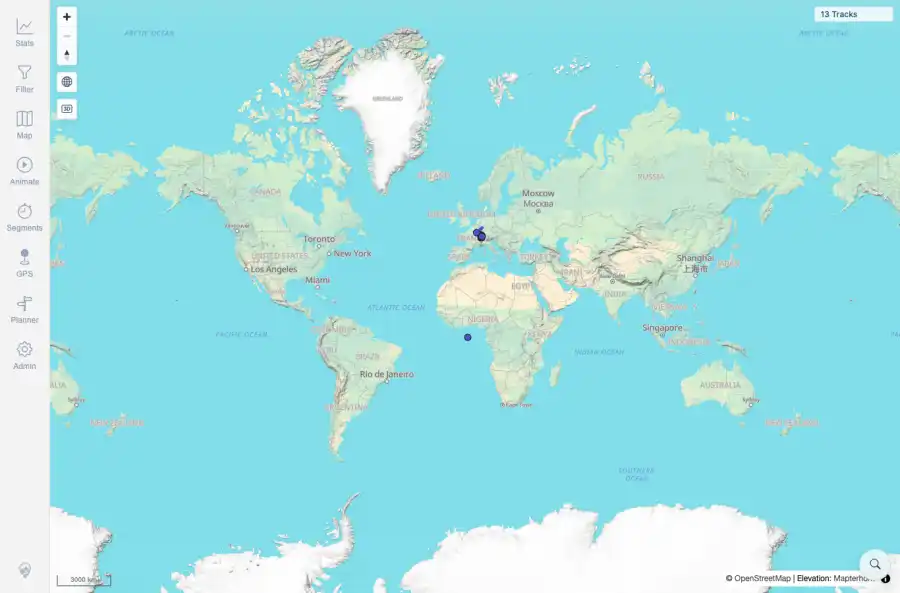

# Packet: GLB_03

## Scope

- Coverage source: `documentation/testing/frontend-regression-test-plan.md`
- Coverage ID or run packet: GLB_03
- In scope: Manual globe disable behavior in the low-zoom band.
- Out of scope: Other coverage IDs except where noted as shared state/evidence.

## Prerequisites

- Required previous coverage IDs or run packets: GLB_01 and GLB_02 terminal; globe control reachable.
- Required app/data state: Current run-state and packet set for this run.
- Required browser context: As specified by the coverage action.

## Allowed Mutations

- Allowed: Toggle globe mode, cycle zoom controls, capture state, and update GLB_03 packet/run-state.
- Not allowed: Collapse this ID into a parent row or skip required direct evidence.

## Actions And Results

| Coverage ID | Action | Expected result | Actual result | Status | Evidence |
|---|---|---|---|---|---|
| GLB_03 | Re-entered low-zoom globe mode, clicked the globe control to disable it, then zoomed in/out while still in the low-zoom range. | Manual disable of globe is respected and does not auto-re-enable until the user re-enables it. | PASS: globe was active before manual disable, inactive immediately after the click, and remained inactive after the follow-up low-zoom cycle; zoom logs showed low zoom in mercator after disable. | PASS | [assets/GLB_03-manual-disable-respected.webp](../assets/GLB_03-manual-disable-respected.webp); [assets/GLB_03-manual-disable-respected.txt](../assets/GLB_03-manual-disable-respected.txt) |

## Issues

| ID | Severity | Summary | Reproduction | Expected | Actual | Evidence | Release impact |
|---|---|---|---|---|---|---|---|

## Evidence Files

| File | Purpose |
|---|---|
| [assets/GLB_03-manual-disable-respected.webp](../assets/GLB_03-manual-disable-respected.webp) | Screenshot evidence |
| [assets/GLB_03-manual-disable-respected.txt](../assets/GLB_03-manual-disable-respected.txt) | Text/log evidence |

## Screenshot Evidence

## Timings

| Step | Timing |
|---|---:|
| Manual disable and zoom-cycle check | ~20 seconds |

## Handoff Notes

- Completed: This coverage ID is terminal.
- Remaining unfinished coverage: Continue with the next queue row.
- Blocked or not applicable: none.
- State left for the next packet: unchanged.
