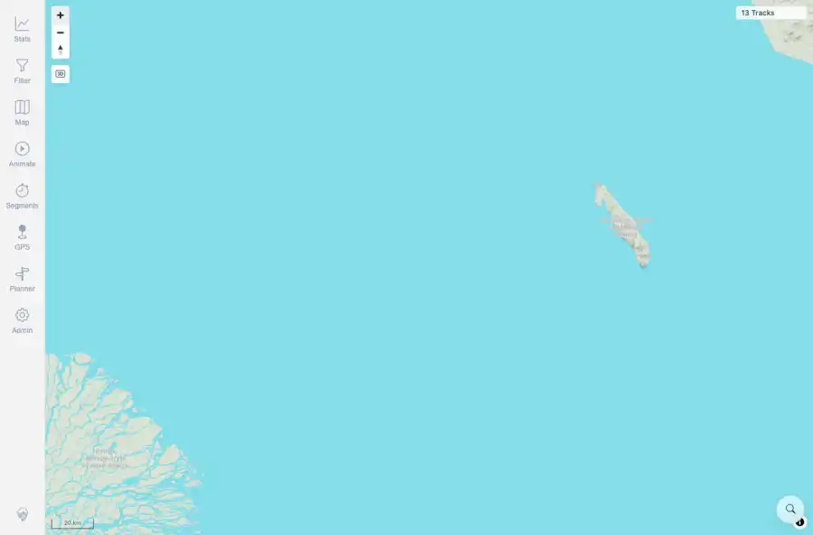

# Packet: GLB_04

## Scope

- Coverage source: `documentation/testing/frontend-regression-test-plan.md`
- Coverage ID or run packet: GLB_04
- In scope: Map zoom limits and edge panning around globe/flat transitions.
- Out of scope: Other coverage IDs except where noted as shared state/evidence.

## Prerequisites

- Required previous coverage IDs or run packets: GLB_01 through GLB_03 terminal.
- Required app/data state: Current run-state and packet set for this run.
- Required browser context: As specified by the coverage action.

## Allowed Mutations

- Allowed: Pan and zoom the map at low zoom, capture state, and update GLB_04 packet/run-state.
- Not allowed: Collapse this ID into a parent row or skip required direct evidence.

## Actions And Results

| Coverage ID | Action | Expected result | Actual result | Status | Evidence |
|---|---|---|---|---|---|
| GLB_04 | At low-zoom globe mode, aggressively panned toward edges, repeatedly clicked Zoom out at the floor, then clicked Zoom in back into flat-map zooms. | Zoom limits do not trap the map at edges; the map remains responsive and recoverable. | PASS: the canvas remained visible, repeated zoom-out at the floor did not trap the map, and zoom-in recovered to inactive mercator mode with visible track count. | PASS | [assets/GLB_04-zoom-limits-responsive.webp](../assets/GLB_04-zoom-limits-responsive.webp); [assets/GLB_04-zoom-limits-responsive.txt](../assets/GLB_04-zoom-limits-responsive.txt) |

## Issues

| ID | Severity | Summary | Reproduction | Expected | Actual | Evidence | Release impact |
|---|---|---|---|---|---|---|---|

## Evidence Files

| File | Purpose |
|---|---|
| [assets/GLB_04-zoom-limits-responsive.webp](../assets/GLB_04-zoom-limits-responsive.webp) | Screenshot evidence |
| [assets/GLB_04-zoom-limits-responsive.txt](../assets/GLB_04-zoom-limits-responsive.txt) | Text/log evidence |

## Screenshot Evidence

## Timings

| Step | Timing |
|---|---:|
| Edge pan and zoom-limit recovery check | ~25 seconds |

## Handoff Notes

- Completed: This coverage ID is terminal.
- Remaining unfinished coverage: Continue with the next queue row.
- Blocked or not applicable: none.
- State left for the next packet: unchanged.
