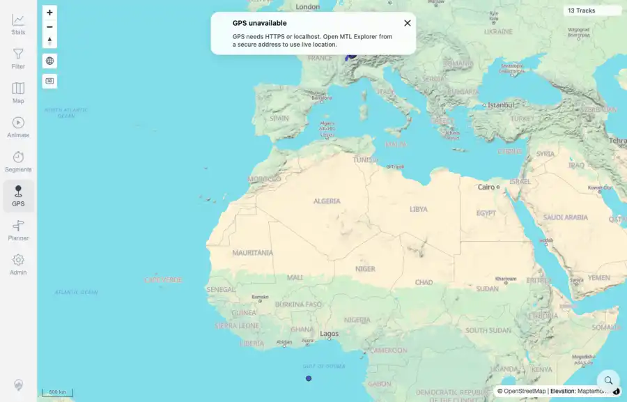

# Packet: GPS_04

## Scope

- Coverage source: `documentation/testing/frontend-regression-test-plan.md`
- Coverage ID or run packet: GPS_04
- In scope: GPS unavailable/disabled-state user messaging.
- Out of scope: Other coverage IDs except where noted as shared state/evidence.

## Prerequisites

- Required previous coverage IDs or run packets: GPS_01 terminal; target is remote plain HTTP.
- Required app/data state: Current run-state and packet set for this run.
- Required browser context: As specified by the coverage action.

## Allowed Mutations

- Allowed: Open GPS, capture disabled-state message evidence, and update GPS_04 packet/run-state.
- Not allowed: Collapse this ID into a parent row or skip required direct evidence.

## Actions And Results

| Coverage ID | Action | Expected result | Actual result | Status | Evidence |
|---|---|---|---|---|---|
| GPS_04 | Opened GPS on the remote HTTP origin after confirming geolocation is browser-blocked. | Permission denied or disabled GPS state shows a clear message. | PASS: the GPS panel displayed 'GPS unavailable' and explained that GPS needs HTTPS or localhost to use live location. | PASS | [assets/GPS_01-remote-http-gps.webp](../assets/GPS_01-remote-http-gps.webp); [assets/GPS_01-remote-http-gps.txt](../assets/GPS_01-remote-http-gps.txt) |

## Issues

| ID | Severity | Summary | Reproduction | Expected | Actual | Evidence | Release impact |
|---|---|---|---|---|---|---|---|

## Evidence Files

| File | Purpose |
|---|---|
| [assets/GPS_01-remote-http-gps.webp](../assets/GPS_01-remote-http-gps.webp) | Screenshot evidence |
| [assets/GPS_01-remote-http-gps.txt](../assets/GPS_01-remote-http-gps.txt) | Text/log evidence |

## Screenshot Evidence

## Timings

| Step | Timing |
|---|---:|
| Disabled-state message check | ~5 seconds |

## Handoff Notes

- Completed: This coverage ID is terminal.
- Remaining unfinished coverage: Continue with the next queue row.
- Blocked or not applicable: none.
- State left for the next packet: unchanged.
