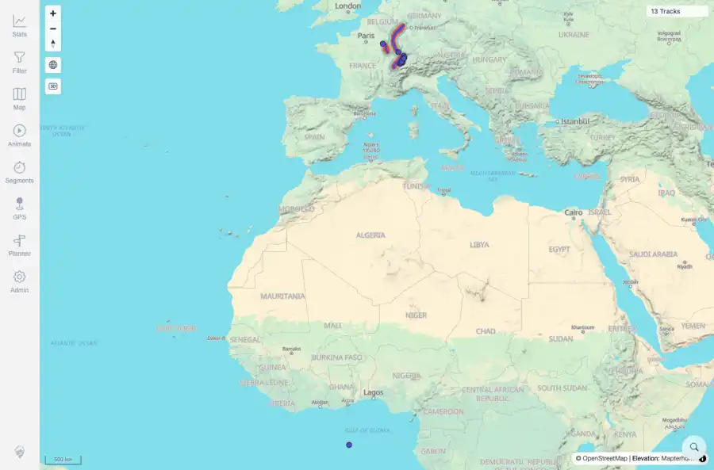

# Packet: HMO_01

## Scope

- Coverage source: `documentation/testing/frontend-regression-test-plan.md`
- Coverage ID or run packet: HMO_01
- In scope: Heatmap toggle behavior and opacity control on the map.
- Out of scope: Other coverage IDs except where noted as shared state/evidence.

## Prerequisites

- Required previous coverage IDs or run packets: Map layer controls available after previous queue rows terminal.
- Required app/data state: Current run-state and packet set for this run.
- Required browser context: As specified by the coverage action.

## Allowed Mutations

- Allowed: Enable heatmap, adjust its opacity, capture evidence, and update HMO_01 packet/run-state.
- Not allowed: Collapse this ID into a parent row or skip required direct evidence.

## Actions And Results

| Coverage ID | Action | Expected result | Actual result | Status | Evidence |
|---|---|---|---|---|---|
| HMO_01 | Opened map layer controls, toggled Heatmap on, adjusted its opacity slider, and confirmed the tracks summary remained visible. | Heatmap draws over the map without hiding tracks and exposes/uses opacity controls. | PASS: Heatmap changed from disabled to enabled, opacity slider was present, and the page still showed 13 Tracks while the heatmap layer was active. | PASS | [assets/HMO_01-heatmap-on-opacity.webp](../assets/HMO_01-heatmap-on-opacity.webp); [assets/HMO_01-heatmap-on-opacity.txt](../assets/HMO_01-heatmap-on-opacity.txt) |

## Issues

| ID | Severity | Summary | Reproduction | Expected | Actual | Evidence | Release impact |
|---|---|---|---|---|---|---|---|

## Evidence Files

| File | Purpose |
|---|---|
| [assets/HMO_01-heatmap-on-opacity.webp](../assets/HMO_01-heatmap-on-opacity.webp) | Screenshot evidence |
| [assets/HMO_01-heatmap-on-opacity.txt](../assets/HMO_01-heatmap-on-opacity.txt) | Text/log evidence |

## Screenshot Evidence

## Timings

| Step | Timing |
|---|---:|
| Heatmap toggle and opacity check | ~20 seconds |

## Handoff Notes

- Completed: This coverage ID is terminal.
- Remaining unfinished coverage: Continue with the next queue row.
- Blocked or not applicable: none.
- State left for the next packet: unchanged.
