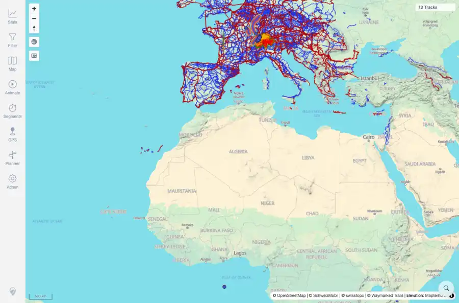

# Packet: HMO_02

## Scope

- Coverage source: `documentation/testing/frontend-regression-test-plan.md`
- Coverage ID or run packet: HMO_02
- In scope: Independent map overlay toggles and overlay opacity controls.
- Out of scope: Other coverage IDs except where noted as shared state/evidence.

## Prerequisites

- Required previous coverage IDs or run packets: HMO_01 terminal; map layer controls available.
- Required app/data state: Current run-state and packet set for this run.
- Required browser context: As specified by the coverage action.

## Allowed Mutations

- Allowed: Toggle overlay rows, adjust an overlay opacity slider, capture evidence, and update HMO_02 packet/run-state.
- Not allowed: Collapse this ID into a parent row or skip required direct evidence.

## Actions And Results

| Coverage ID | Action | Expected result | Actual result | Status | Evidence |
|---|---|---|---|---|---|
| HMO_02 | Toggled Hiking, Cycling, MTB, Swiss route, and trail overlay rows independently, then adjusted Hiking Routes opacity. | Each overlay toggles independently, opacity sliders work, and overlay rows remain enabled in their intended ordering relative to tracks. | PASS: all seven overlay rows changed to enabled independently, the Hiking Routes opacity slider was present, and enabled state persisted after the opacity interaction. | PASS | [assets/HMO_02-overlays-on-opacity.webp](../assets/HMO_02-overlays-on-opacity.webp); [assets/HMO_02-overlays-on-opacity.txt](../assets/HMO_02-overlays-on-opacity.txt) |

## Issues

| ID | Severity | Summary | Reproduction | Expected | Actual | Evidence | Release impact |
|---|---|---|---|---|---|---|---|

## Evidence Files

| File | Purpose |
|---|---|
| [assets/HMO_02-overlays-on-opacity.webp](../assets/HMO_02-overlays-on-opacity.webp) | Screenshot evidence |
| [assets/HMO_02-overlays-on-opacity.txt](../assets/HMO_02-overlays-on-opacity.txt) | Text/log evidence |

## Screenshot Evidence

## Timings

| Step | Timing |
|---|---:|
| Overlay toggles and opacity check | ~45 seconds |

## Handoff Notes

- Completed: This coverage ID is terminal.
- Remaining unfinished coverage: Continue with the next queue row.
- Blocked or not applicable: none.
- State left for the next packet: unchanged.
