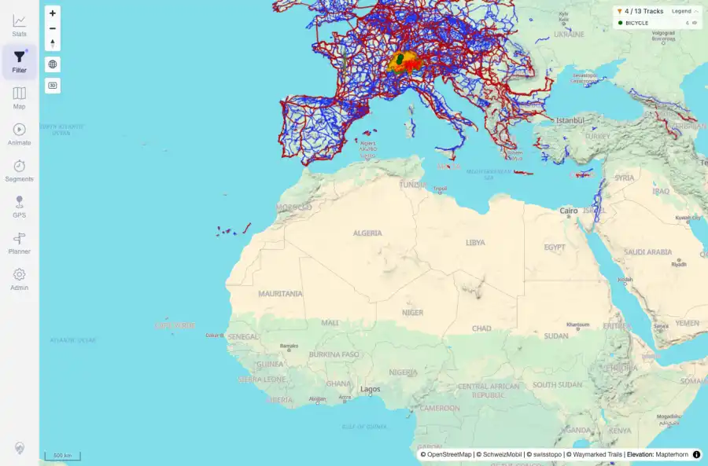

# Packet: HMO_03

## Scope

- Coverage source: `documentation/testing/frontend-regression-test-plan.md`
- Coverage ID or run packet: HMO_03
- In scope: Heatmap behavior after filter changes.
- Out of scope: Other coverage IDs except where noted as shared state/evidence.

## Prerequisites

- Required previous coverage IDs or run packets: HMO_01 and HMO_02 terminal; synthetic crossing tracks available from earlier packets.
- Required app/data state: Current run-state and packet set for this run.
- Required browser context: As specified by the coverage action.

## Allowed Mutations

- Allowed: Apply a keyword filter, observe filtered map and heatmap state, capture evidence, and update HMO_03 packet/run-state.
- Not allowed: Collapse this ID into a parent row or skip required direct evidence.

## Actions And Results

| Coverage ID | Action | Expected result | Actual result | Status | Evidence |
|---|---|---|---|---|---|
| HMO_03 | Applied the keyword filter 'synthetic' while heatmap/map layers were active and inspected the filtered map count. | Heatmap updates with the active filters and the map reflects the filtered track set. | PASS: keyword filter was active, the live map count became 4 matching tracks, and the main counter showed 4 / 13 Tracks with heatmap evidence captured. | PASS | [assets/HMO_03-filtered-heatmap.webp](../assets/HMO_03-filtered-heatmap.webp); [assets/HMO_03-filtered-heatmap.txt](../assets/HMO_03-filtered-heatmap.txt) |

## Issues

| ID | Severity | Summary | Reproduction | Expected | Actual | Evidence | Release impact |
|---|---|---|---|---|---|---|---|

## Evidence Files

| File | Purpose |
|---|---|
| [assets/HMO_03-filtered-heatmap.webp](../assets/HMO_03-filtered-heatmap.webp) | Screenshot evidence |
| [assets/HMO_03-filtered-heatmap.txt](../assets/HMO_03-filtered-heatmap.txt) | Text/log evidence |

## Screenshot Evidence

## Timings

| Step | Timing |
|---|---:|
| Filtered heatmap check | ~30 seconds |

## Handoff Notes

- Completed: This coverage ID is terminal.
- Remaining unfinished coverage: Continue with the next queue row.
- Blocked or not applicable: none.
- State left for the next packet: unchanged.
