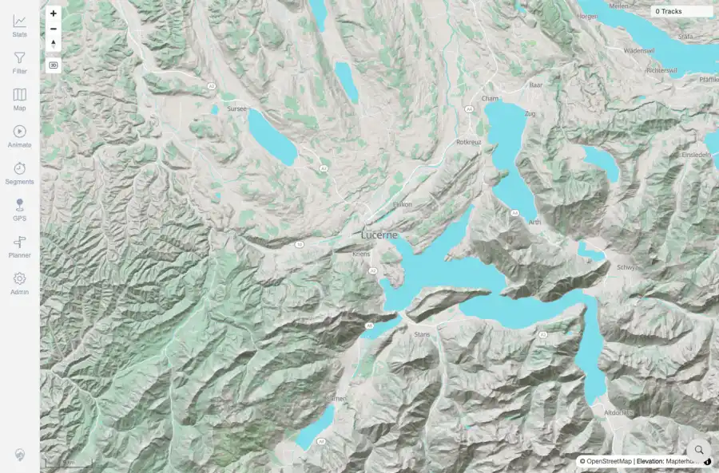
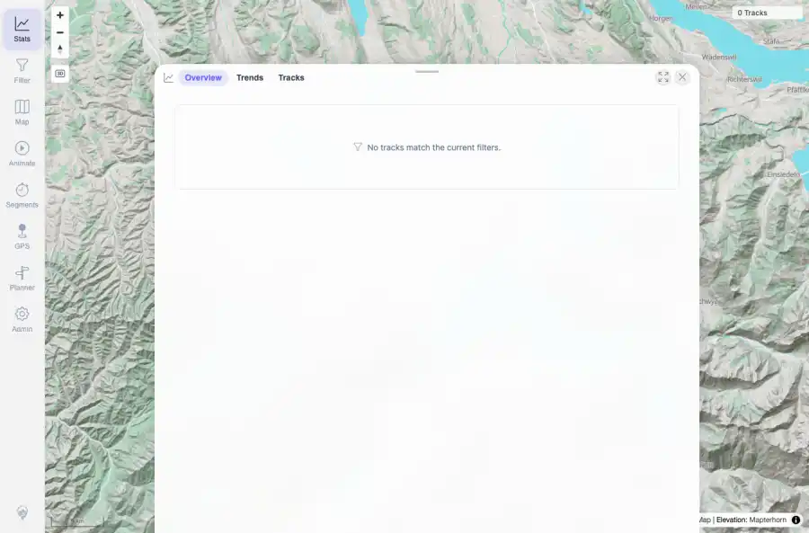

# Packet: IMP_01

## Scope

- Coverage source: `documentation/testing/frontend-regression-test-plan.md`
- Coverage ID or run packet: IMP_01
- In scope: Capture baseline map count, track-browser count, statistics totals, data-freshness token, and GPS indexer status before import.
- Out of scope: Other coverage IDs except where noted as shared state/evidence.

## Prerequisites

- Required previous coverage IDs or run packets: DAT_01-DAT_07 staged data complete; DAT_03 imported mappings intentionally deferred.
- Required app/data state: Current run-state and packet set for this run.
- Required browser context: As specified by the coverage action.

## Allowed Mutations

- Allowed: Read-only UI/API baseline capture.
- Not allowed: Collapse this ID into a parent row or skip required direct evidence.

## Actions And Results

| Coverage ID | Action | Expected result | Actual result | Status | Evidence |
|---|---|---|---|---|---|
| IMP_01 | Opened authenticated desktop map and Stats surfaces, captured screenshots/text, and queried data-freshness, indexer status, tracks/get, and tracks/get-simplified before copying any staged GPX files. | Baseline counts/totals/freshness/indexer state are recorded before import mutation. | Map showed `0 Tracks`; Stats text showed `Overview Trends Tracks No tracks match the current filters`; API returned tracks/get `[]`, simplified count 0, freshness revisions with tracks/index/geometry at 0, and indexer status `[]`. | PASS | [assets/IMP_01-map-baseline.webp](../assets/IMP_01-map-baseline.webp); [assets/IMP_01-stats-baseline.webp](../assets/IMP_01-stats-baseline.webp); [assets/IMP_01-api-baseline.txt](../assets/IMP_01-api-baseline.txt); [assets/IMP_01-map-baseline.txt](../assets/IMP_01-map-baseline.txt); [assets/IMP_01-stats-baseline.txt](../assets/IMP_01-stats-baseline.txt) |

## Issues

| ID | Severity | Summary | Reproduction | Expected | Actual | Evidence | Release impact |
|---|---|---|---|---|---|---|---|

## Evidence Files

| File | Purpose |
|---|---|
| [assets/IMP_01-map-baseline.webp](../assets/IMP_01-map-baseline.webp) | Screenshot evidence |
| [assets/IMP_01-stats-baseline.webp](../assets/IMP_01-stats-baseline.webp) | Screenshot evidence |
| [assets/IMP_01-api-baseline.txt](../assets/IMP_01-api-baseline.txt) | Text/log evidence |
| [assets/IMP_01-map-baseline.txt](../assets/IMP_01-map-baseline.txt) | Text/log evidence |
| [assets/IMP_01-stats-baseline.txt](../assets/IMP_01-stats-baseline.txt) | Text/log evidence |

## Screenshot Evidence

## Timings

| Step | Timing |
|---|---:|
| Baseline API capture | <1 second |\n| Baseline UI capture | 10 seconds |

## Handoff Notes

- Completed: This coverage ID is terminal.
- Remaining unfinished coverage: Continue with the next queue row.
- Blocked or not applicable: none.
- State left for the next packet: unchanged.
