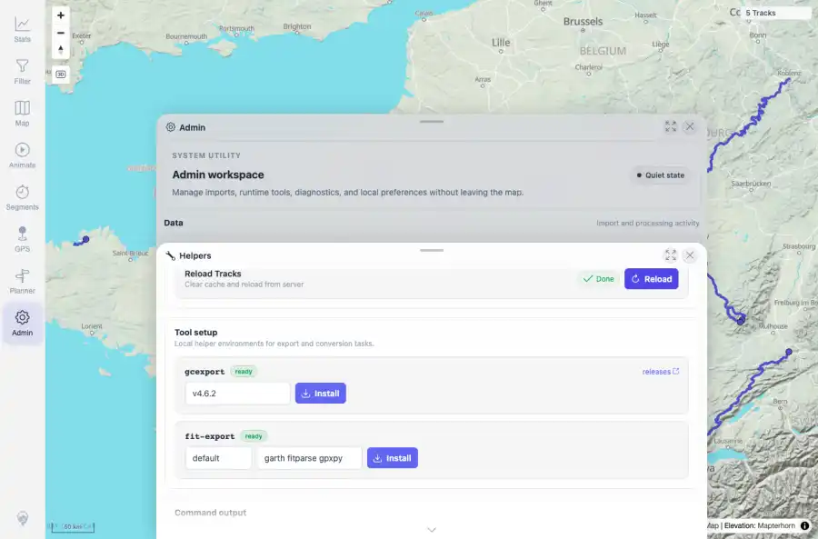
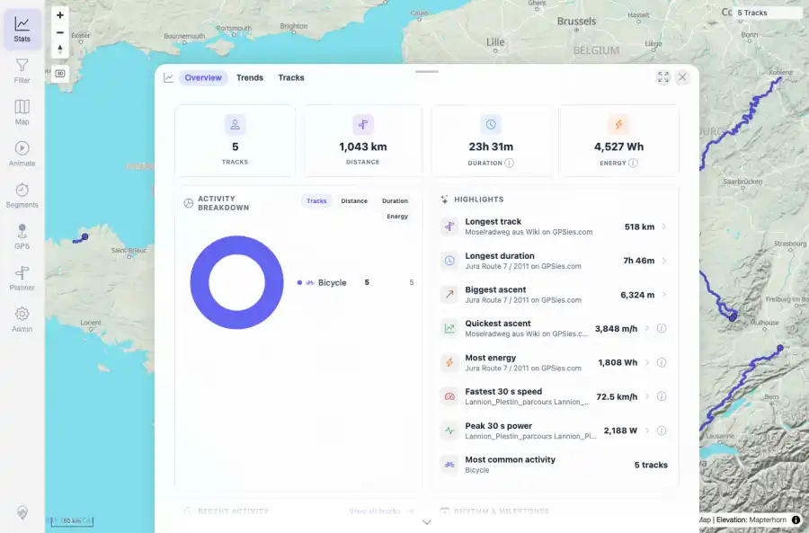
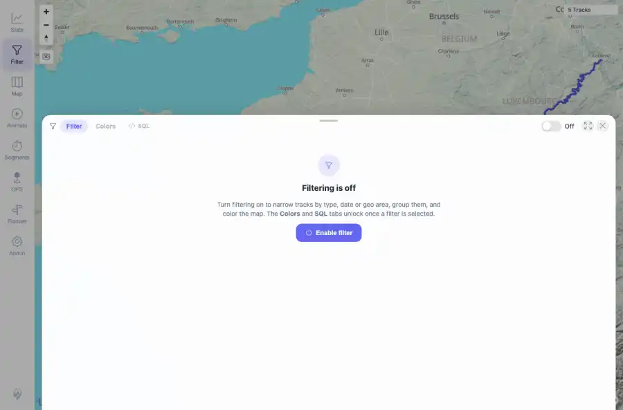

# Packet: IMP_05

## Scope

- Coverage source: `documentation/testing/frontend-regression-test-plan.md`
- Coverage ID or run packet: IMP_05
- In scope: Reload/refresh client track cache after import and verify map, track browser, filters, and statistics show the new data.
- Out of scope: Other coverage IDs except where noted as shared state/evidence.

## Prerequisites

- Required previous coverage IDs or run packets: IMP_04 five GPX files indexed and background jobs settled.
- Required app/data state: Current run-state and packet set for this run.
- Required browser context: As specified by the coverage action.

## Allowed Mutations

- Allowed: Use Admin Helpers Reload Tracks and navigate read-only UI surfaces.
- Not allowed: Collapse this ID into a parent row or skip required direct evidence.

## Actions And Results

| Coverage ID | Action | Expected result | Actual result | Status | Evidence |
|---|---|---|---|---|---|
| IMP_05 | Used Admin Helpers Reload Tracks, then checked a clean map load, Stats overview, Stats Tracks tab, Filter panel, and authenticated count APIs. | Reload from freshness banner or helper reload action makes map, track browser, filters, and statistics show the new imported data. | Helpers reload showed `Done`; clean map showed `5 Tracks`; Stats showed 5 tracks / 1,043 km / 23h 31m; Tracks tab listed all five imported rows; Filter opened against the five-track map; simplified and tracks APIs both returned count 5. | PASS | [assets/IMP_05-reload-helper.webp](../assets/IMP_05-reload-helper.webp); [assets/IMP_05-map-after-reload.webp](../assets/IMP_05-map-after-reload.webp); [assets/IMP_05-stats-after-reload.webp](../assets/IMP_05-stats-after-reload.webp); [assets/IMP_05-tracks-after-reload.webp](../assets/IMP_05-tracks-after-reload.webp); [assets/IMP_05-filter-after-reload.webp](../assets/IMP_05-filter-after-reload.webp); [assets/IMP_05-ui-api-summary.txt](../assets/IMP_05-ui-api-summary.txt) |

## Issues

| ID | Severity | Summary | Reproduction | Expected | Actual | Evidence | Release impact |
|---|---|---|---|---|---|---|---|

## Evidence Files

| File | Purpose |
|---|---|
| [assets/IMP_05-reload-helper.webp](../assets/IMP_05-reload-helper.webp) | Screenshot evidence |
| [assets/IMP_05-map-after-reload.webp](../assets/IMP_05-map-after-reload.webp) | Screenshot evidence |
| [assets/IMP_05-stats-after-reload.webp](../assets/IMP_05-stats-after-reload.webp) | Screenshot evidence |
| [assets/IMP_05-tracks-after-reload.webp](../assets/IMP_05-tracks-after-reload.webp) | Screenshot evidence |
| [assets/IMP_05-filter-after-reload.webp](../assets/IMP_05-filter-after-reload.webp) | Screenshot evidence |
| [assets/IMP_05-ui-api-summary.txt](../assets/IMP_05-ui-api-summary.txt) | Text/log evidence |

## Screenshot Evidence

## Timings

| Step | Timing |
|---|---:|
| Helper reload and surface checks | 30 seconds |

## Handoff Notes

- Completed: This coverage ID is terminal.
- Remaining unfinished coverage: Continue with the next queue row.
- Blocked or not applicable: none.
- State left for the next packet: unchanged.
