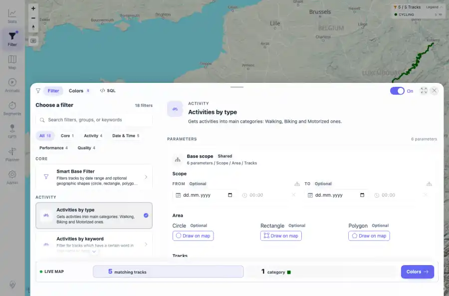
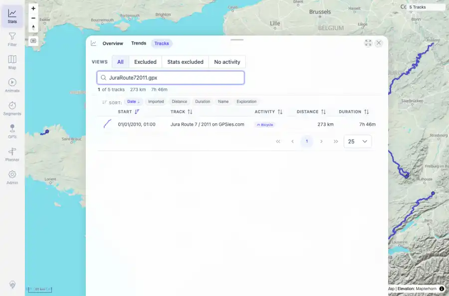

# Packet: IMP_06

## Scope

- Coverage source: `documentation/testing/frontend-regression-test-plan.md`
- Coverage ID or run packet: IMP_06
- In scope: Verify each imported file by name in track browser search, map presence, statistics summaries, and at least one filter result.
- Out of scope: Other coverage IDs except where noted as shared state/evidence.

## Prerequisites

- Required previous coverage IDs or run packets: IMP_05 post-import map/browser/filter/stats visibility passed.
- Required app/data state: Current run-state and packet set for this run.
- Required browser context: As specified by the coverage action.

## Allowed Mutations

- Allowed: Track browser searches and enabling/selecting the Activities by type filter.
- Not allowed: Collapse this ID into a parent row or skip required direct evidence.

## Actions And Results

| Coverage ID | Action | Expected result | Actual result | Status | Evidence |
|---|---|---|---|---|---|
| IMP_06 | Searched the Stats Tracks tab for each imported filename, checked full map geometry API for all five IDs, referenced Stats/Tracks aggregate summaries, and selected Activities by type in the filter catalog. | Each imported file appears in browser search, on the map, in statistics summaries, and in at least one filter result. | All five filename searches returned one of five matching rows; full map response returned five track IDs with one geometry entry each; Stats/Tracks summaries show 5 tracks / 1,043 km / 23h 31m; Activities by type filter shows `5 / 5 Tracks`, legend `CYCLING 5`, and simplified filter groups for all five IDs. | PASS | [assets/IMP_06-browser-search-summary.txt](../assets/IMP_06-browser-search-summary.txt); [assets/IMP_06-api-file-summary.txt](../assets/IMP_06-api-file-summary.txt); [assets/IMP_06-filter-result.webp](../assets/IMP_06-filter-result.webp); [assets/IMP_06-search-JuraRoute72011-gpx.webp](../assets/IMP_06-search-JuraRoute72011-gpx.webp); [assets/IMP_06-search-Lannion-Plestin-parcours24-4RE-gpx.webp](../assets/IMP_06-search-Lannion-Plestin-parcours24-4RE-gpx.webp); [assets/IMP_05-stats-after-reload.txt](../assets/IMP_05-stats-after-reload.txt); [assets/IMP_05-tracks-after-reload.txt](../assets/IMP_05-tracks-after-reload.txt) |

## Issues

| ID | Severity | Summary | Reproduction | Expected | Actual | Evidence | Release impact |
|---|---|---|---|---|---|---|---|

## Evidence Files

| File | Purpose |
|---|---|
| [assets/IMP_06-browser-search-summary.txt](../assets/IMP_06-browser-search-summary.txt) | Text/log evidence |
| [assets/IMP_06-api-file-summary.txt](../assets/IMP_06-api-file-summary.txt) | Text/log evidence |
| [assets/IMP_06-filter-result.webp](../assets/IMP_06-filter-result.webp) | Screenshot evidence |
| [assets/IMP_06-search-JuraRoute72011-gpx.webp](../assets/IMP_06-search-JuraRoute72011-gpx.webp) | Screenshot evidence |
| [assets/IMP_06-search-Lannion-Plestin-parcours24-4RE-gpx.webp](../assets/IMP_06-search-Lannion-Plestin-parcours24-4RE-gpx.webp) | Screenshot evidence |
| [assets/IMP_05-stats-after-reload.txt](../assets/IMP_05-stats-after-reload.txt) | Text/log evidence |
| [assets/IMP_05-tracks-after-reload.txt](../assets/IMP_05-tracks-after-reload.txt) | Text/log evidence |

## Screenshot Evidence

## Timings

| Step | Timing |
|---|---:|
| Per-file browser searches | 8 seconds |\n| Filter result check | 7 seconds |

## Handoff Notes

- Completed: This coverage ID is terminal.
- Remaining unfinished coverage: Continue with the next queue row.
- Blocked or not applicable: none.
- State left for the next packet: unchanged.
