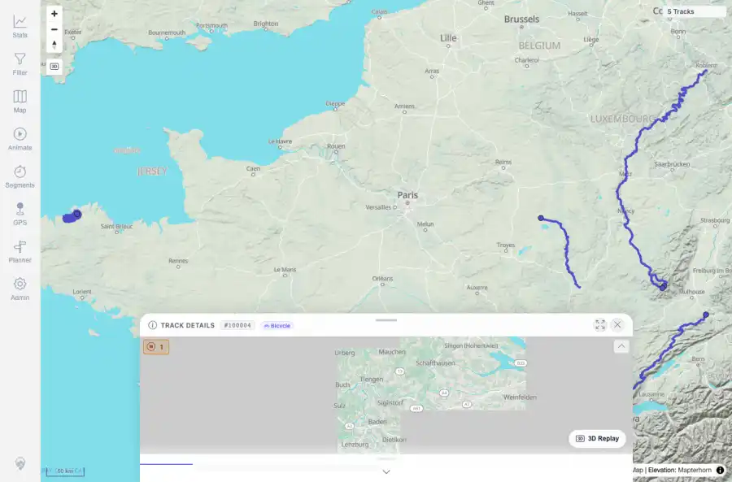
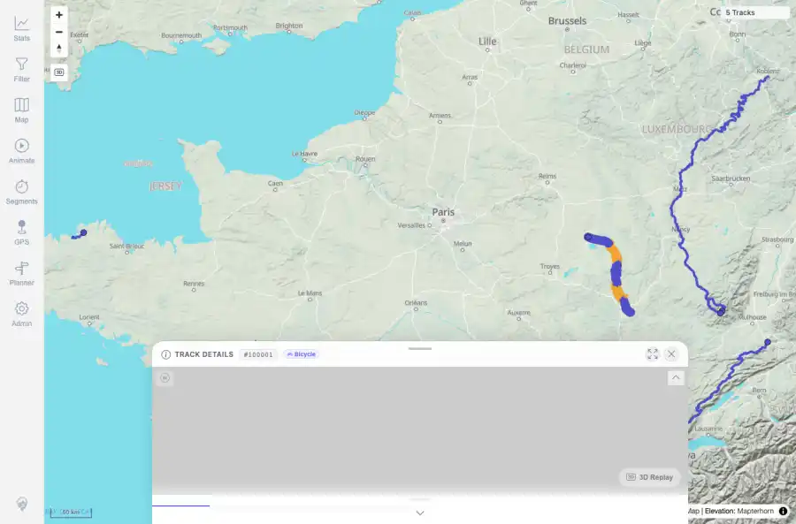
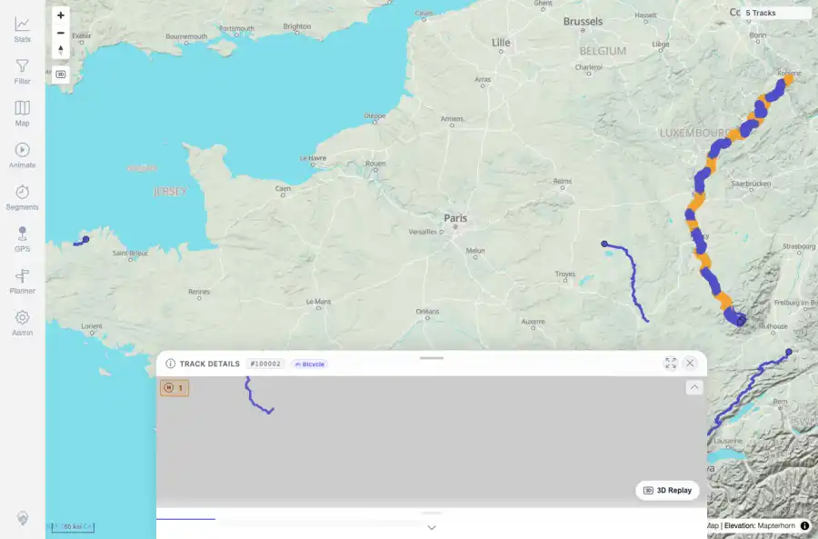
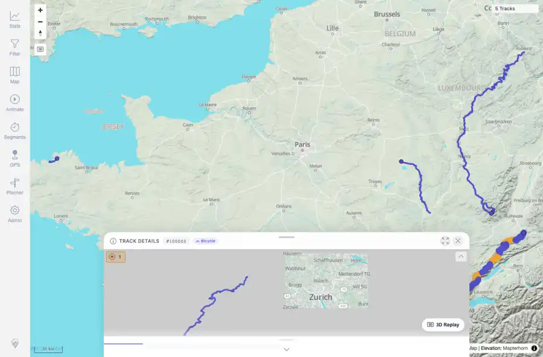
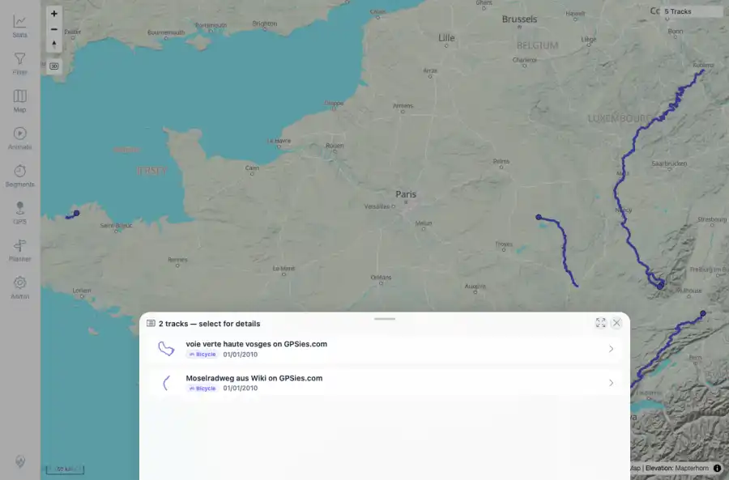
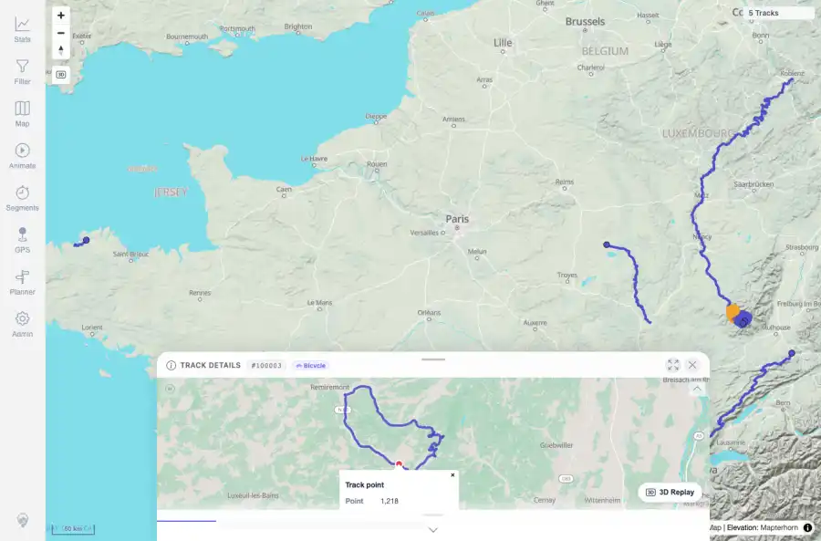

# Packet: IMP_07

## Scope

- Coverage source: `documentation/testing/frontend-regression-test-plan.md`
- Coverage ID or run packet: IMP_07
- In scope: Zoom/imported map geometry, rendered map clicks for each imported GPX track, overlap selection, detail opening, point popup, and stale/duplicate-line check.
- Out of scope: Other coverage IDs except where noted as shared state/evidence.

## Prerequisites

- Required previous coverage IDs or run packets: IMP_06 confirmed five imported tracks visible in map/filter/stats data.
- Required app/data state: Current run-state and packet set for this run.
- Required browser context: As specified by the coverage action.

## Allowed Mutations

- Allowed: Click rendered map tracks, use overlap chooser, open details, and click a detail mini-map point.
- Not allowed: Collapse this ID into a parent row or skip required direct evidence.

## Actions And Results

| Coverage ID | Action | Expected result | Actual result | Status | Evidence |
|---|---|---|---|---|---|
| IMP_07 | Captured clean five-track map; clicked rendered map line positions for Lannion, Vitry, Mosel, Jura, and the Voie/Mosel overlap; selected Voie from the chooser; clicked the detail mini-map to open a track-point popup. | Imported tracks are visible; each track can be clicked/selected; details open; point popup shows metrics; no stale or duplicated lines appear. | Map showed five visible imported lines; direct map clicks opened Lannion #100004, Vitry #100001, Mosel #100002, and Jura #100000; overlap click listed Voie and Mosel, selecting Voie opened #100003; mini-map popup showed Track point, time, distance, elevation, speed, and elapsed metrics. | PASS | [assets/IMP_07-map-clean.webp](../assets/IMP_07-map-clean.webp); [assets/IMP_07-click-Lannion_Plestin1.webp](../assets/IMP_07-click-Lannion_Plestin1.webp); [assets/IMP_07-try-vitry-grid.webp](../assets/IMP_07-try-vitry-grid.webp); [assets/IMP_07-try-mosel4.webp](../assets/IMP_07-try-mosel4.webp); [assets/IMP_07-try-jura2.webp](../assets/IMP_07-try-jura2.webp); [assets/IMP_07-try-voie1.webp](../assets/IMP_07-try-voie1.webp); [assets/IMP_07-select-VoieVerte.webp](../assets/IMP_07-select-VoieVerte.webp); [assets/IMP_07-point-popup.webp](../assets/IMP_07-point-popup.webp); [assets/IMP_07-precise-click-attempts.txt](../assets/IMP_07-precise-click-attempts.txt) |

## Issues

| ID | Severity | Summary | Reproduction | Expected | Actual | Evidence | Release impact |
|---|---|---|---|---|---|---|---|

## Evidence Files

| File | Purpose |
|---|---|
| [assets/IMP_07-map-clean.webp](../assets/IMP_07-map-clean.webp) | Screenshot evidence |
| [assets/IMP_07-click-Lannion_Plestin1.webp](../assets/IMP_07-click-Lannion_Plestin1.webp) | Screenshot evidence |
| [assets/IMP_07-try-vitry-grid.webp](../assets/IMP_07-try-vitry-grid.webp) | Screenshot evidence |
| [assets/IMP_07-try-mosel4.webp](../assets/IMP_07-try-mosel4.webp) | Screenshot evidence |
| [assets/IMP_07-try-jura2.webp](../assets/IMP_07-try-jura2.webp) | Screenshot evidence |
| [assets/IMP_07-try-voie1.webp](../assets/IMP_07-try-voie1.webp) | Screenshot evidence |
| [assets/IMP_07-select-VoieVerte.webp](../assets/IMP_07-select-VoieVerte.webp) | Screenshot evidence |
| [assets/IMP_07-point-popup.webp](../assets/IMP_07-point-popup.webp) | Screenshot evidence |
| [assets/IMP_07-precise-click-attempts.txt](../assets/IMP_07-precise-click-attempts.txt) | Text/log evidence |

## Screenshot Evidence

## Timings

| Step | Timing |
|---|---:|
| Map click attempts and detail checks | about 3 minutes |\n| Point popup check | 2 seconds |

## Handoff Notes

- Completed: This coverage ID is terminal.
- Remaining unfinished coverage: Continue with the next queue row.
- Blocked or not applicable: none.
- State left for the next packet: unchanged.
