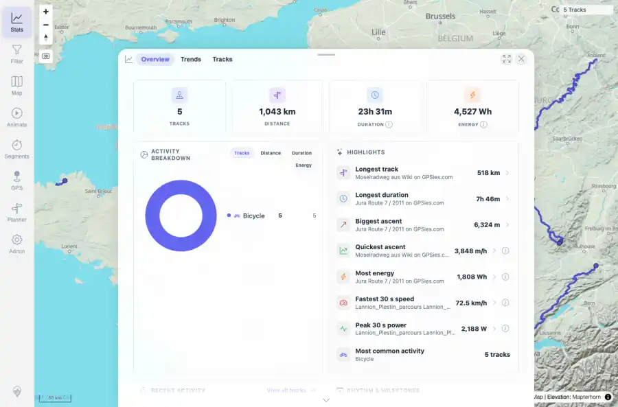
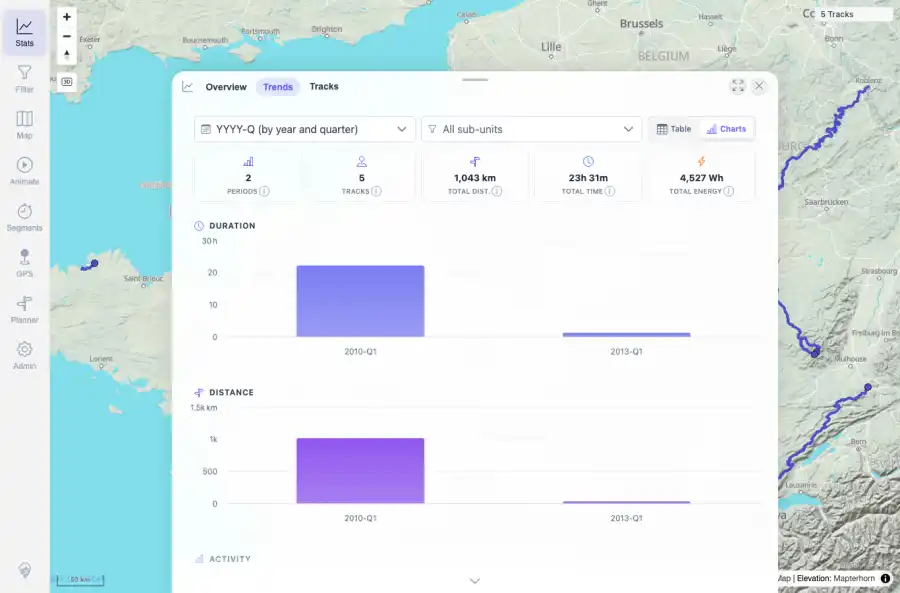
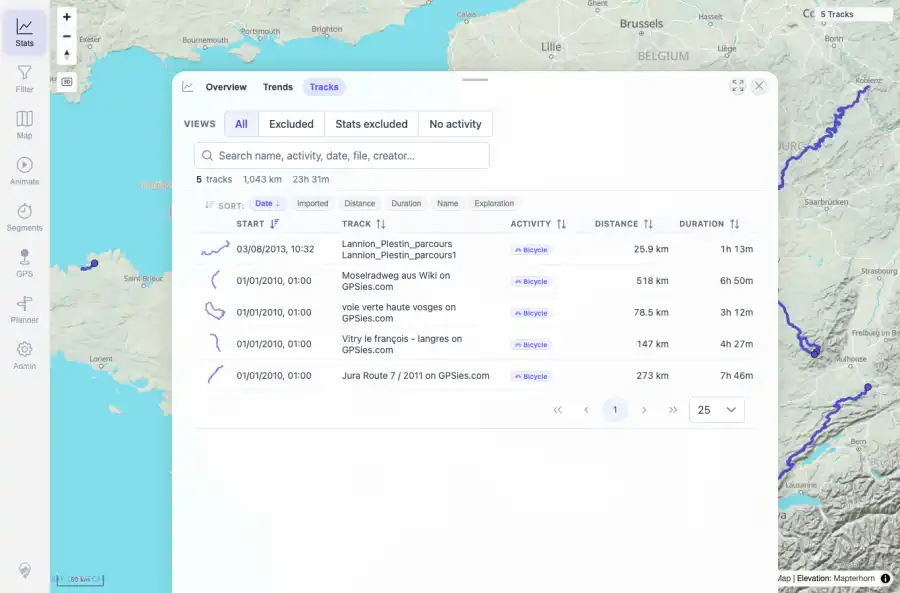
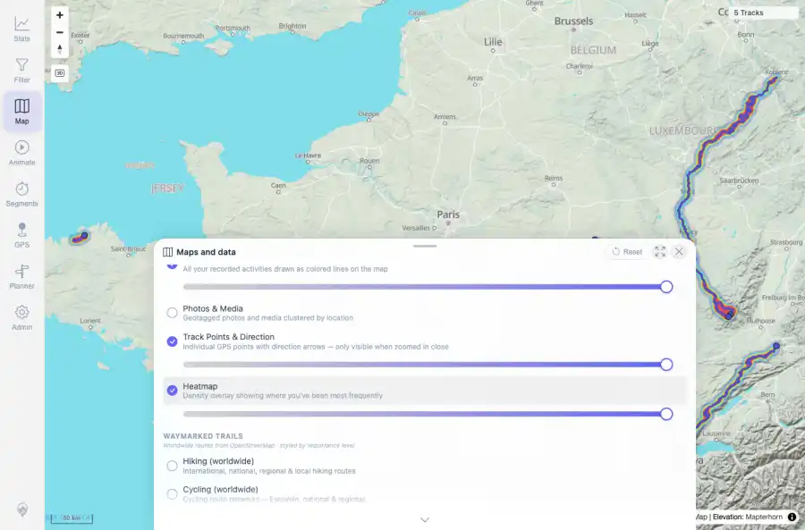
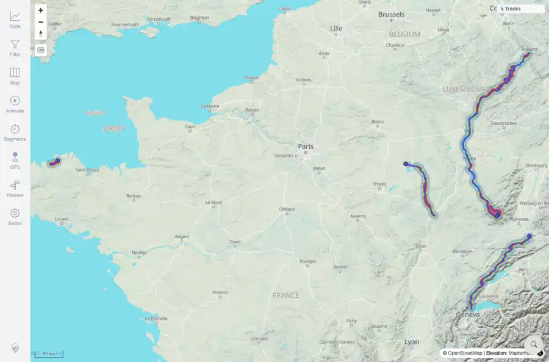

# Packet: IMP_09

## Scope

- Coverage source: `documentation/testing/frontend-regression-test-plan.md`
- Coverage ID or run packet: IMP_09
- In scope: Post-import aggregate statistics, period charts, rankings, heatmap density, and track-browser summary after five public GPX imports.
- Out of scope: Other coverage IDs except where noted as shared state/evidence.

## Prerequisites

- Required previous coverage IDs or run packets: IMP_01 through IMP_08 terminal; five public GPX tracks present and indexed.
- Required app/data state: Current run-state and packet set for this run.
- Required browser context: As specified by the coverage action.

## Allowed Mutations

- Allowed: Read-only UI/API verification; temporary heatmap layer toggle restored off after capture; packet/run-state updates.
- Not allowed: Collapse this ID into a parent row or skip required direct evidence.

## Actions And Results

| Coverage ID | Action | Expected result | Actual result | Status | Evidence |
|---|---|---|---|---|---|
| IMP_09 | Opened Stats Overview, Trends, and Tracks; computed current API totals; enabled the Heatmap layer for visual density evidence and restored it off afterward. | Totals move from the empty baseline to non-zero count, distance, duration, ascent/descent, activity breakdown, period chart data, rankings, heatmap density, and a five-track browser summary. | API/UI showed 5 tracks, 1,042.7 km, 23.76 h total duration, 12,936 m ascent, 13,086 m descent, 4,527 Wh, 7,725 trackpoints, and BICYCLE=5. Overview rankings, quarterly trend charts, track-browser summary, and heatmap layer on-state were visible; heatmap was restored off for the next packet. | PASS | [assets/IMP_09-api-stats-summary.txt](../assets/IMP_09-api-stats-summary.txt); [assets/IMP_09-stats-overview.webp](../assets/IMP_09-stats-overview.webp); [assets/IMP_09-stats-overview.txt](../assets/IMP_09-stats-overview.txt); [assets/IMP_09-stats-trends.webp](../assets/IMP_09-stats-trends.webp); [assets/IMP_09-stats-trends.txt](../assets/IMP_09-stats-trends.txt); [assets/IMP_09-track-browser-summary.webp](../assets/IMP_09-track-browser-summary.webp); [assets/IMP_09-track-browser-summary.txt](../assets/IMP_09-track-browser-summary.txt); [assets/IMP_09-heatmap-layer-control.webp](../assets/IMP_09-heatmap-layer-control.webp); [assets/IMP_09-heatmap-layer-control.txt](../assets/IMP_09-heatmap-layer-control.txt); [assets/IMP_09-heatmap-density.webp](../assets/IMP_09-heatmap-density.webp); [assets/IMP_09-heatmap-density.txt](../assets/IMP_09-heatmap-density.txt) |

## Issues

| ID | Severity | Summary | Reproduction | Expected | Actual | Evidence | Release impact |
|---|---|---|---|---|---|---|---|

## Evidence Files

| File | Purpose |
|---|---|
| [assets/IMP_09-api-stats-summary.txt](../assets/IMP_09-api-stats-summary.txt) | Text/log evidence |
| [assets/IMP_09-stats-overview.webp](../assets/IMP_09-stats-overview.webp) | Screenshot evidence |
| [assets/IMP_09-stats-overview.txt](../assets/IMP_09-stats-overview.txt) | Text/log evidence |
| [assets/IMP_09-stats-trends.webp](../assets/IMP_09-stats-trends.webp) | Screenshot evidence |
| [assets/IMP_09-stats-trends.txt](../assets/IMP_09-stats-trends.txt) | Text/log evidence |
| [assets/IMP_09-track-browser-summary.webp](../assets/IMP_09-track-browser-summary.webp) | Screenshot evidence |
| [assets/IMP_09-track-browser-summary.txt](../assets/IMP_09-track-browser-summary.txt) | Text/log evidence |
| [assets/IMP_09-heatmap-layer-control.webp](../assets/IMP_09-heatmap-layer-control.webp) | Screenshot evidence |
| [assets/IMP_09-heatmap-layer-control.txt](../assets/IMP_09-heatmap-layer-control.txt) | Text/log evidence |
| [assets/IMP_09-heatmap-density.webp](../assets/IMP_09-heatmap-density.webp) | Screenshot evidence |
| [assets/IMP_09-heatmap-density.txt](../assets/IMP_09-heatmap-density.txt) | Text/log evidence |

## Screenshot Evidence

## Timings

| Step | Timing |
|---|---:|
| Browser/API evidence capture | 24 seconds |

## Handoff Notes

- Completed: This coverage ID is terminal.
- Remaining unfinished coverage: Continue with the next queue row.
- Blocked or not applicable: none.
- State left for the next packet: unchanged.
