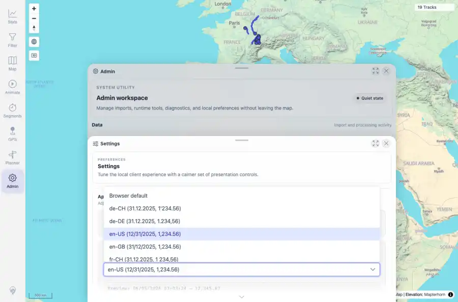
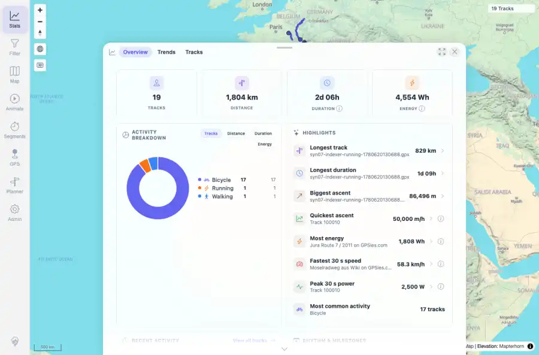

# Packet: LOC_01

## Scope

- Coverage source: `documentation/testing/frontend-regression-test-plan.md`
- Coverage ID or run packet: LOC_01
- In scope: Locale-aware rendering for numbers, distances, durations, and dates under the expected browser/default en-US locale.
- Out of scope: Other coverage IDs except where noted as shared state/evidence.

## Prerequisites

- Required previous coverage IDs or run packets: Previous queue rows terminal or explicitly not required.
- Required app/data state: Current run-state and packet set for this run.
- Required browser context: As specified by the coverage action.

## Allowed Mutations

- Allowed: Read-only verification and packet/run-state updates.
- Not allowed: Collapse this ID into a parent row or skip required direct evidence.

## Actions And Results

| Coverage ID | Action | Expected result | Actual result | Status | Evidence |
|---|---|---|---|---|---|
| LOC_01 | Opened Admin Settings and Stats in an en-US browser context; captured locale preview, statistics totals, dates, distances, durations, and checked for bad literals. | Numbers, distances, durations, and dates render in the expected locale format. | Effective browser/default en-US formatting used comma thousands and slash dates: Stats showed examples such as 1,804 km, 4,554 Wh, 86,496 m, 0m 00s durations, and 06/04/2026-style dates; no NaN/undefined/null literals were visible. | PASS | [assets/LOC_01-en-us-settings.webp](../assets/LOC_01-en-us-settings.webp); [assets/LOC_01-en-us-stats.webp](../assets/LOC_01-en-us-stats.webp); [assets/LOC_01-locale-formatting.txt](../assets/LOC_01-locale-formatting.txt) |

## Issues

| ID | Severity | Summary | Reproduction | Expected | Actual | Evidence | Release impact |
|---|---|---|---|---|---|---|---|

## Evidence Files

| File | Purpose |
|---|---|
| [assets/LOC_01-en-us-settings.webp](../assets/LOC_01-en-us-settings.webp) | Screenshot evidence |
| [assets/LOC_01-en-us-stats.webp](../assets/LOC_01-en-us-stats.webp) | Screenshot evidence |
| [assets/LOC_01-locale-formatting.txt](../assets/LOC_01-locale-formatting.txt) | Text/log evidence |

## Screenshot Evidence

## Timings

| Step | Timing |
|---|---:|
| Locale format capture | ~45 seconds |

## Handoff Notes

- Completed: This coverage ID is terminal.
- Remaining unfinished coverage: Continue with the next queue row.
- Blocked or not applicable: none.
- State left for the next packet: unchanged.
