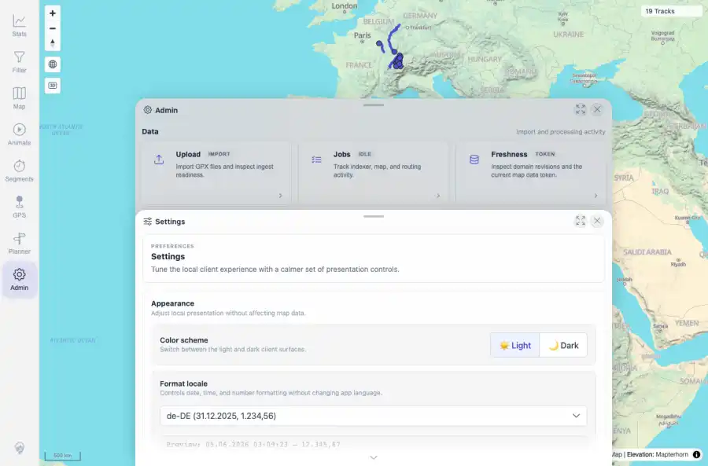
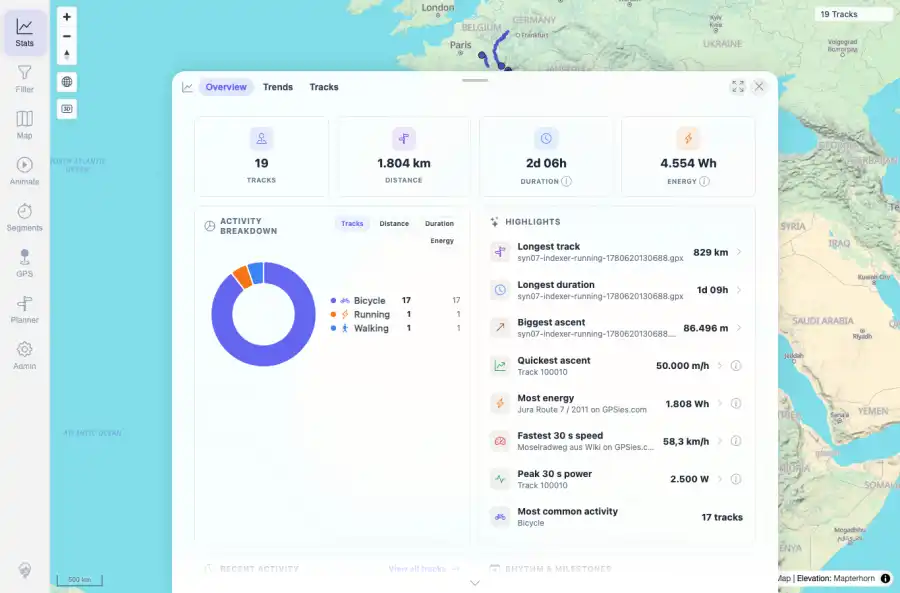

# Packet: LOC_02

## Scope

- Coverage source: `documentation/testing/frontend-regression-test-plan.md`
- Coverage ID or run packet: LOC_02
- In scope: Changing locale through the available Admin Settings locale selector without page reload.
- Out of scope: Other coverage IDs except where noted as shared state/evidence.

## Prerequisites

- Required previous coverage IDs or run packets: Previous queue rows terminal or explicitly not required.
- Required app/data state: Current run-state and packet set for this run.
- Required browser context: As specified by the coverage action.

## Allowed Mutations

- Allowed: Read-only verification and packet/run-state updates.
- Not allowed: Collapse this ID into a parent row or skip required direct evidence.

## Actions And Results

| Coverage ID | Action | Expected result | Actual result | Status | Evidence |
|---|---|---|---|---|---|
| LOC_02 | Opened Admin Settings, selected de-DE from the locale dropdown after scrolling Settings into view, then opened Stats in the same session without browser reload. | Changing locale updates formatting across the app without reload artifacts. | The locale selector stored de-DE, preview changed from en-US to German formatting, and Stats used German separators such as 1.804 km, 4.554 Wh, and 86.496 m without bad literals. | PASS | [assets/LOC_02-de-de-settings.webp](../assets/LOC_02-de-de-settings.webp); [assets/LOC_02-de-de-stats.webp](../assets/LOC_02-de-de-stats.webp); [assets/LOC_02-locale-live-change.txt](../assets/LOC_02-locale-live-change.txt) |

## Issues

| ID | Severity | Summary | Reproduction | Expected | Actual | Evidence | Release impact |
|---|---|---|---|---|---|---|---|

## Evidence Files

| File | Purpose |
|---|---|
| [assets/LOC_02-de-de-settings.webp](../assets/LOC_02-de-de-settings.webp) | Screenshot evidence |
| [assets/LOC_02-de-de-stats.webp](../assets/LOC_02-de-de-stats.webp) | Screenshot evidence |
| [assets/LOC_02-locale-live-change.txt](../assets/LOC_02-locale-live-change.txt) | Text/log evidence |

## Screenshot Evidence

## Timings

| Step | Timing |
|---|---:|
| Locale change and Stats capture | ~1 minute |

## Handoff Notes

- Completed: This coverage ID is terminal.
- Remaining unfinished coverage: Continue with the next queue row.
- Blocked or not applicable: none.
- State left for the next packet: unchanged.
