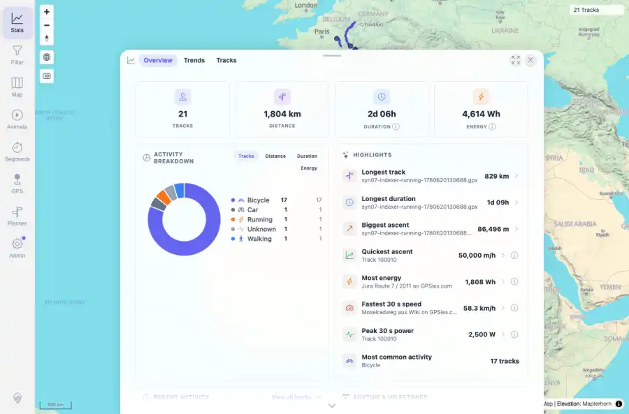

# Packet: LOC_04

## Scope

- Coverage source: `documentation/testing/frontend-regression-test-plan.md`
- Coverage ID or run packet: LOC_04
- In scope: Boundary value rendering for zero, very large, missing-elevation, and negative-elevation synthetic inputs.
- Out of scope: Other coverage IDs except where noted as shared state/evidence.

## Prerequisites

- Required previous coverage IDs or run packets: Previous queue rows terminal or explicitly not required.
- Required app/data state: Current run-state and packet set for this run.
- Required browser context: As specified by the coverage action.

## Allowed Mutations

- Allowed: Read-only verification and packet/run-state updates.
- Not allowed: Collapse this ID into a parent row or skip required direct evidence.

## Actions And Results

| Coverage ID | Action | Expected result | Actual result | Status | Evidence |
|---|---|---|---|---|---|
| LOC_04 | Uploaded two fully synthetic boundary GPX tracks: one with no elevation values and zero duration, one with negative elevation values; waited for indexing, opened a fresh Stats context, and checked visible rows plus API summary. | Boundary values render sensibly, not as NaN or blank/bad literals. | Both uploads indexed; fresh Stats showed the missing-elevation/zero-duration row as 0.00 m and 0m 00s, the negative-elevation source as an 82.89 m row, existing large totals still rendered as 1,804 km and 86,496 m, and no NaN/undefined/null value literals appeared. | PASS | [assets/LOC_04-boundary-values.webp](../assets/LOC_04-boundary-values.webp); [assets/LOC_04-boundary-values.txt](../assets/LOC_04-boundary-values.txt) |

## Issues

| ID | Severity | Summary | Reproduction | Expected | Actual | Evidence | Release impact |
|---|---|---|---|---|---|---|---|

## Evidence Files

| File | Purpose |
|---|---|
| [assets/LOC_04-boundary-values.webp](../assets/LOC_04-boundary-values.webp) | Screenshot evidence |
| [assets/LOC_04-boundary-values.txt](../assets/LOC_04-boundary-values.txt) | Text/log evidence |

## Screenshot Evidence

## Timings

| Step | Timing |
|---|---:|
| Boundary upload/index/UI check | ~1 minute |

## Handoff Notes

- Completed: This coverage ID is terminal.
- Remaining unfinished coverage: Continue with the next queue row.
- Blocked or not applicable: none.
- State left for the next packet: unchanged.
