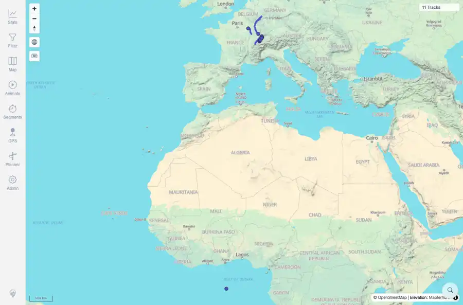
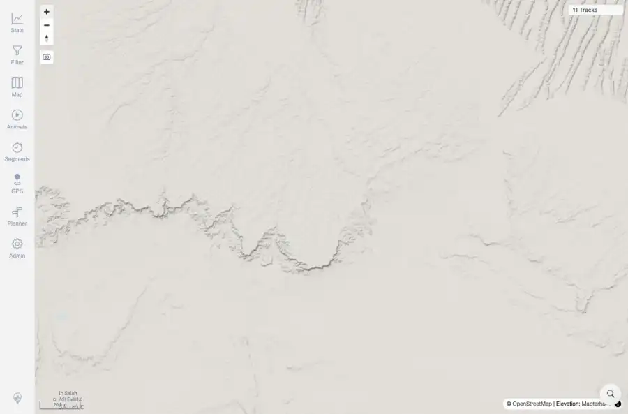

# Packet: MAP_05

## Scope

- Coverage source: `documentation/testing/frontend-regression-test-plan.md`
- Coverage ID or run packet: MAP_05
- In scope: Zoom in on a track and verify detail/precision improves without duplicate or broken lines.
- Out of scope: Other coverage IDs except where noted as shared state/evidence.

## Prerequisites

- Required previous coverage IDs or run packets: Current map with 11 tracks loaded.
- Required app/data state: Current run-state and packet set for this run.
- Required browser context: As specified by the coverage action.

## Allowed Mutations

- Allowed: Map zoom interaction and packet/run-state updates.
- Not allowed: Collapse this ID into a parent row or skip required direct evidence.

## Actions And Results

| Coverage ID | Action | Expected result | Actual result | Status | Evidence |
|---|---|---|---|---|---|
| MAP_05 | Captured map before zoom, clicked Zoom in five times, and captured the resulting higher-zoom map state. | Zooming in improves map detail/precision and does not create duplicate/broken track lines. | Zoom interaction completed with map still rendering 11 tracks and no visible broken/duplicate-line state or loading failure in the zoom-after screenshot. | PASS | [assets/MAP_05-zoom-before.webp](../assets/MAP_05-zoom-before.webp); [assets/MAP_05-zoom-before.txt](../assets/MAP_05-zoom-before.txt); [assets/MAP_05-zoom-after.webp](../assets/MAP_05-zoom-after.webp); [assets/MAP_05-zoom-after.txt](../assets/MAP_05-zoom-after.txt); [assets/MAP_05_12-interaction-summary.txt](../assets/MAP_05_12-interaction-summary.txt) |

## Issues

| ID | Severity | Summary | Reproduction | Expected | Actual | Evidence | Release impact |
|---|---|---|---|---|---|---|---|

## Evidence Files

| File | Purpose |
|---|---|
| [assets/MAP_05-zoom-before.webp](../assets/MAP_05-zoom-before.webp) | Screenshot evidence |
| [assets/MAP_05-zoom-before.txt](../assets/MAP_05-zoom-before.txt) | Text/log evidence |
| [assets/MAP_05-zoom-after.webp](../assets/MAP_05-zoom-after.webp) | Screenshot evidence |
| [assets/MAP_05-zoom-after.txt](../assets/MAP_05-zoom-after.txt) | Text/log evidence |
| [assets/MAP_05_12-interaction-summary.txt](../assets/MAP_05_12-interaction-summary.txt) | Text/log evidence |

## Screenshot Evidence

## Timings

| Step | Timing |
|---|---:|
| Browser zoom interaction | 4 seconds |

## Handoff Notes

- Completed: This coverage ID is terminal.
- Remaining unfinished coverage: Continue with the next queue row.
- Blocked or not applicable: none.
- State left for the next packet: unchanged.
