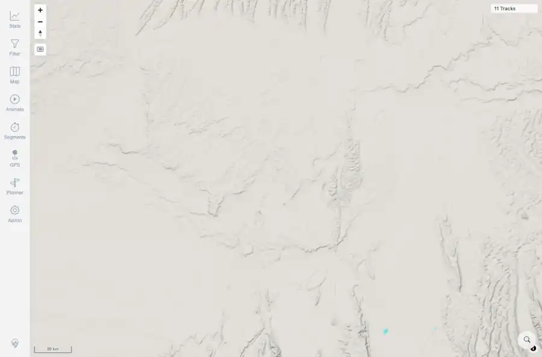

# Packet: MAP_06

## Scope

- Coverage source: `documentation/testing/frontend-regression-test-plan.md`
- Coverage ID or run packet: MAP_06
- In scope: Fast pan/zoom does not leave stale lines, missing tiles, or runaway loading spinners.
- Out of scope: Other coverage IDs except where noted as shared state/evidence.

## Prerequisites

- Required previous coverage IDs or run packets: Current map loaded.
- Required app/data state: Current run-state and packet set for this run.
- Required browser context: As specified by the coverage action.

## Allowed Mutations

- Allowed: Rapid mouse drag/wheel interactions and packet/run-state updates.
- Not allowed: Collapse this ID into a parent row or skip required direct evidence.

## Actions And Results

| Coverage ID | Action | Expected result | Actual result | Status | Evidence |
|---|---|---|---|---|---|
| MAP_06 | Performed repeated mouse drags and wheel zooms on the main map canvas, then waited for redraw and captured the result. | Fast pan/zoom leaves a stable map with tracks/tiles and no runaway loading spinner or stale-line failure. | After rapid pan/zoom, the map remained visible with track/navigation UI and no loading/spinner/stale text in captured state. | PASS | [assets/MAP_06-fast-pan-zoom.webp](../assets/MAP_06-fast-pan-zoom.webp); [assets/MAP_06-fast-pan-zoom.txt](../assets/MAP_06-fast-pan-zoom.txt); [assets/MAP_05_12-interaction-summary.txt](../assets/MAP_05_12-interaction-summary.txt) |

## Issues

| ID | Severity | Summary | Reproduction | Expected | Actual | Evidence | Release impact |
|---|---|---|---|---|---|---|---|

## Evidence Files

| File | Purpose |
|---|---|
| [assets/MAP_06-fast-pan-zoom.webp](../assets/MAP_06-fast-pan-zoom.webp) | Screenshot evidence |
| [assets/MAP_06-fast-pan-zoom.txt](../assets/MAP_06-fast-pan-zoom.txt) | Text/log evidence |
| [assets/MAP_05_12-interaction-summary.txt](../assets/MAP_05_12-interaction-summary.txt) | Text/log evidence |

## Screenshot Evidence

## Timings

| Step | Timing |
|---|---:|
| Browser pan/zoom stress | 6 seconds |

## Handoff Notes

- Completed: This coverage ID is terminal.
- Remaining unfinished coverage: Continue with the next queue row.
- Blocked or not applicable: none.
- State left for the next packet: unchanged.
