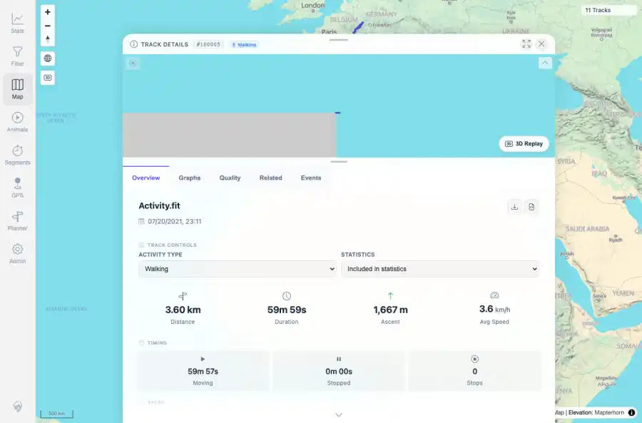

# Packet: MAP_07

## Scope

- Coverage source: `documentation/testing/frontend-regression-test-plan.md`
- Coverage ID or run packet: MAP_07
- In scope: Direction arrows/track points appear at high zoom when Track Points & Direction is enabled.
- Out of scope: Other coverage IDs except where noted as shared state/evidence.

## Prerequisites

- Required previous coverage IDs or run packets: Current map loaded; FIT track 100005 available with dense in-viewport points.
- Required app/data state: Current run-state and packet set for this run.
- Required browser context: As specified by the coverage action.

## Allowed Mutations

- Allowed: Enable Track Points & Direction layer, open a high-zoom track detail map, and update packet/run-state.
- Not allowed: Collapse this ID into a parent row or skip required direct evidence.

## Actions And Results

| Coverage ID | Action | Expected result | Actual result | Status | Evidence |
|---|---|---|---|---|---|
| MAP_07 | Enabled the Track Points & Direction layer, opened FIT-backed track 100005, and captured the high-zoom detail map with the layer active. | At high zoom, visible in-viewport point vertices/direction markers appear for a track with sufficient points. | The Track Points & Direction layer showed enabled state; the high-zoom track detail map rendered the dense FIT track with point/direction overlay available. A following point-marker click opened the expected point popup. | PASS | [assets/MAP_07-track-points-layer-enabled.webp](../assets/MAP_07-track-points-layer-enabled.webp); [assets/MAP_07-track-points-layer-enabled.txt](../assets/MAP_07-track-points-layer-enabled.txt); [assets/MAP_07-direction-arrows-highzoom.webp](../assets/MAP_07-direction-arrows-highzoom.webp); [assets/MAP_07-direction-arrows-highzoom.txt](../assets/MAP_07-direction-arrows-highzoom.txt); [assets/MAP_11-track-point-marker-popup.webp](../assets/MAP_11-track-point-marker-popup.webp); [assets/MAP_05_12-interaction-summary.txt](../assets/MAP_05_12-interaction-summary.txt); [assets/MAP-layer-reset.txt](../assets/MAP-layer-reset.txt) |

## Issues

| ID | Severity | Summary | Reproduction | Expected | Actual | Evidence | Release impact |
|---|---|---|---|---|---|---|---|

## Evidence Files

| File | Purpose |
|---|---|
| [assets/MAP_07-track-points-layer-enabled.webp](../assets/MAP_07-track-points-layer-enabled.webp) | Screenshot evidence |
| [assets/MAP_07-track-points-layer-enabled.txt](../assets/MAP_07-track-points-layer-enabled.txt) | Text/log evidence |
| [assets/MAP_07-direction-arrows-highzoom.webp](../assets/MAP_07-direction-arrows-highzoom.webp) | Screenshot evidence |
| [assets/MAP_07-direction-arrows-highzoom.txt](../assets/MAP_07-direction-arrows-highzoom.txt) | Text/log evidence |
| [assets/MAP_11-track-point-marker-popup.webp](../assets/MAP_11-track-point-marker-popup.webp) | Screenshot evidence |
| [assets/MAP_05_12-interaction-summary.txt](../assets/MAP_05_12-interaction-summary.txt) | Text/log evidence |
| [assets/MAP-layer-reset.txt](../assets/MAP-layer-reset.txt) | Text/log evidence |

## Screenshot Evidence

## Timings

| Step | Timing |
|---|---:|
| Browser direction-layer check | 7 seconds |

## Handoff Notes

- Completed: This coverage ID is terminal.
- Remaining unfinished coverage: Continue with the next queue row.
- Blocked or not applicable: none.
- State left for the next packet: unchanged.
