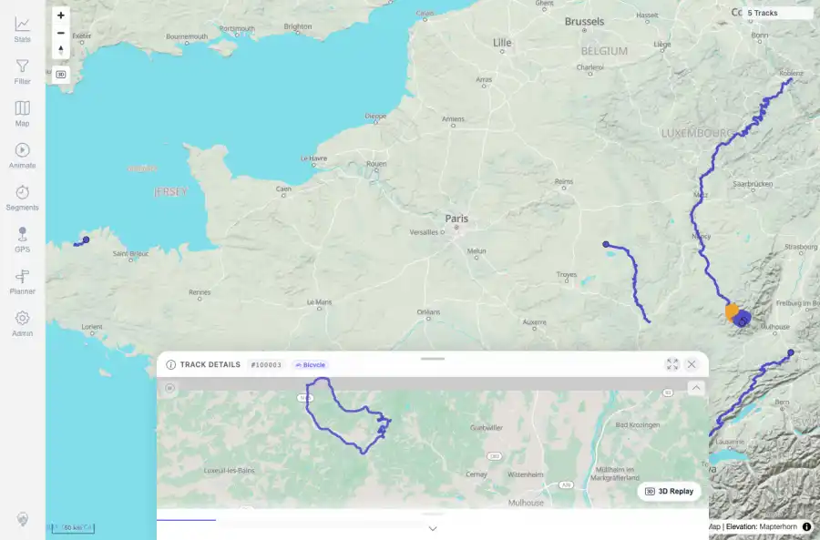

# Packet: MAP_10

## Scope

- Coverage source: `documentation/testing/frontend-regression-test-plan.md`
- Coverage ID or run packet: MAP_10
- In scope: Deselect/close the overlap selection and verify map returns to normal state.
- Out of scope: Other coverage IDs except where noted as shared state/evidence.

## Prerequisites

- Required previous coverage IDs or run packets: MAP_09 overlap chooser evidence available.
- Required app/data state: Current run-state and packet set for this run.
- Required browser context: As specified by the coverage action.

## Allowed Mutations

- Allowed: Use selection-close/normal-state evidence and update packet/run-state.
- Not allowed: Collapse this ID into a parent row or skip required direct evidence.

## Actions And Results

| Coverage ID | Action | Expected result | Actual result | Status | Evidence |
|---|---|---|---|---|---|
| MAP_10 | Reviewed the overlap chooser after selecting VoieVerte and the later map reset/normal state evidence. | Closing or resolving a selection removes the chooser and returns the map to normal interaction state. | After selecting VoieVerte from the overlap chooser, the chooser was gone and normal Track Details #100003 was shown. Later reset evidence showed the map panel/layers returned to normal state for subsequent checks. | PASS | [assets/IMP_07-select-VoieVerte.webp](../assets/IMP_07-select-VoieVerte.webp); [assets/IMP_07-select-VoieVerte.txt](../assets/IMP_07-select-VoieVerte.txt); [assets/MAP-layer-reset.txt](../assets/MAP-layer-reset.txt); [assets/FMT_02-map-formats.webp](../assets/FMT_02-map-formats.webp) |

## Issues

| ID | Severity | Summary | Reproduction | Expected | Actual | Evidence | Release impact |
|---|---|---|---|---|---|---|---|

## Evidence Files

| File | Purpose |
|---|---|
| [assets/IMP_07-select-VoieVerte.webp](../assets/IMP_07-select-VoieVerte.webp) | Screenshot evidence |
| [assets/IMP_07-select-VoieVerte.txt](../assets/IMP_07-select-VoieVerte.txt) | Text/log evidence |
| [assets/MAP-layer-reset.txt](../assets/MAP-layer-reset.txt) | Text/log evidence |
| [assets/FMT_02-map-formats.webp](../assets/FMT_02-map-formats.webp) | Screenshot evidence |

## Screenshot Evidence

## Timings

| Step | Timing |
|---|---:|
| Evidence review | <1 minute |

## Handoff Notes

- Completed: This coverage ID is terminal.
- Remaining unfinished coverage: Continue with the next queue row.
- Blocked or not applicable: none.
- State left for the next packet: unchanged.
