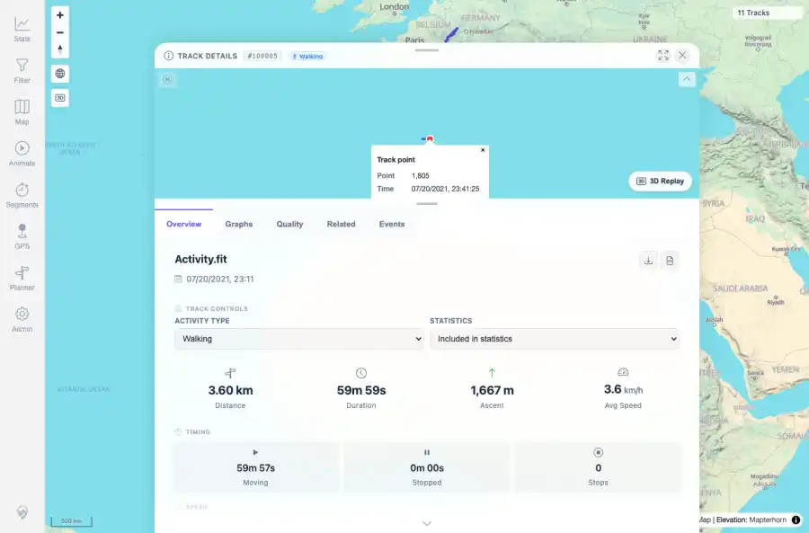
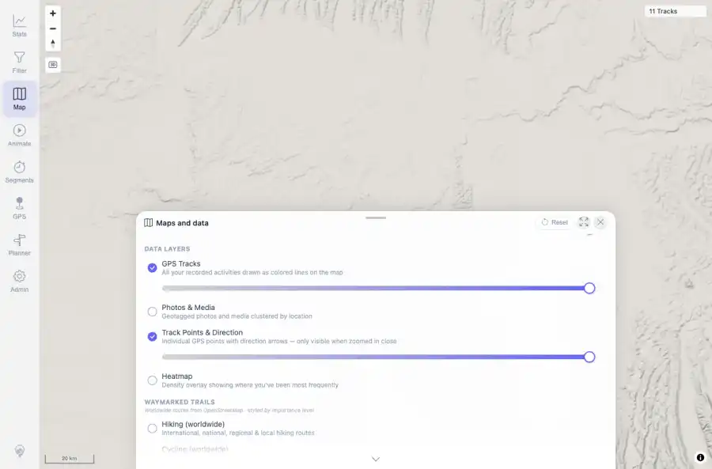

# Packet: MAP_11

## Scope

- Coverage source: `documentation/testing/frontend-regression-test-plan.md`
- Coverage ID or run packet: MAP_11
- In scope: Click a rendered track-point marker and verify popup metrics.
- Out of scope: Other coverage IDs except where noted as shared state/evidence.

## Prerequisites

- Required previous coverage IDs or run packets: Track Points & Direction layer enabled; FIT track 100005 high-zoom map available.
- Required app/data state: Current run-state and packet set for this run.
- Required browser context: As specified by the coverage action.

## Allowed Mutations

- Allowed: Click an in-viewport point marker on the high-zoom track map and update packet/run-state.
- Not allowed: Collapse this ID into a parent row or skip required direct evidence.

## Actions And Results

| Coverage ID | Action | Expected result | Actual result | Status | Evidence |
|---|---|---|---|---|---|
| MAP_11 | Clicked the high-zoom FIT track mini-map with Track Points & Direction enabled. | Clicking a rendered point/direction marker shows a popup with expected metrics such as time, speed, elevation, and distance. | A Track point popup opened for Point 1,805 with time, distance 1.81 km, elevation 96.9 m, speed 3.6 km/h, and elapsed 29m 59s. | PASS | [assets/MAP_11-track-point-marker-popup.webp](../assets/MAP_11-track-point-marker-popup.webp); [assets/MAP_11-track-point-marker-popup.txt](../assets/MAP_11-track-point-marker-popup.txt); [assets/MAP_07-track-points-layer-enabled.webp](../assets/MAP_07-track-points-layer-enabled.webp); [assets/MAP_05_12-interaction-summary.txt](../assets/MAP_05_12-interaction-summary.txt) |

## Issues

| ID | Severity | Summary | Reproduction | Expected | Actual | Evidence | Release impact |
|---|---|---|---|---|---|---|---|

## Evidence Files

| File | Purpose |
|---|---|
| [assets/MAP_11-track-point-marker-popup.webp](../assets/MAP_11-track-point-marker-popup.webp) | Screenshot evidence |
| [assets/MAP_11-track-point-marker-popup.txt](../assets/MAP_11-track-point-marker-popup.txt) | Text/log evidence |
| [assets/MAP_07-track-points-layer-enabled.webp](../assets/MAP_07-track-points-layer-enabled.webp) | Screenshot evidence |
| [assets/MAP_05_12-interaction-summary.txt](../assets/MAP_05_12-interaction-summary.txt) | Text/log evidence |

## Screenshot Evidence

## Timings

| Step | Timing |
|---|---:|
| Browser point-marker popup check | 2 seconds |

## Handoff Notes

- Completed: This coverage ID is terminal.
- Remaining unfinished coverage: Continue with the next queue row.
- Blocked or not applicable: none.
- State left for the next packet: unchanged.
