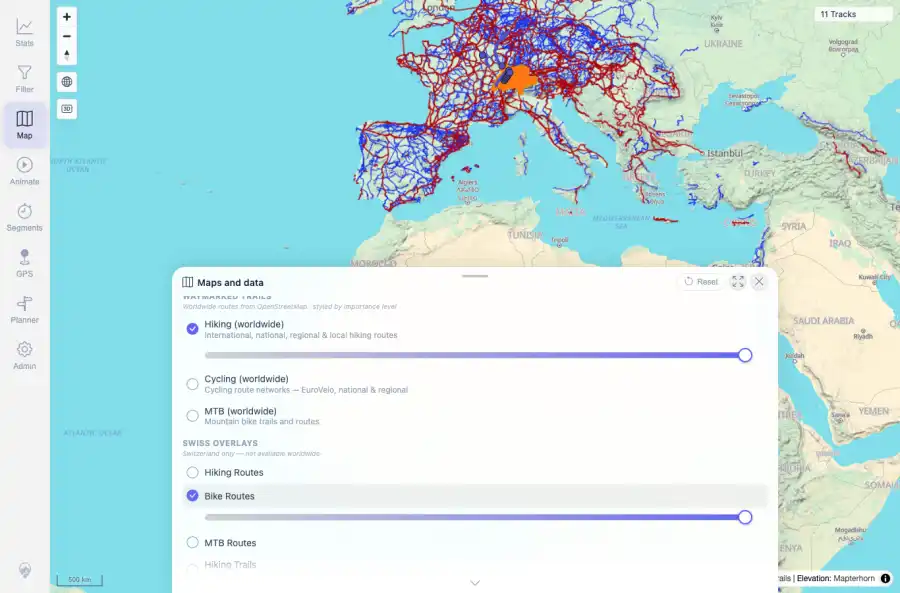
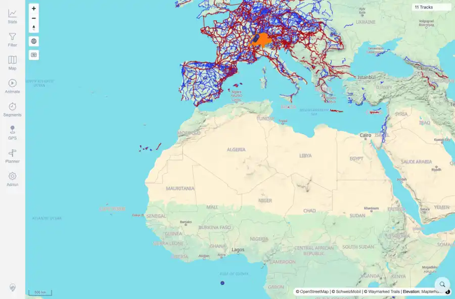
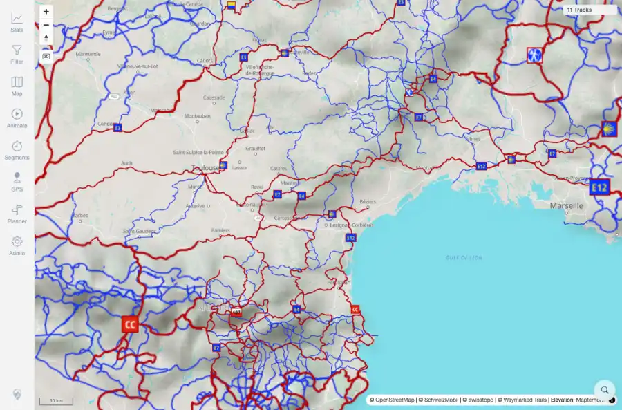

# Packet: MAP_12

## Scope

- Coverage source: `documentation/testing/frontend-regression-test-plan.md`
- Coverage ID or run packet: MAP_12
- In scope: Swiss Mobility routes popup where applicable.
- Out of scope: Other coverage IDs except where noted as shared state/evidence.

## Prerequisites

- Required previous coverage IDs or run packets: Map overlays available in quick-install deployment.
- Required app/data state: Current run-state and packet set for this run.
- Required browser context: As specified by the coverage action.

## Allowed Mutations

- Allowed: Enable Swiss/Waymarked overlays, attempt route clicks, record applicability result, and update packet/run-state.
- Not allowed: Collapse this ID into a parent row or skip required direct evidence.

## Actions And Results

| Coverage ID | Action | Expected result | Actual result | Status | Evidence |
|---|---|---|---|---|---|
| MAP_12 | Enabled Swiss Hiking/Bike/MTB/Hiking Trail overlays, verified SchweizMobil/swisstopo/Waymarked attribution, zoomed into visible Swiss route lines, and clicked multiple visible route positions. | Where an interactive official-route feature popup is applicable, clicking nearby routes shows the popup and it closes cleanly. | In this quick-install configuration the Swiss layers exposed raster/attribution overlays, not interactive feature-hit popup targets. Visible overlays loaded, but repeated clicks on visible route lines produced no popup; there was no route-popup UI to close. This conditional popup row is therefore not applicable to the configured raster overlay mode. | NOT APPLICABLE | [assets/MAP_12-swiss-overlays-enabled.webp](../assets/MAP_12-swiss-overlays-enabled.webp); [assets/MAP_12-swiss-overlays-enabled.txt](../assets/MAP_12-swiss-overlays-enabled.txt); [assets/MAP_12-swiss-route-click-result.webp](../assets/MAP_12-swiss-route-click-result.webp); [assets/MAP_12-swiss-route-click-result.txt](../assets/MAP_12-swiss-route-click-result.txt); [assets/MAP_12-zoomed-swiss-routes.webp](../assets/MAP_12-zoomed-swiss-routes.webp); [assets/MAP_12-route-popup-attempts.txt](../assets/MAP_12-route-popup-attempts.txt); [assets/MAP_05_12-interaction-summary.txt](../assets/MAP_05_12-interaction-summary.txt) |

## Issues

| ID | Severity | Summary | Reproduction | Expected | Actual | Evidence | Release impact |
|---|---|---|---|---|---|---|---|

## Evidence Files

| File | Purpose |
|---|---|
| [assets/MAP_12-swiss-overlays-enabled.webp](../assets/MAP_12-swiss-overlays-enabled.webp) | Screenshot evidence |
| [assets/MAP_12-swiss-overlays-enabled.txt](../assets/MAP_12-swiss-overlays-enabled.txt) | Text/log evidence |
| [assets/MAP_12-swiss-route-click-result.webp](../assets/MAP_12-swiss-route-click-result.webp) | Screenshot evidence |
| [assets/MAP_12-swiss-route-click-result.txt](../assets/MAP_12-swiss-route-click-result.txt) | Text/log evidence |
| [assets/MAP_12-zoomed-swiss-routes.webp](../assets/MAP_12-zoomed-swiss-routes.webp) | Screenshot evidence |
| [assets/MAP_12-route-popup-attempts.txt](../assets/MAP_12-route-popup-attempts.txt) | Text/log evidence |
| [assets/MAP_05_12-interaction-summary.txt](../assets/MAP_05_12-interaction-summary.txt) | Text/log evidence |

## Screenshot Evidence

## Timings

| Step | Timing |
|---|---:|
| Swiss overlay/click attempts | 47 seconds |

## Handoff Notes

- Completed: This coverage ID is terminal.
- Remaining unfinished coverage: Continue with the next queue row.
- Blocked or not applicable: none.
- State left for the next packet: unchanged.
