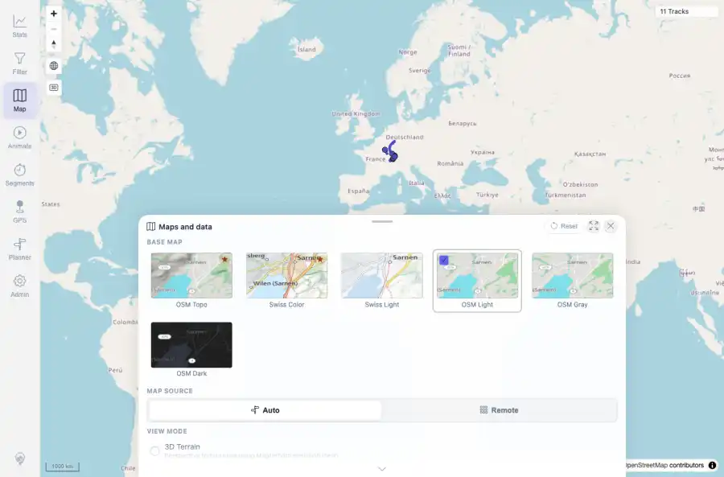
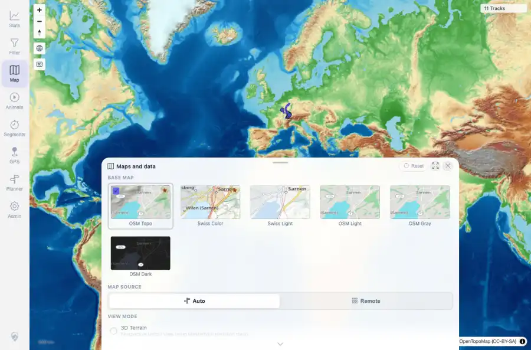
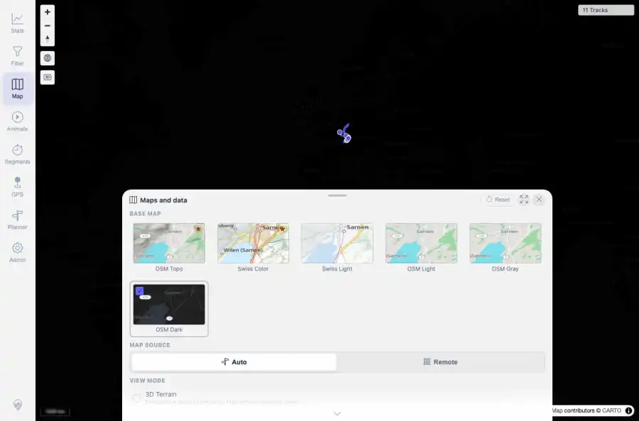

# Packet: MAP_13

## Scope

- Coverage source: `documentation/testing/frontend-regression-test-plan.md`
- Coverage ID or run packet: MAP_13
- In scope: Intentional remote raster mode with OSM Light, OSM Topo, and OSM Dark.
- Out of scope: Other coverage IDs except where noted as shared state/evidence.

## Prerequisites

- Required previous coverage IDs or run packets: Temporary compose override sets MTL_MAP_SERVER_TILE_MODE=remote; app service restarted.
- Required app/data state: Current run-state and packet set for this run.
- Required browser context: As specified by the coverage action.

## Allowed Mutations

- Allowed: Temporarily change app service environment to remote raster mode, verify map providers, and update packet/run-state.
- Not allowed: Collapse this ID into a parent row or skip required direct evidence.

## Actions And Results

| Coverage ID | Action | Expected result | Actual result | Status | Evidence |
|---|---|---|---|---|---|
| MAP_13 | Created a compose override for remote tile mode, restarted the app service, fetched /api/map/config, selected OSM Light/Topo/Dark in Maps and data, and captured request URLs/screenshots. | /api/map/config exposes remoteRasterStyles for light, light-topo, and dark, does not expose remoteTileUrl; each raster theme loads its provider/attribution, map remains interactive, and no /api/map-proxy tile requests occur. | tileMode=remote; remoteRasterStyles included light, light-topo, and dark; legacy remoteTileUrl was absent. Browser requests hit tile.openstreetmap.org, tile.opentopomap.org, and basemaps.cartocdn.com; mapProxyRequests=0; map remained interactive with 11 tracks. | PASS | [assets/MAP_13-remote-mode-setup.txt](../assets/MAP_13-remote-mode-setup.txt); [assets/MAP_13-remote-config-wait.txt](../assets/MAP_13-remote-config-wait.txt); [assets/MAP_13-remote-raster-summary.txt](../assets/MAP_13-remote-raster-summary.txt); [assets/MAP_13-remote-osm-light.webp](../assets/MAP_13-remote-osm-light.webp); [assets/MAP_13-remote-osm-light.txt](../assets/MAP_13-remote-osm-light.txt); [assets/MAP_13-remote-osm-light-requests.txt](../assets/MAP_13-remote-osm-light-requests.txt); [assets/MAP_13-remote-osm-topo.webp](../assets/MAP_13-remote-osm-topo.webp); [assets/MAP_13-remote-osm-topo.txt](../assets/MAP_13-remote-osm-topo.txt); [assets/MAP_13-remote-osm-topo-requests.txt](../assets/MAP_13-remote-osm-topo-requests.txt); [assets/MAP_13-remote-osm-dark.webp](../assets/MAP_13-remote-osm-dark.webp); [assets/MAP_13-remote-osm-dark.txt](../assets/MAP_13-remote-osm-dark.txt); [assets/MAP_13-remote-osm-dark-requests.txt](../assets/MAP_13-remote-osm-dark-requests.txt) |

## Issues

| ID | Severity | Summary | Reproduction | Expected | Actual | Evidence | Release impact |
|---|---|---|---|---|---|---|---|

## Evidence Files

| File | Purpose |
|---|---|
| [assets/MAP_13-remote-mode-setup.txt](../assets/MAP_13-remote-mode-setup.txt) | Text/log evidence |
| [assets/MAP_13-remote-config-wait.txt](../assets/MAP_13-remote-config-wait.txt) | Text/log evidence |
| [assets/MAP_13-remote-raster-summary.txt](../assets/MAP_13-remote-raster-summary.txt) | Text/log evidence |
| [assets/MAP_13-remote-osm-light.webp](../assets/MAP_13-remote-osm-light.webp) | Screenshot evidence |
| [assets/MAP_13-remote-osm-light.txt](../assets/MAP_13-remote-osm-light.txt) | Text/log evidence |
| [assets/MAP_13-remote-osm-light-requests.txt](../assets/MAP_13-remote-osm-light-requests.txt) | Text/log evidence |
| [assets/MAP_13-remote-osm-topo.webp](../assets/MAP_13-remote-osm-topo.webp) | Screenshot evidence |
| [assets/MAP_13-remote-osm-topo.txt](../assets/MAP_13-remote-osm-topo.txt) | Text/log evidence |
| [assets/MAP_13-remote-osm-topo-requests.txt](../assets/MAP_13-remote-osm-topo-requests.txt) | Text/log evidence |
| [assets/MAP_13-remote-osm-dark.webp](../assets/MAP_13-remote-osm-dark.webp) | Screenshot evidence |
| [assets/MAP_13-remote-osm-dark.txt](../assets/MAP_13-remote-osm-dark.txt) | Text/log evidence |
| [assets/MAP_13-remote-osm-dark-requests.txt](../assets/MAP_13-remote-osm-dark-requests.txt) | Text/log evidence |

## Screenshot Evidence

## Timings

| Step | Timing |
|---|---:|
| Remote-mode app restart and config wait | 19 seconds |
| Browser remote raster verification | 23 seconds |

## Handoff Notes

- Completed: This coverage ID is terminal.
- Remaining unfinished coverage: Continue with the next queue row.
- Blocked or not applicable: none.
- State left for the next packet: unchanged.
