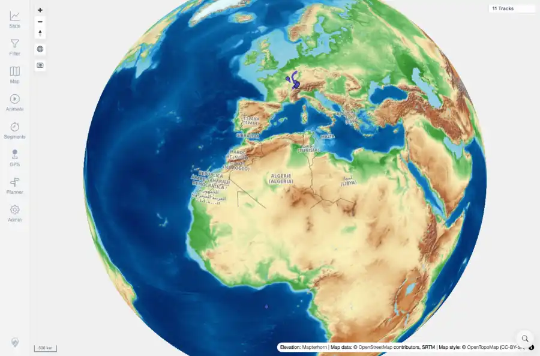

# Packet: MAP_14

## Scope

- Coverage source: `documentation/testing/frontend-regression-test-plan.md`
- Coverage ID or run packet: MAP_14
- In scope: Remote raster fallback from local vector mode when local PMTiles fail at runtime.
- Out of scope: Other coverage IDs except where noted as shared state/evidence.

## Prerequisites

- Required previous coverage IDs or run packets: App restored to local tileMode; browser route interception can safely abort local map-proxy PMTiles requests.
- Required app/data state: Current run-state and packet set for this run.
- Required browser context: As specified by the coverage action.

## Allowed Mutations

- Allowed: Abort local PMTiles requests in browser context only, verify fallback behavior, and update packet/run-state.
- Not allowed: Collapse this ID into a parent row or skip required direct evidence.

## Actions And Results

| Coverage ID | Action | Expected result | Actual result | Status | Evidence |
|---|---|---|---|---|---|
| MAP_14 | Loaded the app in local-vector mode while aborting /mtl/api/map-proxy/prod/*.pmtiles requests in the browser, then checked fallback requests, map visibility, and console messages. | When local vector PMTiles are unavailable, the map switches to configured remote raster style, uses attribution, stays interactive, supports track display, and does not blank/freeze. | Three PMTiles requests were aborted; the console logged Local vector map tiles failed; switched base map to raster fallback. The browser made 98 remote provider requests, showed OpenTopoMap attribution, kept 11 Tracks visible, and no startup/loading failure remained. | PASS | [assets/MAP_14-local-fallback-summary.txt](../assets/MAP_14-local-fallback-summary.txt); [assets/MAP_14-local-tile-fallback.webp](../assets/MAP_14-local-tile-fallback.webp); [assets/MAP_14-local-tile-fallback.txt](../assets/MAP_14-local-tile-fallback.txt); [assets/MAP_13-restore-local-mode.txt](../assets/MAP_13-restore-local-mode.txt) |

## Issues

| ID | Severity | Summary | Reproduction | Expected | Actual | Evidence | Release impact |
|---|---|---|---|---|---|---|---|

## Evidence Files

| File | Purpose |
|---|---|
| [assets/MAP_14-local-fallback-summary.txt](../assets/MAP_14-local-fallback-summary.txt) | Text/log evidence |
| [assets/MAP_14-local-tile-fallback.webp](../assets/MAP_14-local-tile-fallback.webp) | Screenshot evidence |
| [assets/MAP_14-local-tile-fallback.txt](../assets/MAP_14-local-tile-fallback.txt) | Text/log evidence |
| [assets/MAP_13-restore-local-mode.txt](../assets/MAP_13-restore-local-mode.txt) | Text/log evidence |

## Screenshot Evidence

## Timings

| Step | Timing |
|---|---:|
| Browser local-tile failure simulation | 12 seconds |

## Handoff Notes

- Completed: This coverage ID is terminal.
- Remaining unfinished coverage: Continue with the next queue row.
- Blocked or not applicable: none.
- State left for the next packet: unchanged.
