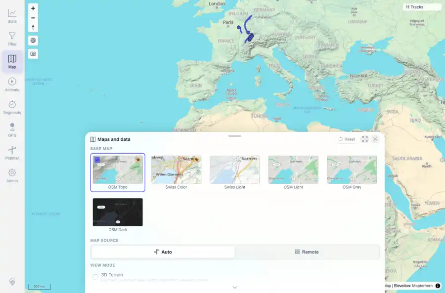
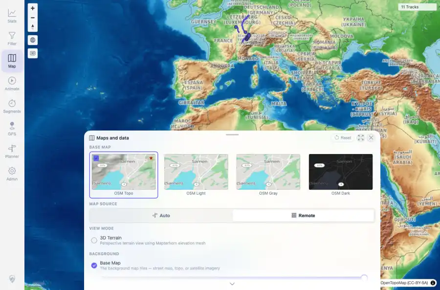

# Packet: MAP_15

## Scope

- Coverage source: `documentation/testing/frontend-regression-test-plan.md`
- Coverage ID or run packet: MAP_15
- In scope: Manual remote raster source override in local-vector deployment.
- Out of scope: Other coverage IDs except where noted as shared state/evidence.

## Prerequisites

- Required previous coverage IDs or run packets: App restored to local tileMode after MAP_13; map source control available.
- Required app/data state: Current run-state and packet set for this run.
- Required browser context: As specified by the coverage action.

## Allowed Mutations

- Allowed: Use the in-app Map Source control, verify persistence after reload, Reset to Auto, and update packet/run-state.
- Not allowed: Collapse this ID into a parent row or skip required direct evidence.

## Actions And Results

| Coverage ID | Action | Expected result | Actual result | Status | Evidence |
|---|---|---|---|---|---|
| MAP_15 | Started from local tileMode/Auto, switched Map Source to Remote, checked remote provider requests and theme list, reloaded to verify persistence, then clicked Reset to restore Auto/local-vector mode. | Remote override reloads base map from configured remote raster provider without /api/map-proxy tile requests; OSM raster themes remain selectable; Swiss vector themes are not offered in Remote mode; setting persists after reload; Reset restores Auto. | Local config tileMode was local. After Remote selection and after reload, OpenTopoMap remote attribution/provider requests were present, /api/map-proxy tile requests were 0, OSM raster themes were visible, Swiss Color/Light base map themes were absent, and Remote persisted after reload. Reset restored Auto/local mode, Swiss vector themes reappeared, and local map-proxy requests resumed. | PASS | [assets/MAP_15-manual-remote-summary.txt](../assets/MAP_15-manual-remote-summary.txt); [assets/MAP_15-source-auto-before.webp](../assets/MAP_15-source-auto-before.webp); [assets/MAP_15-source-auto-before.txt](../assets/MAP_15-source-auto-before.txt); [assets/MAP_15-source-remote-selected.webp](../assets/MAP_15-source-remote-selected.webp); [assets/MAP_15-source-remote-selected.txt](../assets/MAP_15-source-remote-selected.txt); [assets/MAP_15-source-remote-after-reload.webp](../assets/MAP_15-source-remote-after-reload.webp); [assets/MAP_15-source-remote-after-reload.txt](../assets/MAP_15-source-remote-after-reload.txt); [assets/MAP_15-source-reset-auto.webp](../assets/MAP_15-source-reset-auto.webp); [assets/MAP_15-source-reset-auto.txt](../assets/MAP_15-source-reset-auto.txt); [assets/MAP_13-restore-local-mode.txt](../assets/MAP_13-restore-local-mode.txt) |

## Issues

| ID | Severity | Summary | Reproduction | Expected | Actual | Evidence | Release impact |
|---|---|---|---|---|---|---|---|

## Evidence Files

| File | Purpose |
|---|---|
| [assets/MAP_15-manual-remote-summary.txt](../assets/MAP_15-manual-remote-summary.txt) | Text/log evidence |
| [assets/MAP_15-source-auto-before.webp](../assets/MAP_15-source-auto-before.webp) | Screenshot evidence |
| [assets/MAP_15-source-auto-before.txt](../assets/MAP_15-source-auto-before.txt) | Text/log evidence |
| [assets/MAP_15-source-remote-selected.webp](../assets/MAP_15-source-remote-selected.webp) | Screenshot evidence |
| [assets/MAP_15-source-remote-selected.txt](../assets/MAP_15-source-remote-selected.txt) | Text/log evidence |
| [assets/MAP_15-source-remote-after-reload.webp](../assets/MAP_15-source-remote-after-reload.webp) | Screenshot evidence |
| [assets/MAP_15-source-remote-after-reload.txt](../assets/MAP_15-source-remote-after-reload.txt) | Text/log evidence |
| [assets/MAP_15-source-reset-auto.webp](../assets/MAP_15-source-reset-auto.webp) | Screenshot evidence |
| [assets/MAP_15-source-reset-auto.txt](../assets/MAP_15-source-reset-auto.txt) | Text/log evidence |
| [assets/MAP_13-restore-local-mode.txt](../assets/MAP_13-restore-local-mode.txt) | Text/log evidence |

## Screenshot Evidence

## Timings

| Step | Timing |
|---|---:|
| Browser manual remote override and reset | 26 seconds |

## Handoff Notes

- Completed: This coverage ID is terminal.
- Remaining unfinished coverage: Continue with the next queue row.
- Blocked or not applicable: none.
- State left for the next packet: unchanged.
