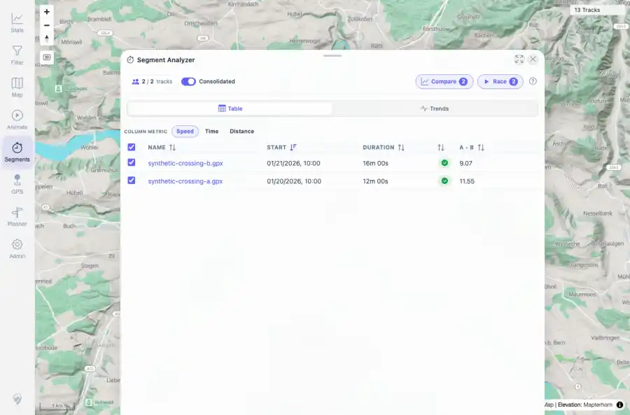

# Packet: MCT_01

## Scope

- Coverage source: `documentation/testing/frontend-regression-test-plan.md`
- Coverage ID or run packet: MCT_01
- In scope: Measure tool start, two-zone placement, and crossing result list.
- Out of scope: Other coverage IDs except where noted as shared state/evidence.

## Prerequisites

- Required previous coverage IDs or run packets: PLN_11 PASS; DAT_07 synthetic segment requirement available. Two synthetic crossing GPX files imported for this coverage because they were not yet indexed.
- Required app/data state: Current run-state and packet set for this run.
- Required browser context: As specified by the coverage action.

## Allowed Mutations

- Allowed: Import fully synthetic regression GPX files, open Segments, place two zones, analyze, and update packet/run-state evidence.
- Not allowed: Collapse this ID into a parent row or skip required direct evidence.

## Actions And Results

| Coverage ID | Action | Expected result | Actual result | Status | Evidence |
|---|---|---|---|---|---|
| MCT_01 | Imported synthetic-crossing-a.gpx and synthetic-crossing-b.gpx into the watched folder, opened Segments over Bern, placed A/B zones, and ran Analyze. | Result list of tracks crossing both zones appears with speed, time, and distance metrics. | The current indexed total became 13 tracks; synthetic ids 100017 and 100018 indexed successfully. Measure result sheet showed 2 / 2 tracks for segment A-B with Speed/Time/Distance columns; crossing API returned A=2, B=2, A-B count 2, distance about 1.32 km, speeds 11.55 and 9.07 km/h. | PASS | [assets/MCT_01-measure-results.webp](../assets/MCT_01-measure-results.webp); [assets/MCT_01-measure-results.txt](../assets/MCT_01-measure-results.txt) |

## Issues

| ID | Severity | Summary | Reproduction | Expected | Actual | Evidence | Release impact |
|---|---|---|---|---|---|---|---|

## Evidence Files

| File | Purpose |
|---|---|
| [assets/MCT_01-measure-results.webp](../assets/MCT_01-measure-results.webp) | Screenshot evidence |
| [assets/MCT_01-measure-results.txt](../assets/MCT_01-measure-results.txt) | Text/log evidence |

## Screenshot Evidence

## Timings

| Step | Timing |
|---|---:|
| Packet execution | <1 minute |

## Handoff Notes

- Completed: This coverage ID is terminal.
- Remaining unfinished coverage: Continue with the next queue row.
- Blocked or not applicable: none.
- State left for the next packet: unchanged.
