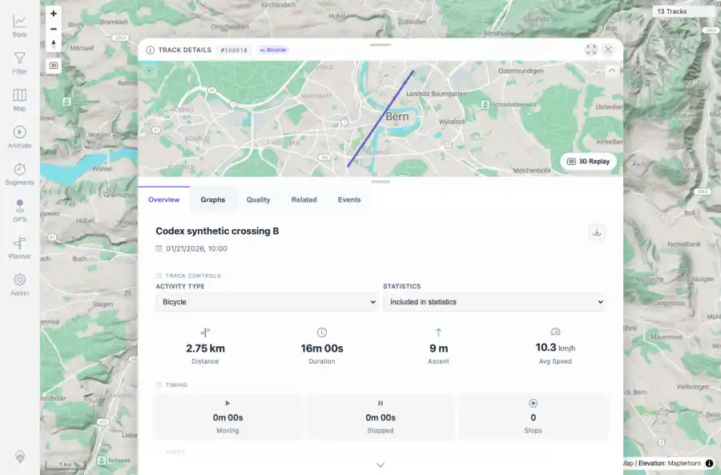

# Packet: MCT_02

## Scope

- Coverage source: `documentation/testing/frontend-regression-test-plan.md`
- Coverage ID or run packet: MCT_02
- In scope: Measure result row navigation to track details/segment context.
- Out of scope: Other coverage IDs except where noted as shared state/evidence.

## Prerequisites

- Required previous coverage IDs or run packets: MCT_01 PASS with measure results visible.
- Required app/data state: Current run-state and packet set for this run.
- Required browser context: As specified by the coverage action.

## Allowed Mutations

- Allowed: Click a measure result row/link and capture resulting detail view.
- Not allowed: Collapse this ID into a parent row or skip required direct evidence.

## Actions And Results

| Coverage ID | Action | Expected result | Actual result | Status | Evidence |
|---|---|---|---|---|---|
| MCT_02 | Clicked the synthetic-crossing-b.gpx result in the measure table. | Clicking a result opens that track details or segment-related detail view. | The app navigated to /mtl/track/100018 and opened Track Details #100018 for Codex synthetic crossing B while preserving the segment analyzer result context behind it. | PASS | [assets/MCT_02-result-opens-track-details.webp](../assets/MCT_02-result-opens-track-details.webp); [assets/MCT_02-result-opens-track-details.txt](../assets/MCT_02-result-opens-track-details.txt) |

## Issues

| ID | Severity | Summary | Reproduction | Expected | Actual | Evidence | Release impact |
|---|---|---|---|---|---|---|---|

## Evidence Files

| File | Purpose |
|---|---|
| [assets/MCT_02-result-opens-track-details.webp](../assets/MCT_02-result-opens-track-details.webp) | Screenshot evidence |
| [assets/MCT_02-result-opens-track-details.txt](../assets/MCT_02-result-opens-track-details.txt) | Text/log evidence |

## Screenshot Evidence

## Timings

| Step | Timing |
|---|---:|
| Packet execution | <1 minute |

## Handoff Notes

- Completed: This coverage ID is terminal.
- Remaining unfinished coverage: Continue with the next queue row.
- Blocked or not applicable: none.
- State left for the next packet: unchanged.
