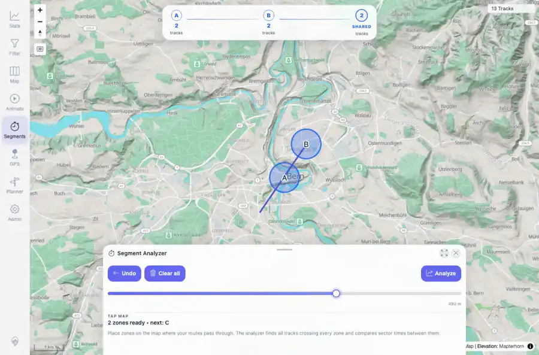
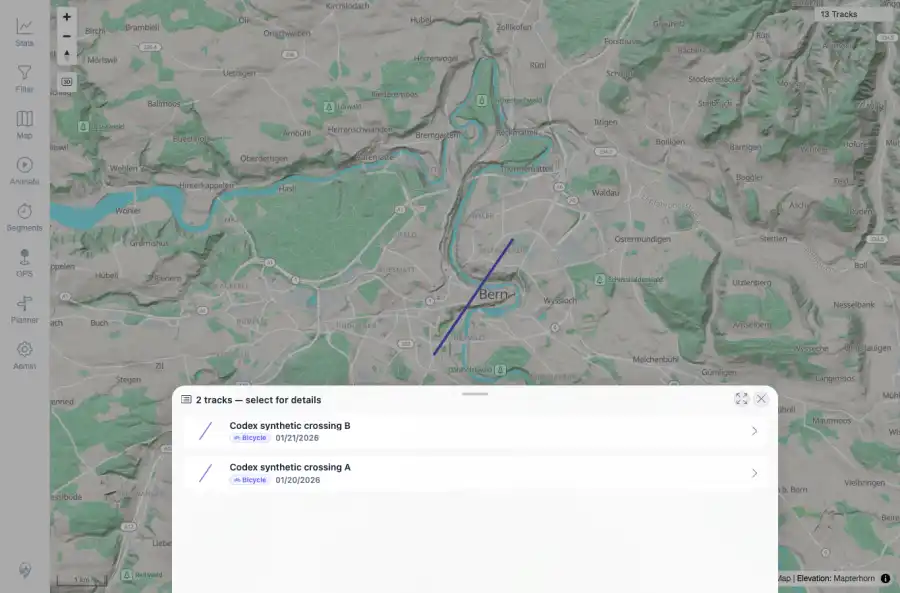

# Packet: MCT_03

## Scope

- Coverage source: `documentation/testing/frontend-regression-test-plan.md`
- Coverage ID or run packet: MCT_03
- In scope: Stopping/closing the measure tool and cleanup of temporary measure UI/listeners.
- Out of scope: Other coverage IDs except where noted as shared state/evidence.

## Prerequisites

- Required previous coverage IDs or run packets: MCT_02 PASS; map remains centered near Bern synthetic tracks.
- Required app/data state: Current run-state and packet set for this run.
- Required browser context: As specified by the coverage action.

## Allowed Mutations

- Allowed: Open/close measure tool and click map afterward to verify cleanup.
- Not allowed: Collapse this ID into a parent row or skip required direct evidence.

## Actions And Results

| Coverage ID | Action | Expected result | Actual result | Status | Evidence |
|---|---|---|---|---|---|
| MCT_03 | Opened Segments, placed two temporary zones, closed the measure sheet, then clicked the map again. | Stop/close removes temporary measure markers and listeners; a later map click should not keep adding measure zones. | Before stop, A/B zone overlay showed 2 shared tracks. After close, measure sheet was not visible and flow node count was 0. A later map click opened the normal track picker for the synthetic tracks, not a measure-zone overlay. | PASS | [assets/MCT_03-before-stop.webp](../assets/MCT_03-before-stop.webp); [assets/MCT_03-after-stop.webp](../assets/MCT_03-after-stop.webp); [assets/MCT_03-stop-cleanup.txt](../assets/MCT_03-stop-cleanup.txt) |

## Issues

| ID | Severity | Summary | Reproduction | Expected | Actual | Evidence | Release impact |
|---|---|---|---|---|---|---|---|

## Evidence Files

| File | Purpose |
|---|---|
| [assets/MCT_03-before-stop.webp](../assets/MCT_03-before-stop.webp) | Screenshot evidence |
| [assets/MCT_03-after-stop.webp](../assets/MCT_03-after-stop.webp) | Screenshot evidence |
| [assets/MCT_03-stop-cleanup.txt](../assets/MCT_03-stop-cleanup.txt) | Text/log evidence |

## Screenshot Evidence

## Timings

| Step | Timing |
|---|---:|
| Packet execution | <1 minute |

## Handoff Notes

- Completed: This coverage ID is terminal.
- Remaining unfinished coverage: Continue with the next queue row.
- Blocked or not applicable: none.
- State left for the next packet: unchanged.
