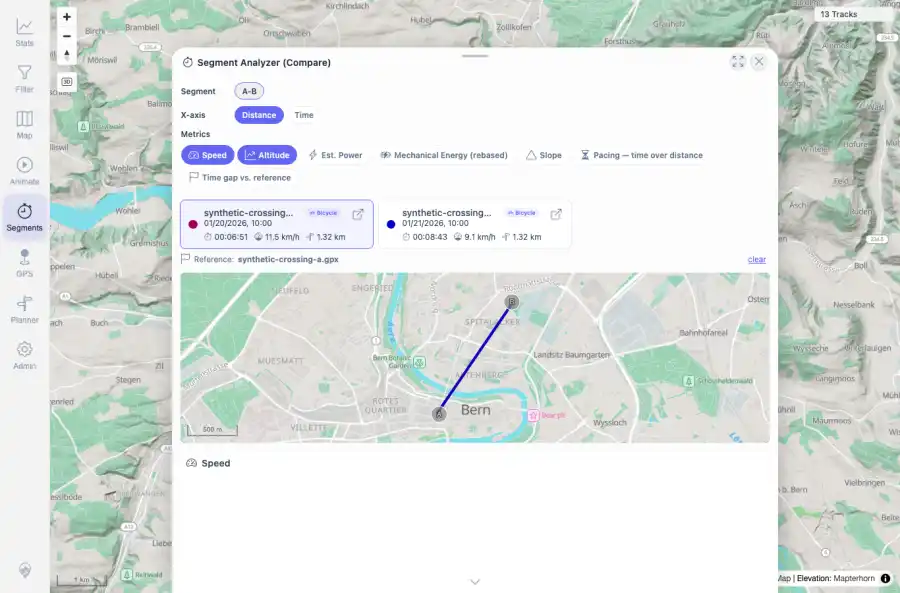

# Packet: MCT_04

## Scope

- Coverage source: `documentation/testing/frontend-regression-test-plan.md`
- Coverage ID or run packet: MCT_04
- In scope: Segment comparison overlay with selected tracks, charts, and comparison mini-map.
- Out of scope: Other coverage IDs except where noted as shared state/evidence.

## Prerequisites

- Required previous coverage IDs or run packets: MCT_03 PASS; synthetic A-B segment available.
- Required app/data state: Current run-state and packet set for this run.
- Required browser context: As specified by the coverage action.

## Allowed Mutations

- Allowed: Re-run measure, open Compare, select A-B, and fetch sub-track slices.
- Not allowed: Collapse this ID into a parent row or skip required direct evidence.

## Actions And Results

| Coverage ID | Action | Expected result | Actual result | Status | Evidence |
|---|---|---|---|---|---|
| MCT_04 | Opened Compare from the measure results, selected the A-B segment, and waited for comparison charts and mini-map. | Picking several tracks creates aligned comparison charts and map, even with sparse/missing synthetic segment data. | Compare opened for two selected synthetic tracks, rendered racer cards, Speed and Altitude Highcharts, the segment chip set, and one comparison mini-map canvas. Sub-track fetches succeeded for both tracks. | PASS | [assets/MCT_04-segment-comparison.webp](../assets/MCT_04-segment-comparison.webp); [assets/MCT_04-segment-comparison.txt](../assets/MCT_04-segment-comparison.txt) |

## Issues

| ID | Severity | Summary | Reproduction | Expected | Actual | Evidence | Release impact |
|---|---|---|---|---|---|---|---|

## Evidence Files

| File | Purpose |
|---|---|
| [assets/MCT_04-segment-comparison.webp](../assets/MCT_04-segment-comparison.webp) | Screenshot evidence |
| [assets/MCT_04-segment-comparison.txt](../assets/MCT_04-segment-comparison.txt) | Text/log evidence |

## Screenshot Evidence

## Timings

| Step | Timing |
|---|---:|
| Packet execution | <1 minute |

## Handoff Notes

- Completed: This coverage ID is terminal.
- Remaining unfinished coverage: Continue with the next queue row.
- Blocked or not applicable: none.
- State left for the next packet: unchanged.
