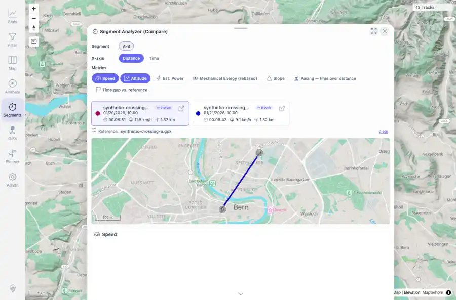

# Packet: MCT_05

## Scope

- Coverage source: `documentation/testing/frontend-regression-test-plan.md`
- Coverage ID or run packet: MCT_05
- In scope: Sub-track extraction between measured segment crossing points.
- Out of scope: Other coverage IDs except where noted as shared state/evidence.

## Prerequisites

- Required previous coverage IDs or run packets: MCT_04 PASS with A-B comparison selected.
- Required app/data state: Current run-state and packet set for this run.
- Required browser context: As specified by the coverage action.

## Allowed Mutations

- Allowed: Use the sub-track API requests triggered by Segment Compare as evidence.
- Not allowed: Collapse this ID into a parent row or skip required direct evidence.

## Actions And Results

| Coverage ID | Action | Expected result | Actual result | Status | Evidence |
|---|---|---|---|---|---|
| MCT_05 | Selected A-B in Segment Compare and inspected the get-sub-track API responses for both synthetic tracks. | Sub-track extraction between two points on a track returns the expected local slice. | Track 100017 fetched point 637011 to 637012 and track 100018 fetched point 637008 to 637009. Both sub-track responses were HTTP 200, contained 2 points, and spanned the expected Bern A-B coordinate slice. | PASS | [assets/MCT_05-subtrack-comparison-context.webp](../assets/MCT_05-subtrack-comparison-context.webp); [assets/MCT_05-subtrack-slices.txt](../assets/MCT_05-subtrack-slices.txt) |

## Issues

| ID | Severity | Summary | Reproduction | Expected | Actual | Evidence | Release impact |
|---|---|---|---|---|---|---|---|

## Evidence Files

| File | Purpose |
|---|---|
| [assets/MCT_05-subtrack-comparison-context.webp](../assets/MCT_05-subtrack-comparison-context.webp) | Screenshot evidence |
| [assets/MCT_05-subtrack-slices.txt](../assets/MCT_05-subtrack-slices.txt) | Text/log evidence |

## Screenshot Evidence

## Timings

| Step | Timing |
|---|---:|
| Packet execution | <1 minute |

## Handoff Notes

- Completed: This coverage ID is terminal.
- Remaining unfinished coverage: Continue with the next queue row.
- Blocked or not applicable: none.
- State left for the next packet: unchanged.
