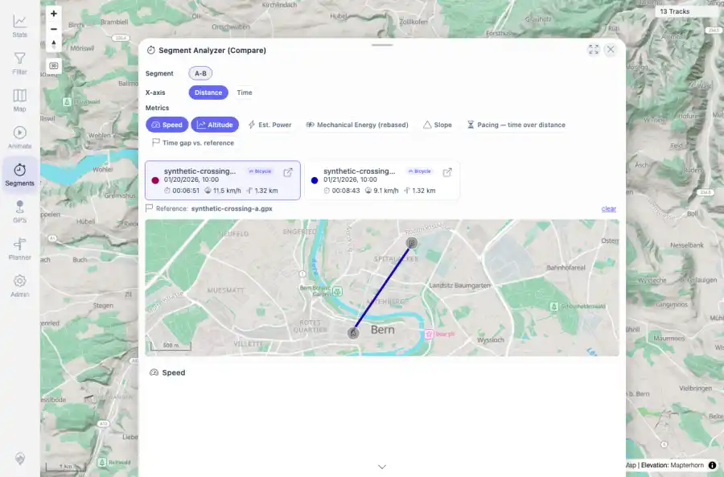

# Packet: MCT_06

## Scope

- Coverage source: `documentation/testing/frontend-regression-test-plan.md`
- Coverage ID or run packet: MCT_06
- In scope: Measured segment comparison geometry sanity.
- Out of scope: Other coverage IDs except where noted as shared state/evidence.

## Prerequisites

- Required previous coverage IDs or run packets: MCT_05 PASS with comparison mini-map and sub-track slices available.
- Required app/data state: Current run-state and packet set for this run.
- Required browser context: As specified by the coverage action.

## Allowed Mutations

- Allowed: Inspect comparison mini-map evidence and sub-track coordinate bounds.
- Not allowed: Collapse this ID into a parent row or skip required direct evidence.

## Actions And Results

| Coverage ID | Action | Expected result | Actual result | Status | Evidence |
|---|---|---|---|---|---|
| MCT_06 | Checked the selected A-B comparison map and sub-track coordinate bounds for zero/global/off-continent geometry. | Comparison map lines stay within selected tracks real local bounds; no global straight line, [0,0], or off-continent segment appears. | Comparison mini-map rendered, sub-track bounds stayed within Bern envelope lng 7.4470-7.4572 and lat 46.9480-46.9582, and sanity counters reported invalid=0, zeroish=0, offContinent=0. | PASS | [assets/MCT_06-comparison-map-geometry.webp](../assets/MCT_06-comparison-map-geometry.webp); [assets/MCT_06-geometry-sanity.txt](../assets/MCT_06-geometry-sanity.txt) |

## Issues

| ID | Severity | Summary | Reproduction | Expected | Actual | Evidence | Release impact |
|---|---|---|---|---|---|---|---|

## Evidence Files

| File | Purpose |
|---|---|
| [assets/MCT_06-comparison-map-geometry.webp](../assets/MCT_06-comparison-map-geometry.webp) | Screenshot evidence |
| [assets/MCT_06-geometry-sanity.txt](../assets/MCT_06-geometry-sanity.txt) | Text/log evidence |

## Screenshot Evidence

## Timings

| Step | Timing |
|---|---:|
| Packet execution | <1 minute |

## Handoff Notes

- Completed: This coverage ID is terminal.
- Remaining unfinished coverage: Continue with the next queue row.
- Blocked or not applicable: none.
- State left for the next packet: unchanged.
