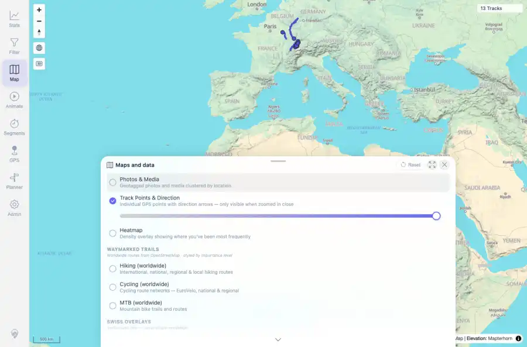
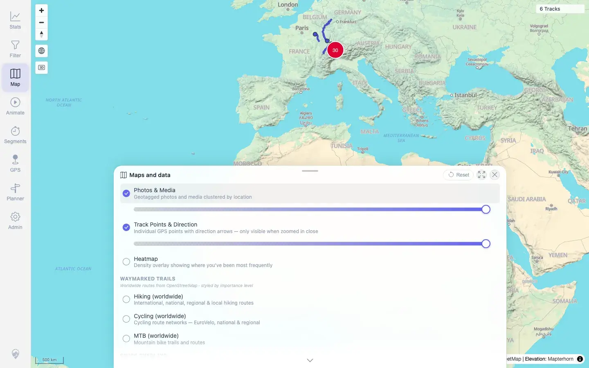

# Packet: MED_01

## Scope

- Coverage source: `documentation/testing/frontend-regression-test-plan.md`
- Coverage ID or run packet: MED_01
- In scope: Media layer toggle from the normal overview map.
- Out of scope: Other coverage IDs except where noted as shared state/evidence.

## Prerequisites

- Required previous coverage IDs or run packets: AVR_04 terminal; synthetic media indexed for this run.
- Required app/data state: Current run-state and packet set for this run.
- Required browser context: As specified by the coverage action.

## Allowed Mutations

- Allowed: Toggle Photos & Media, capture console/UI evidence, and update MED_01 packet/run-state.
- Not allowed: Collapse this ID into a parent row or skip required direct evidence.

## Actions And Results

| Coverage ID | Action | Expected result | Actual result | Status | Evidence |
|---|---|---|---|---|---|
| MED_01 | Opened the Map sheet at the default full-track overview and clicked Photos & Media. Retested on beta image `1.300` built `2026-06-05T07:16:20Z`. | The media layer toggles on and photo pins or clusters appear in the map view. | PASS: the overview media request was clamped to valid latitude bounds (`minLat=-90`, `maxLat=90`), returned HTTP 200 with 30 media points, and no `Invalid LngLat` Vue/page error occurred. | PASS | [assets/RETEST_MED_01-media-toggle-fixed.webp](../assets/RETEST_MED_01-media-toggle-fixed.webp); [assets/RETEST_open-defects-2026-06-05-beta-1.300.json](../assets/RETEST_open-defects-2026-06-05-beta-1.300.json) |

## Issues

| ID | Severity | Summary | Reproduction | Expected | Actual | Evidence | Release impact |
|---|---|---|---|---|---|---|---|
| MED_01-I01 | High | Media layer toggle fails at overview | Open Map sheet at full-track overview, click Photos & Media | Layer toggles on and loads pins/clusters | FIXED on beta image `1.300`: toggle starts a successful clamped bounds request and no `Invalid LngLat` error is emitted. | [assets/RETEST_MED_01-media-toggle-fixed.webp](../assets/RETEST_MED_01-media-toggle-fixed.webp), [assets/RETEST_open-defects-2026-06-05-beta-1.300.json](../assets/RETEST_open-defects-2026-06-05-beta-1.300.json) | Fixed in targeted beta retest. |

## Evidence Files

| File | Purpose |
|---|---|
| [assets/MED_01-media-toggle-failure.webp](../assets/MED_01-media-toggle-failure.webp) | Screenshot evidence |
| [assets/MED_01-media-layer-pins.txt](../assets/MED_01-media-layer-pins.txt) | Text/log evidence |
| [assets/RETEST_MED_01-media-toggle-fixed.webp](../assets/RETEST_MED_01-media-toggle-fixed.webp) | Targeted beta retest screenshot |
| [assets/RETEST_open-defects-2026-06-05-beta-1.300.json](../assets/RETEST_open-defects-2026-06-05-beta-1.300.json) | Targeted beta retest JSON evidence |

## Screenshot Evidence

## Timings

| Step | Timing |
|---|---:|
| Overview media toggle | ~8 seconds |
| Targeted beta retest | ~8 seconds |

## Handoff Notes

- Completed: This coverage ID is terminal.
- Remaining unfinished coverage: Continue with the next queue row.
- Blocked or not applicable: none.
- State left for the next packet: unchanged.
