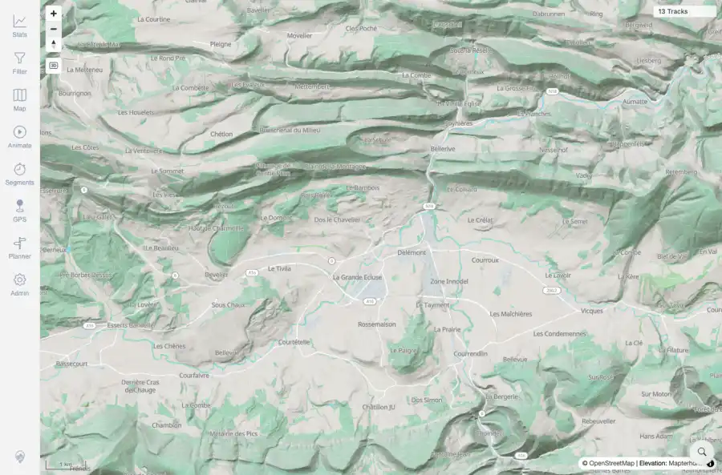

# Packet: MED_02

## Scope

- Coverage source: `documentation/testing/frontend-regression-test-plan.md`
- Coverage ID or run packet: MED_02
- In scope: Media viewport-bounded loading during pan/zoom.
- Out of scope: Other coverage IDs except where noted as shared state/evidence.

## Prerequisites

- Required previous coverage IDs or run packets: MED_01 terminal; local workaround viewport used after overview toggle failure.
- Required app/data state: Current run-state and packet set for this run.
- Required browser context: As specified by the coverage action.

## Allowed Mutations

- Allowed: Search local viewport, toggle media, zoom map, capture bounded media API evidence, and update MED_02 packet/run-state.
- Not allowed: Collapse this ID into a parent row or skip required direct evidence.

## Actions And Results

| Coverage ID | Action | Expected result | Actual result | Status | Evidence |
|---|---|---|---|---|---|
| MED_02 | Searched Delémont, toggled Photos & Media successfully at local zoom, zoomed out until the media overlay requested a new viewport. | Media loads through bounded viewport requests rather than a whole-world request; pan/zoom changes request bounds and loaded points. | PASS: the local toggle used minLat/minLng/maxLat/maxLng, initial local response returned 0 in a tight viewport, zoom-out request changed bounds and returned 8 media points. The request spans were far smaller than world bounds. | PASS | [assets/MED_02-viewport-media-loaded.webp](../assets/MED_02-viewport-media-loaded.webp); [assets/MED_02-viewport-loading.txt](../assets/MED_02-viewport-loading.txt) |

## Issues

| ID | Severity | Summary | Reproduction | Expected | Actual | Evidence | Release impact |
|---|---|---|---|---|---|---|---|

## Evidence Files

| File | Purpose |
|---|---|
| [assets/MED_02-viewport-media-loaded.webp](../assets/MED_02-viewport-media-loaded.webp) | Screenshot evidence |
| [assets/MED_02-viewport-loading.txt](../assets/MED_02-viewport-loading.txt) | Text/log evidence |

## Screenshot Evidence

## Timings

| Step | Timing |
|---|---:|
| Local toggle and zoom-out media load | ~15 seconds |

## Handoff Notes

- Completed: This coverage ID is terminal.
- Remaining unfinished coverage: Continue with the next queue row.
- Blocked or not applicable: none.
- State left for the next packet: unchanged.
