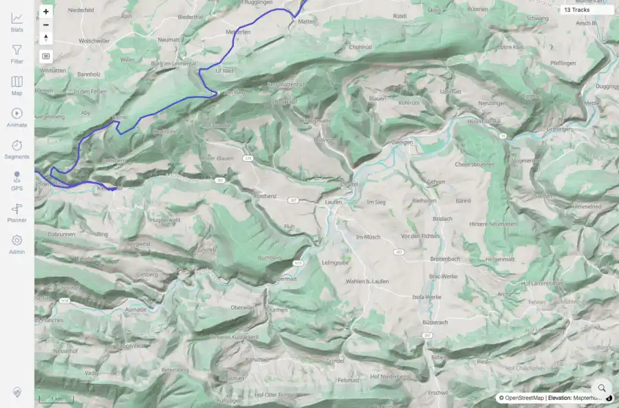
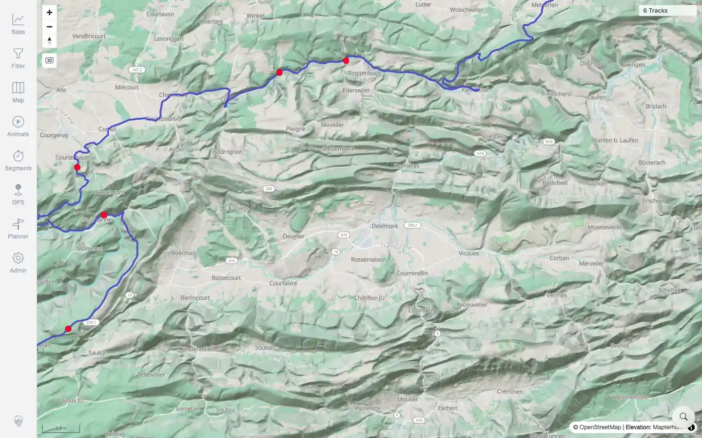

# Packet: MED_03

## Scope

- Coverage source: `documentation/testing/frontend-regression-test-plan.md`
- Coverage ID or run packet: MED_03
- In scope: Click media pin and verify photo preview plus next/previous navigation.
- Out of scope: Other coverage IDs except where noted as shared state/evidence.

## Prerequisites

- Required previous coverage IDs or run packets: MED_02 terminal with media points returned by bounded API.
- Required app/data state: Current run-state and packet set for this run.
- Required browser context: As specified by the coverage action.

## Allowed Mutations

- Allowed: Click rendered media candidates, inspect preview sheet state, capture failure screenshots, and update MED_03 packet/run-state.
- Not allowed: Collapse this ID into a parent row or skip required direct evidence.

## Actions And Results

| Coverage ID | Action | Expected result | Actual result | Status | Evidence |
|---|---|---|---|---|---|
| MED_03 | After the bounded media API returned points, clicked a rendered Delémont/Jura media marker and verified the Photo sheet. Retested on beta image `1.300` built `2026-06-05T07:16:20Z`. | A rendered pin opens the Photo sheet; preview image, metadata, and next/previous navigation work. | PASS: the bounded API returned 7 media points, red media markers were visible, and clicking the marker opened the Photo sheet with `demo_photo_00003.jpg`, image content, metadata, and `1 / 5` navigation. | PASS | [assets/RETEST_MED_03-visible-media-pins.webp](../assets/RETEST_MED_03-visible-media-pins.webp); [assets/RETEST_MED_03-photo-sheet-fixed.webp](../assets/RETEST_MED_03-photo-sheet-fixed.webp); [assets/RETEST_open-defects-2026-06-05-beta-1.300.json](../assets/RETEST_open-defects-2026-06-05-beta-1.300.json) |

## Issues

| ID | Severity | Summary | Reproduction | Expected | Actual | Evidence | Release impact |
|---|---|---|---|---|---|---|---|
| MED_03-I01 | High | Loaded media points do not render as clickable map pins | Toggle media in a local viewport, zoom until /get-media-in-bounds returns media points, inspect/click map | Red pins/clusters appear and click opens Photo preview | FIXED on beta image `1.300`: returned media points render as red markers; clicking a marker opens a populated Photo sheet. | [assets/RETEST_MED_03-visible-media-pins.webp](../assets/RETEST_MED_03-visible-media-pins.webp), [assets/RETEST_MED_03-photo-sheet-fixed.webp](../assets/RETEST_MED_03-photo-sheet-fixed.webp) | Fixed in targeted beta retest. |

## Evidence Files

| File | Purpose |
|---|---|
| [assets/MED_03-preview-navigation.webp](../assets/MED_03-preview-navigation.webp) | Screenshot evidence |
| [assets/MED_03-preview-navigation.txt](../assets/MED_03-preview-navigation.txt) | Text/log evidence |
| [assets/MED_probe_Laufen.webp](../assets/MED_probe_Laufen.webp) | Screenshot evidence |
| [assets/RETEST_MED_03-visible-media-pins.webp](../assets/RETEST_MED_03-visible-media-pins.webp) | Targeted beta retest screenshot |
| [assets/RETEST_MED_03-photo-sheet-fixed.webp](../assets/RETEST_MED_03-photo-sheet-fixed.webp) | Targeted beta retest screenshot |
| [assets/RETEST_open-defects-2026-06-05-beta-1.300.json](../assets/RETEST_open-defects-2026-06-05-beta-1.300.json) | Targeted beta retest JSON evidence |

## Screenshot Evidence

## Timings

| Step | Timing |
|---|---:|
| Pin click and local marker probes | ~1 minute |
| Targeted beta retest | ~25 seconds |

## Handoff Notes

- Completed: This coverage ID is terminal.
- Remaining unfinished coverage: Continue with the next queue row.
- Blocked or not applicable: none.
- State left for the next packet: unchanged.
