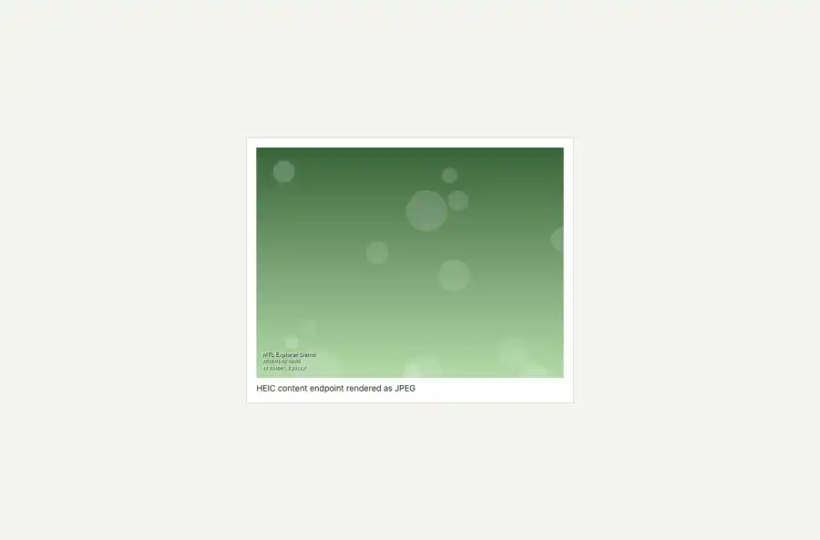

# Packet: MED_04

## Scope

- Coverage source: `documentation/testing/frontend-regression-test-plan.md`
- Coverage ID or run packet: MED_04
- In scope: HEIC media display through server-side conversion.
- Out of scope: Other coverage IDs except where noted as shared state/evidence.

## Prerequisites

- Required previous coverage IDs or run packets: Synthetic HEIC id 400028 indexed during MED setup.
- Required app/data state: Current run-state and packet set for this run.
- Required browser context: As specified by the coverage action.

## Allowed Mutations

- Allowed: Request HEIC content endpoint, render converted image in browser, capture evidence, and update MED_04 packet/run-state.
- Not allowed: Collapse this ID into a parent row or skip required direct evidence.

## Actions And Results

| Coverage ID | Action | Expected result | Actual result | Status | Evidence |
|---|---|---|---|---|---|
| MED_04 | Loaded /api/media/get/400028/content?maxSize=512 in the browser and inspected response type, byte size, and decoded image dimensions. | HEIC content is converted server-side to a browser-displayable image. | PASS: the HEIC content endpoint returned 200 image/jpeg, 12,367 bytes, and the browser decoded a 512 x 384 image. | PASS | [assets/MED_04-heic-conversion.webp](../assets/MED_04-heic-conversion.webp); [assets/MED_04-heic-conversion.txt](../assets/MED_04-heic-conversion.txt) |

## Issues

| ID | Severity | Summary | Reproduction | Expected | Actual | Evidence | Release impact |
|---|---|---|---|---|---|---|---|

## Evidence Files

| File | Purpose |
|---|---|
| [assets/MED_04-heic-conversion.webp](../assets/MED_04-heic-conversion.webp) | Screenshot evidence |
| [assets/MED_04-heic-conversion.txt](../assets/MED_04-heic-conversion.txt) | Text/log evidence |

## Screenshot Evidence

## Timings

| Step | Timing |
|---|---:|
| HEIC content conversion | ~3 seconds |

## Handoff Notes

- Completed: This coverage ID is terminal.
- Remaining unfinished coverage: Continue with the next queue row.
- Blocked or not applicable: none.
- State left for the next packet: unchanged.
