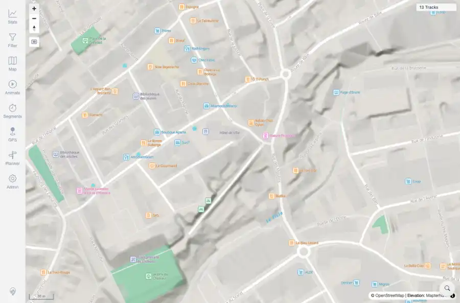
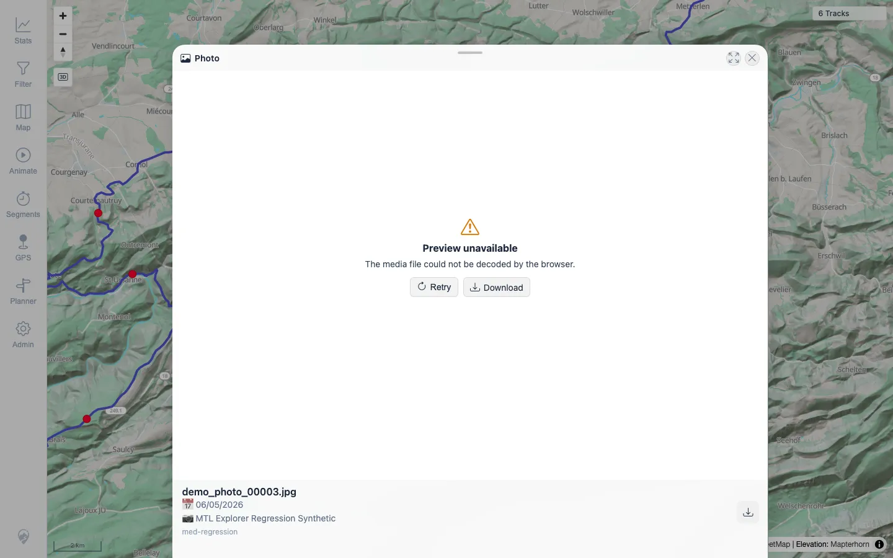

# Packet: MED_05

## Scope

- Coverage source: `documentation/testing/frontend-regression-test-plan.md`
- Coverage ID or run packet: MED_05
- In scope: Broken/missing photo recovery UI.
- Out of scope: Other coverage IDs except where noted as shared state/evidence.

## Prerequisites

- Required previous coverage IDs or run packets: MED_03 expected to provide a clickable Photo sheet path.
- Required app/data state: Current run-state and packet set for this run.
- Required browser context: As specified by the coverage action.

## Allowed Mutations

- Allowed: Temporarily move one indexed media file, probe content endpoint, restore file, and update MED_05 packet/run-state.
- Not allowed: Collapse this ID into a parent row or skip required direct evidence.

## Actions And Results

| Coverage ID | Action | Expected result | Actual result | Status | Evidence |
|---|---|---|---|---|---|
| MED_05 | Opened a Photo sheet through a map media marker, temporarily moved `demo_photo_00003.jpg`, clicked the same marker, then restored the file. Retested on beta image `1.300` built `2026-06-05T07:16:20Z`. | A missing/broken photo opens a recoverable preview error with Retry/Download rather than a blank sheet. | PASS: the Photo sheet showed `Preview unavailable`, an error detail, Retry, and Download while the image file was missing; the file was restored after the probe. | PASS | [assets/RETEST_MED_05-broken-photo-recovery-fixed.webp](../assets/RETEST_MED_05-broken-photo-recovery-fixed.webp); [assets/RETEST_open-defects-2026-06-05-beta-1.300.json](../assets/RETEST_open-defects-2026-06-05-beta-1.300.json) |

## Issues

| ID | Severity | Summary | Reproduction | Expected | Actual | Evidence | Release impact |
|---|---|---|---|---|---|---|---|

## Evidence Files

| File | Purpose |
|---|---|
| [assets/MED_05-broken-content-blocked.txt](../assets/MED_05-broken-content-blocked.txt) | Text/log evidence |
| [assets/MED_03-preview-navigation.webp](../assets/MED_03-preview-navigation.webp) | Screenshot evidence |
| [assets/RETEST_MED_05-broken-photo-recovery-fixed.webp](../assets/RETEST_MED_05-broken-photo-recovery-fixed.webp) | Targeted beta retest screenshot |
| [assets/RETEST_open-defects-2026-06-05-beta-1.300.json](../assets/RETEST_open-defects-2026-06-05-beta-1.300.json) | Targeted beta retest JSON evidence |

## Screenshot Evidence

## Timings

| Step | Timing |
|---|---:|
| Broken content direct probe and restore | ~2 seconds |
| Targeted beta retest through Photo sheet | ~25 seconds |

## Handoff Notes

- Completed: This coverage ID is terminal as PASS after MED_03-I01 was fixed.
- Remaining unfinished coverage: Continue with HMO_01.
- Blocked or not applicable: none.
- State left for the next packet: media file restored; 31 media files remain in the target media folder.
