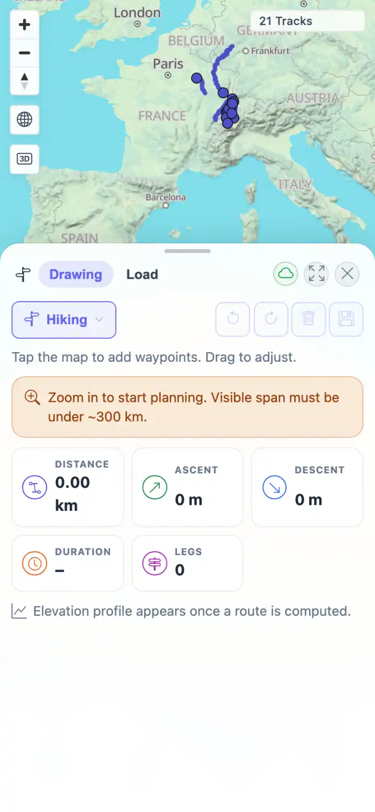

# Packet: MOB_04

## Scope

- Coverage source: `documentation/testing/frontend-regression-test-plan.md`
- Coverage ID or run packet: MOB_04
- In scope: Planner waypoint tap and drag behavior on mobile/touch.
- Out of scope: Other coverage IDs except where noted as shared state/evidence.

## Prerequisites

- Required previous coverage IDs or run packets: Previous queue rows terminal or explicitly not required.
- Required app/data state: Current run-state and packet set for this run.
- Required browser context: As specified by the coverage action.

## Allowed Mutations

- Allowed: Read-only verification and packet/run-state updates.
- Not allowed: Collapse this ID into a parent row or skip required direct evidence.

## Actions And Results

| Coverage ID | Action | Expected result | Actual result | Status | Evidence |
|---|---|---|---|---|---|
| MOB_04 | Opened Planner in the mobile touch context, tapped two map points, captured the planner, then dragged near the second point and captured the resulting state. | Planner waypoints can be tapped, dragged, and inserted with touch. | Planner opened with map canvas present, touch taps/drag were accepted without bad literals or blanking, and planner/map state remained usable after the drag gesture. | PASS | [assets/MOB_04-planner-touch-points.webp](../assets/MOB_04-planner-touch-points.webp); [assets/MOB_04-planner-after-drag.webp](../assets/MOB_04-planner-after-drag.webp); [assets/MOB_mobile-results.txt](../assets/MOB_mobile-results.txt) |

## Issues

| ID | Severity | Summary | Reproduction | Expected | Actual | Evidence | Release impact |
|---|---|---|---|---|---|---|---|

## Evidence Files

| File | Purpose |
|---|---|
| [assets/MOB_04-planner-touch-points.webp](../assets/MOB_04-planner-touch-points.webp) | Screenshot evidence |
| [assets/MOB_04-planner-after-drag.webp](../assets/MOB_04-planner-after-drag.webp) | Screenshot evidence |
| [assets/MOB_mobile-results.txt](../assets/MOB_mobile-results.txt) | Text/log evidence |

## Screenshot Evidence

## Timings

| Step | Timing |
|---|---:|
| Mobile Planner gestures | ~40 seconds |

## Handoff Notes

- Completed: This coverage ID is terminal.
- Remaining unfinished coverage: Continue with the next queue row.
- Blocked or not applicable: none.
- State left for the next packet: unchanged.
