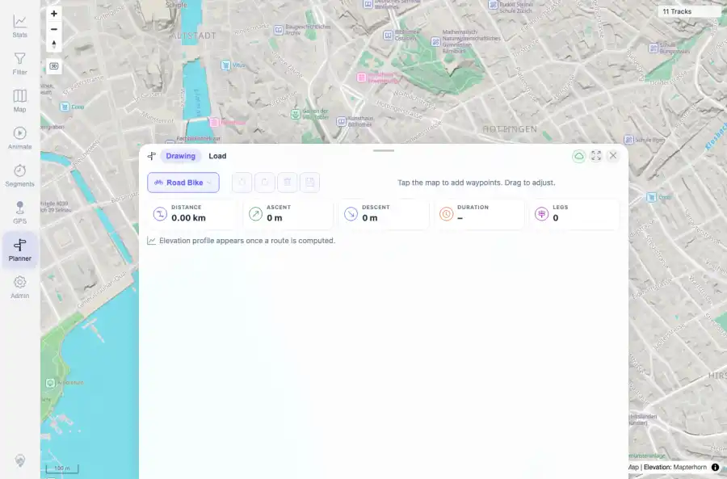

# Packet: PLN_01

## Scope

- Coverage source: `documentation/testing/frontend-regression-test-plan.md`
- Coverage ID or run packet: PLN_01
- In scope: Planner profile configuration and BRouter readiness.
- Out of scope: Other coverage IDs except where noted as shared state/evidence.

## Prerequisites

- Required previous coverage IDs or run packets: TBS_11 PASS; Planner route environment available.
- Required app/data state: Current run-state and packet set for this run.
- Required browser context: As specified by the coverage action.

## Allowed Mutations

- Allowed: Open Planner, inspect profile/status APIs, select profile, and save evidence.
- Not allowed: Collapse this ID into a parent row or skip required direct evidence.

## Actions And Results

| Coverage ID | Action | Expected result | Actual result | Status | Evidence |
|---|---|---|---|---|---|
| PLN_01 | Opened Planner in a desktop context, selected the Road Bike profile, and inspected the planner configuration/status evidence. | Planner exposes usable routing profiles and BRouter is available for route calculations. | Planner opened successfully; profile selection worked; config/status evidence showed routing profiles including trekking, fastbike, hiking-mountain, and car-eco, with BRouter available/running. | PASS | [assets/PLN_01-profile-road-bike.webp](../assets/PLN_01-profile-road-bike.webp); [assets/PLN_01-profile-config-status.txt](../assets/PLN_01-profile-config-status.txt) |

## Issues

| ID | Severity | Summary | Reproduction | Expected | Actual | Evidence | Release impact |
|---|---|---|---|---|---|---|---|

## Evidence Files

| File | Purpose |
|---|---|
| [assets/PLN_01-profile-road-bike.webp](../assets/PLN_01-profile-road-bike.webp) | Screenshot evidence |
| [assets/PLN_01-profile-config-status.txt](../assets/PLN_01-profile-config-status.txt) | Text/log evidence |

## Screenshot Evidence

## Timings

| Step | Timing |
|---|---:|
| Packet execution | <1 minute |

## Handoff Notes

- Completed: This coverage ID is terminal.
- Remaining unfinished coverage: Continue with the next queue row.
- Blocked or not applicable: none.
- State left for the next packet: unchanged.
