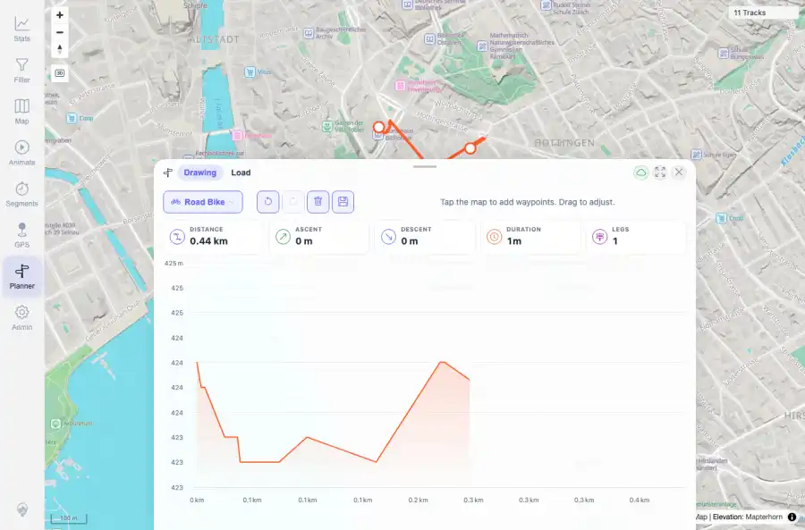

# Packet: PLN_02

## Scope

- Coverage source: `documentation/testing/frontend-regression-test-plan.md`
- Coverage ID or run packet: PLN_02
- In scope: Planner two-waypoint route calculation.
- Out of scope: Other coverage IDs except where noted as shared state/evidence.

## Prerequisites

- Required previous coverage IDs or run packets: PLN_01 PASS.
- Required app/data state: Current run-state and packet set for this run.
- Required browser context: As specified by the coverage action.

## Allowed Mutations

- Allowed: Create temporary planner waypoints and capture route evidence.
- Not allowed: Collapse this ID into a parent row or skip required direct evidence.

## Actions And Results

| Coverage ID | Action | Expected result | Actual result | Status | Evidence |
|---|---|---|---|---|---|
| PLN_02 | Placed two waypoints on the Planner map and waited for route computation and chart rendering. | A route is computed, route stats update, and elevation/chart surfaces render. | Route computed with distance 0.44 km, duration 1m, one leg, HTTP 200 route response, and rendered elevation/highcharts surface. | PASS | [assets/PLN_02-route-computed-two-waypoints.webp](../assets/PLN_02-route-computed-two-waypoints.webp); [assets/PLN_02-route-computed.txt](../assets/PLN_02-route-computed.txt) |

## Issues

| ID | Severity | Summary | Reproduction | Expected | Actual | Evidence | Release impact |
|---|---|---|---|---|---|---|---|

## Evidence Files

| File | Purpose |
|---|---|
| [assets/PLN_02-route-computed-two-waypoints.webp](../assets/PLN_02-route-computed-two-waypoints.webp) | Screenshot evidence |
| [assets/PLN_02-route-computed.txt](../assets/PLN_02-route-computed.txt) | Text/log evidence |

## Screenshot Evidence

## Timings

| Step | Timing |
|---|---:|
| Packet execution | <1 minute |

## Handoff Notes

- Completed: This coverage ID is terminal.
- Remaining unfinished coverage: Continue with the next queue row.
- Blocked or not applicable: none.
- State left for the next packet: unchanged.
