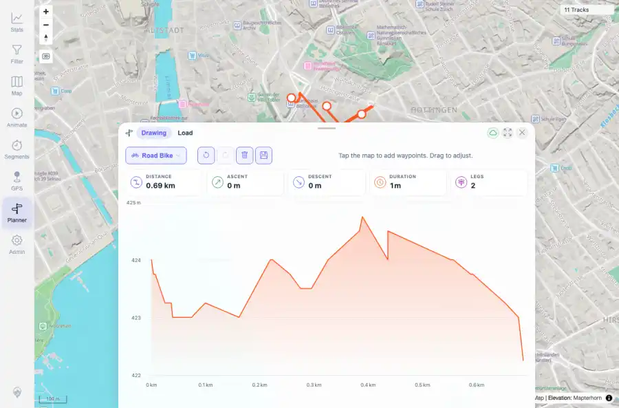

# Packet: PLN_03

## Scope

- Coverage source: `documentation/testing/frontend-regression-test-plan.md`
- Coverage ID or run packet: PLN_03
- In scope: Planner insertion of an intermediate waypoint on an existing route.
- Out of scope: Other coverage IDs except where noted as shared state/evidence.

## Prerequisites

- Required previous coverage IDs or run packets: PLN_02 PASS.
- Required app/data state: Current run-state and packet set for this run.
- Required browser context: As specified by the coverage action.

## Allowed Mutations

- Allowed: Mutate the temporary planner route by inserting a waypoint.
- Not allowed: Collapse this ID into a parent row or skip required direct evidence.

## Actions And Results

| Coverage ID | Action | Expected result | Actual result | Status | Evidence |
|---|---|---|---|---|---|
| PLN_03 | Clicked the existing route to insert an intermediate waypoint and observed stats/leg count. | Inserted waypoint splits the route into multiple legs and keeps the route valid. | Inserted waypoint increased legs from 1 to 2 and distance from 0.44 km to 0.69 km while keeping the route rendered. | PASS | [assets/PLN_03-route-inserted-waypoint.webp](../assets/PLN_03-route-inserted-waypoint.webp); [assets/PLN_03-insert-waypoint.txt](../assets/PLN_03-insert-waypoint.txt) |

## Issues

| ID | Severity | Summary | Reproduction | Expected | Actual | Evidence | Release impact |
|---|---|---|---|---|---|---|---|

## Evidence Files

| File | Purpose |
|---|---|
| [assets/PLN_03-route-inserted-waypoint.webp](../assets/PLN_03-route-inserted-waypoint.webp) | Screenshot evidence |
| [assets/PLN_03-insert-waypoint.txt](../assets/PLN_03-insert-waypoint.txt) | Text/log evidence |

## Screenshot Evidence

## Timings

| Step | Timing |
|---|---:|
| Packet execution | <1 minute |

## Handoff Notes

- Completed: This coverage ID is terminal.
- Remaining unfinished coverage: Continue with the next queue row.
- Blocked or not applicable: none.
- State left for the next packet: unchanged.
