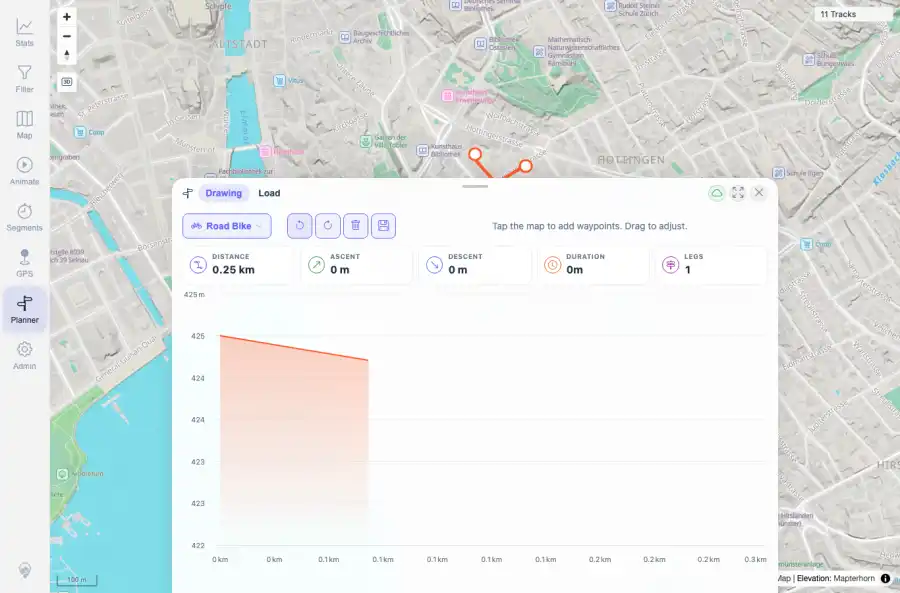

# Packet: PLN_04

## Scope

- Coverage source: `documentation/testing/frontend-regression-test-plan.md`
- Coverage ID or run packet: PLN_04
- In scope: Planner edit history, waypoint drag/delete, clear, undo, and redo.
- Out of scope: Other coverage IDs except where noted as shared state/evidence.

## Prerequisites

- Required previous coverage IDs or run packets: PLN_03 PASS.
- Required app/data state: Current run-state and packet set for this run.
- Required browser context: As specified by the coverage action.

## Allowed Mutations

- Allowed: Mutate temporary planner waypoints and use edit-history controls.
- Not allowed: Collapse this ID into a parent row or skip required direct evidence.

## Actions And Results

| Coverage ID | Action | Expected result | Actual result | Status | Evidence |
|---|---|---|---|---|---|
| PLN_04 | Dragged a waypoint, deleted a selected waypoint, exercised undo/redo for delete, cleared the route, exercised undo/redo for clear, and restored a route. | Each edit updates the route without losing history; undo/redo restore the expected route states. | Waypoint drag recomputed a valid route; delete reduced the route to one leg; undo restored two legs; redo returned to one leg; clear reset stats; undo/redo around clear restored and cleared as expected; final undo restored a valid route. | PASS | [assets/PLN_04-edit-history-restored-route.webp](../assets/PLN_04-edit-history-restored-route.webp); [assets/PLN_04-edit-history.txt](../assets/PLN_04-edit-history.txt) |

## Issues

| ID | Severity | Summary | Reproduction | Expected | Actual | Evidence | Release impact |
|---|---|---|---|---|---|---|---|

## Evidence Files

| File | Purpose |
|---|---|
| [assets/PLN_04-edit-history-restored-route.webp](../assets/PLN_04-edit-history-restored-route.webp) | Screenshot evidence |
| [assets/PLN_04-edit-history.txt](../assets/PLN_04-edit-history.txt) | Text/log evidence |

## Screenshot Evidence

## Timings

| Step | Timing |
|---|---:|
| Packet execution | <1 minute |

## Handoff Notes

- Completed: This coverage ID is terminal.
- Remaining unfinished coverage: Continue with the next queue row.
- Blocked or not applicable: none.
- State left for the next packet: unchanged.
