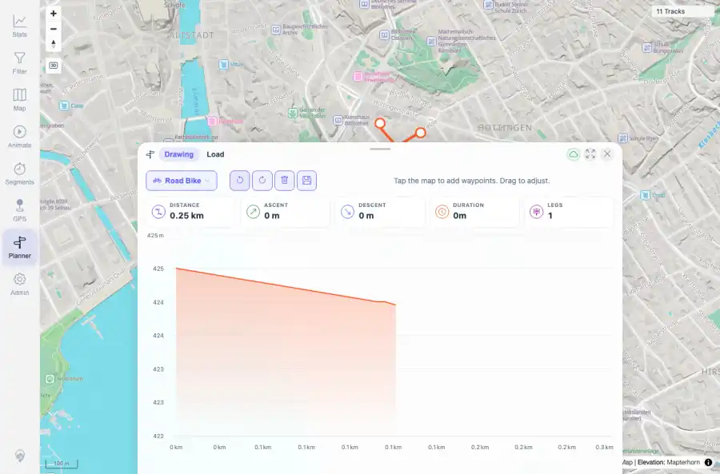

# Packet: PLN_05

## Scope

- Coverage source: `documentation/testing/frontend-regression-test-plan.md`
- Coverage ID or run packet: PLN_05
- In scope: Planner live statistics updates during edits.
- Out of scope: Other coverage IDs except where noted as shared state/evidence.

## Prerequisites

- Required previous coverage IDs or run packets: PLN_04 PASS.
- Required app/data state: Current run-state and packet set for this run.
- Required browser context: As specified by the coverage action.

## Allowed Mutations

- Allowed: Observe stats while mutating temporary Planner state.
- Not allowed: Collapse this ID into a parent row or skip required direct evidence.

## Actions And Results

| Coverage ID | Action | Expected result | Actual result | Status | Evidence |
|---|---|---|---|---|---|
| PLN_05 | Captured route stats across insert, drag, delete, undo, redo, clear, and restore actions. | Distance, duration, ascent, and leg counts update live with route state and reset when route is cleared. | Live stats changed with edits: distance moved 0.44 km -> 0.69 km after insert, 0.69 km -> 0.25 km after delete, 0.25 km -> 0.58 km after undo; clear reset distance to 0.00 km and legs to 0; undo restored a route. | PASS | [assets/PLN_05-live-stats-after-edits.webp](../assets/PLN_05-live-stats-after-edits.webp); [assets/PLN_05-live-stats-sequence.txt](../assets/PLN_05-live-stats-sequence.txt) |

## Issues

| ID | Severity | Summary | Reproduction | Expected | Actual | Evidence | Release impact |
|---|---|---|---|---|---|---|---|

## Evidence Files

| File | Purpose |
|---|---|
| [assets/PLN_05-live-stats-after-edits.webp](../assets/PLN_05-live-stats-after-edits.webp) | Screenshot evidence |
| [assets/PLN_05-live-stats-sequence.txt](../assets/PLN_05-live-stats-sequence.txt) | Text/log evidence |

## Screenshot Evidence

## Timings

| Step | Timing |
|---|---:|
| Packet execution | <1 minute |

## Handoff Notes

- Completed: This coverage ID is terminal.
- Remaining unfinished coverage: Continue with the next queue row.
- Blocked or not applicable: none.
- State left for the next packet: unchanged.
